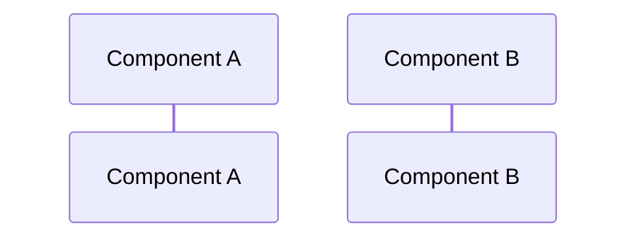
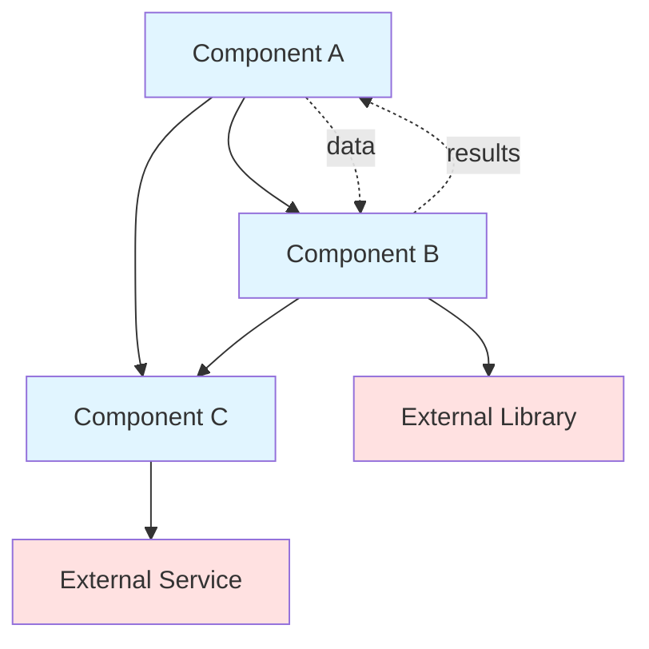
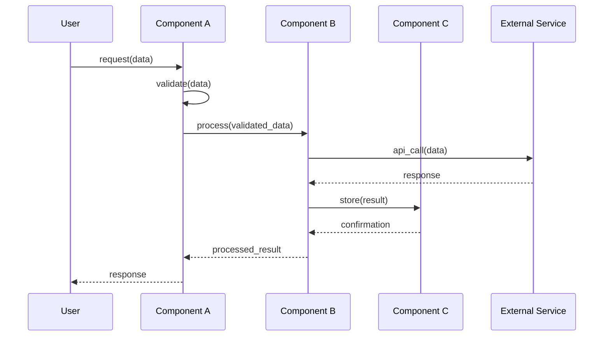
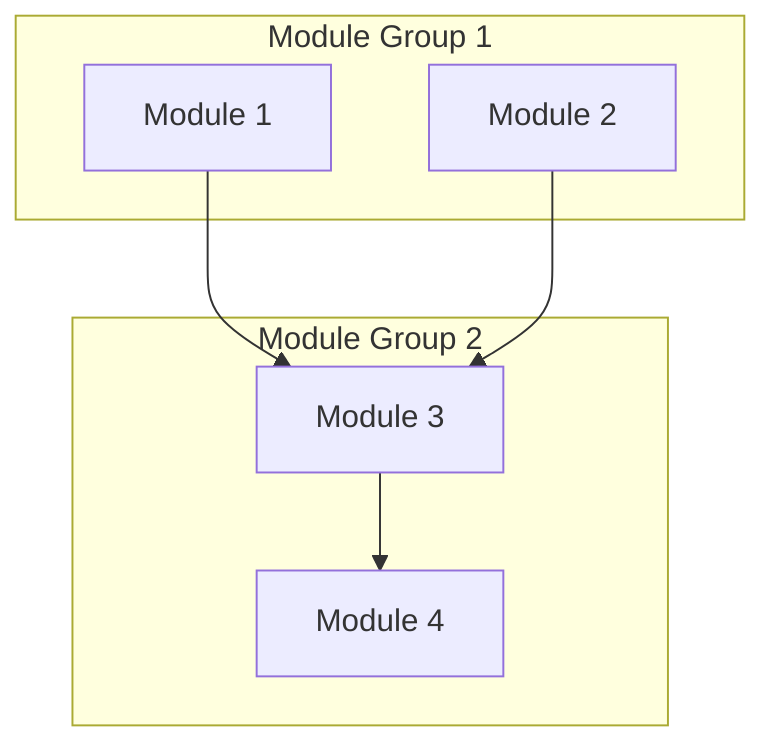

# GatomIA Prompt Templates

> **Important**: This file contains formatting templates used by GatomIA agents (`@gatomia`, `@gatomia-orchestrator`, `@gatomia-leaf`). Users should NOT invoke this prompt directly. Use `@gatomia` to generate documentation.

## How This File Is Used

```mermaid
graph LR
    U[User] -->|@gatomia| A[Entry Point Agent]
    A -->|routes to| O[Orchestrator/Leaf Agent]
    O -->|reads templates from| P[This Prompt File]
    P -->|formats output| D[Documentation]
```

**Agents reference these templates to**:
- Generate consistent documentation structure
- Format module overviews, component descriptions, and diagrams
- Follow best practices for Mermaid diagrams
- Handle errors gracefully

---

This file contains reusable prompt templates for common documentation generation tasks. These templates ensure consistent quality and format across all generated documentation.

## Template 1: Module Overview Generation (DeepWiki Quality)

### Purpose
Generate a **comprehensive, rich** overview section with detailed explanations, not superficial summaries. Documentation should be at the quality level of DeepWiki reference documentation.

### Required Context
- `module_name`: Name of the module
- `components`: List of component names in the module
- `source_code`: Complete source code for analysis
- `sub_modules`: List of sub-module names (if any)
- `dependencies`: List of dependencies (internal and external)

### Quality Requirements

> **CRITICAL**: Documentation must be DETAILED and DESCRIPTIVE. Each section should have multiple paragraphs of rich text explaining the WHY, not just the WHAT.

**BAD (Superficial)**:
```markdown
## Overview
The CLI module handles command-line interface functionality.
```

**GOOD (DeepWiki Quality)**:
```markdown
## Overview
The CLI module serves as the primary user interface for GatomIA, providing a 
comprehensive command-line experience for documentation generation and repository 
analysis. It bridges the gap between user commands and the underlying analysis engine.

### Purpose and Scope
The CLI module is a multi-command interface that provides programmatic control of 
GatomIA's documentation generation capabilities. It handles argument parsing, 
validation, progress reporting, and output formatting.

**Key Characteristics:**
- **Command Pattern**: Each command (`analyze`, `publish`, `config`) is implemented as a separate Click command group
- **Progressive Output**: Supports verbose, quiet, and JSON output modes
- **Error Recovery**: Graceful error handling with actionable user messages
- **Integration Ready**: Compatible with CI/CD pipelines and automated workflows
```

### Generation Steps

1. **Deep Analysis** (not surface-level):
   - Read ALL source files, not just signatures
   - Understand the business logic, not just structure
   - Identify patterns, decisions, and trade-offs
   - Note any limitations or edge cases

2. **Write Rich Descriptions**:
   - Minimum 2-3 paragraphs per major section
   - Every paragraph should add NEW information
   - Avoid generic phrases like "handles functionality"
   - Use specific technical terms and explain them

3. **Include Key Characteristics**:
   - Bulleted list with **bold titles**
   - Each item: `**Title**: Detailed explanation`
   - Minimum 4-6 characteristics per module

4. **Add What It Does / Doesn't Do**:
   - Clear distinction of capabilities
   - Prevents misunderstanding of scope

### Output Format

```markdown
# Module: <module_name>

## Purpose and Scope

[2-3 paragraphs explaining the module's purpose in detail. Include:
- What problem does this module solve?
- Why was this approach chosen?
- How does it fit into the larger system?]

**Key Characteristics:**
- **[Characteristic 1]**: [Detailed explanation of this characteristic]
- **[Characteristic 2]**: [Detailed explanation of this characteristic]
- **[Characteristic 3]**: [Detailed explanation of this characteristic]
- **[Characteristic 4]**: [Detailed explanation of this characteristic]

### What This Module Provides

[Bulleted list of capabilities with explanations]
- **[Capability 1]**: [What it does and why it matters]
- **[Capability 2]**: [What it does and why it matters]
- **[Capability 3]**: [What it does and why it matters]

### What This Module Does NOT Do

[Clear boundaries and limitations]
- The module does NOT [limitation 1] - this is handled by [other component]
- The module does NOT [limitation 2] - use [alternative] instead

## Architecture Overview

[1-2 paragraphs describing the architectural approach]

**Key Architectural Decisions:**
1. **[Decision 1]**: [Why this decision was made]
2. **[Decision 2]**: [Why this decision was made]
3. **[Decision 3]**: [Why this decision was made]

```mermaid
graph TB
    %% Detailed component diagram with relationships
    %% Include subgraphs for logical groupings
    %% Show data flow direction
```

## Core Components

[For each major component, include detailed description]

### <Component Name>

**File**: `path/to/component`

**Purpose**: [2-3 sentences explaining what this component does, not just its name]

**Key Features:**
- [Feature 1 with explanation]
- [Feature 2 with explanation]

**How It Works**: [Paragraph explaining the internal logic]

[Add code snippet if helpful for understanding]

## Component Interactions

[2-3 paragraphs explaining how components work together]



## Dependencies

### Internal Dependencies
- **[Module X]**: [Detailed explanation of why this dependency exists and how it's used]

### External Dependencies
- **[Library Y]** (version): [What functionality it provides and why it was chosen]

## Usage Examples

[Practical, runnable examples with explanations]

### Basic Usage
```python
# Example with comments explaining each step
```

### Advanced Usage
```python
# More complex example showing advanced features
```

---
Sources: [List of source files analyzed]
```

### Validation Criteria
- ✓ Minimum 500 words of descriptive text
- ✓ Every section has at least 2 paragraphs
- ✓ Key Characteristics list with 4+ items
- ✓ What It Does / Doesn't Do section included
- ✓ Architectural Decisions numbered list
- ✓ Code examples are practical and explained
- ✓ NO placeholder text or generic descriptions
- ✓ Sources referenced at the end

---

## Template 2: Component Description

### Purpose
Document a single component (class, function, service, utility) with detailed information about its purpose, responsibilities, and usage.

### Required Context
- `component_name`: Name of the component
- `component_type`: Type (class, function, module, service, utility, interface)
- `source_code`: Complete source code of the component
- `dependencies`: Components/modules this depends on
- `usage_context`: How this component is used in the module

### Generation Steps

1. **Extract component signature**:
   - For classes: class name, inheritance, attributes, methods
   - For functions: function name, parameters, return type
   - For interfaces: interface name, required methods/properties

2. **Analyze responsibilities**:
   - Read docstrings and comments
   - Examine method/function names
   - Identify patterns in implementation
   - Note any special behaviors or constraints

3. **Document interface**:
   - Public methods/functions with signatures
   - Parameters with types and descriptions
   - Return values with types and descriptions
   - Exceptions/errors that may be raised

4. **Provide examples**:
   - Basic usage example
   - Advanced usage (if applicable)
   - Error handling example

### Output Format

```markdown
### <Component Name>

**File**: `path/to/component.py`

**Purpose**: [1-2 sentences explaining what this component does]

**Type**: [Class | Function | Service | Utility | Interface]

**Key Features**:
- [Feature 1]
- [Feature 2]
- [Feature 3]

#### Interface

##### `ComponentName` (for classes)

```python
class ComponentName(BaseClass):
    """Component docstring"""
    
    def __init__(self, param1: Type1, param2: Type2):
        """Initialize the component"""
```

**Attributes**:
- `attribute_name` (Type): Description of attribute
- `another_attr` (Type): Description

**Methods**:
- `method_name(param1: Type1, param2: Type2) -> ReturnType`: Description of what method does
- `another_method() -> None`: Description

##### `function_name` (for functions)

**Signature**:
```python
def function_name(param1: Type1, param2: Type2) -> ReturnType:
```

**Parameters**:
- `param1` (Type1): Description of parameter
- `param2` (Type2): Description of parameter

**Returns**: `ReturnType` - Description of return value

**Raises**:
- `ExceptionType`: When this exception occurs

#### Usage Example

```python
# Basic usage
component = ComponentName(param1_value, param2_value)
result = component.method_name(arg1, arg2)

# Advanced usage
with component.context_manager() as ctx:
    ctx.do_something()
```

**Dependencies**:
- Internal: [module.component1, module.component2]
- External: [third_party_lib (v1.2.3), another_lib (v2.0.0)]
```

### Validation Criteria
- ✓ Purpose clearly states what component does
- ✓ All public methods/functions documented
- ✓ Parameters and return types specified
- ✓ Usage examples are runnable
- ✓ Dependencies are complete

---

## Template 3: Architecture Diagram

### Purpose
Generate a Mermaid diagram showing component relationships, data flow, and system structure.

### Required Context
- `components`: List of all components in module
- `relationships`: How components relate (calls, uses, extends, implements)
- `data_flow`: How data moves through components
- `external_deps`: External libraries/services

### Generation Steps

1. **Identify node types**:
   - Internal components (blue)
   - Sub-modules (green)
   - External dependencies (red)
   - Data stores (yellow)

2. **Map relationships**:
   - Function calls: `A --> B`
   - Data flow: `A -.data.-> B`
   - Inheritance: `A ---|> B`
   - Composition: `A --o B`

3. **Simplify for clarity**:
   - Group similar components
   - Show only key relationships
   - Use subgraphs for logical groupings
   - Limit to 10-12 nodes max

### Output Format

````markdown
## Architecture



**Legend**:
- **Blue boxes**: Internal components
- **Red boxes**: External dependencies
- **Solid arrows**: Function calls/control flow
- **Dotted arrows**: Data flow
````

### Validation Criteria
- ✓ Valid Mermaid syntax
- ✓ All key components shown
- ✓ Relationships are clear
- ✓ Not overcrowded (≤12 nodes)
- ✓ Color coding is consistent

---

## Template 4: Interaction Analysis

### Purpose
Document how components interact, showing sequence of operations and data flow.

### Required Context
- `components`: Components involved in interaction
- `operations`: Sequence of operations/method calls
- `data`: Data passed between components
- `use_case`: Specific use case being documented

### Output Format

````markdown
## Interactions

### Component Collaboration

[1-2 paragraphs explaining how components work together to achieve functionality]

Example: "Component A receives user input and validates it. After validation, it passes the data to Component B for processing. Component B transforms the data and stores results using Component C. Finally, Component A retrieves the processed results and returns them to the user."

### Data Flow



### Design Patterns

[Identify and explain design patterns used in interactions]

Example:
- **Chain of Responsibility**: Validation handlers process request in sequence
- **Observer Pattern**: Component B notifies Component C of state changes
- **Command Pattern**: Operations encapsulated as command objects
````

### Validation Criteria
- ✓ Sequence diagram is valid
- ✓ All participants shown
- ✓ Message flow is logical
- ✓ Return values shown
- ✓ Design patterns identified correctly

---

## Template 5: Repository Overview

### Purpose
Generate repository-level documentation covering the entire system.

### Required Context
- `repository_name`: Name of the repository
- `modules`: All top-level modules with descriptions
- `module_tree`: Complete module hierarchy
- `tech_stack`: Technologies used
- `purpose`: Why repository exists

### Output Format

```markdown
# Repository: <repository_name>

## Overview

[2-3 paragraphs explaining:
- What this repository does
- Why it exists
- Who uses it
- Key features and capabilities]

## System Architecture



## Modules

### [Module 1](module1.md)
**Purpose**: Brief description
**Components**: X components
**Status**: Documented

### [Module 2](module2.md)
**Purpose**: Brief description
**Components**: Y components
**Status**: Documented

## Technology Stack

- **Language**: Python 3.12+
- **Framework**: FastAPI
- **Database**: PostgreSQL
- **Other**: List key technologies

## Getting Started

[Quick start guide with installation and basic usage]

## Documentation Index

- [Module 1 Documentation](module1.md)
- [Module 2 Documentation](module2.md)
- [API Reference](api.md)
```

---

## Template 6: Error Recovery

### Purpose
Guide for handling errors during documentation generation.

### Common Errors and Solutions

| Error Type | Cause | Recovery Strategy |
|------------|-------|------------------|
| **FileNotFound** | Source file missing | Skip component, note in docs: "[Source unavailable]" |
| **ParseError** | Invalid code syntax | Skip component, log warning, continue with others |
| **MemoryError** | File too large | Process in chunks, or skip and note limitation |
| **PermissionError** | Can't write to output | Report to user, suggest checking directory permissions |
| **MermaidSyntaxError** | Invalid diagram | Simplify diagram, reduce node count, retry |
| **EmptyModule** | No components found | Skip module, report to user "No components in module" |
| **CircularDependency** | Infinite recursion | Stop at depth 3, treat as leaf module |
| **JSONDecodeError** | Invalid module_tree | Run `mia wiki analyze` again, validate JSON structure |

### Error Reporting Template

```markdown
⚠️ Error: <Error Type>

**Component**: <component_name>
**File**: <file_path>
**Cause**: <what caused the error>

**Action Taken**: <how error was handled>

**User Action Required**: <what user should do, if anything>
```

### Recovery Workflow

1. **Catch error** with specific exception type
2. **Log details** (file, component, error message)
3. **Attempt recovery**:
   - Skip problematic component
   - Use fallback approach
   - Continue with remaining components
4. **Note in documentation** if component skipped
5. **Report to user** with clear explanation
6. **Suggest solutions** when possible

---

## Usage Guidelines

### Filename Normalization

**Always normalize module names to create friendly, readable filenames**:

| Module Name Pattern | Normalized Filename | Example |
|-------------------|---------------------|----------|
| Root/repository level | `overview.md` | `src` → `overview.md` |
| Backend modules | `backend.md` | `src/core`, `src.core` → `backend.md` |
| Frontend modules | `frontend.md` | `src/web`, `src.web` → `frontend.md` |
| Path separators | Use last segment | `api/routes` → `routes.md` |
| Dot separators | Replace with dash | `api.routes` → `api-routes.md` |
| CamelCase/PascalCase | Convert to kebab-case | `UserService` → `user-service.md` |
| Common modules | Use standard names | `utils`, `models`, `services` |

**Why normalize?**
- **Readability**: `backend.md` is clearer than `src-be.md`
- **Consistency**: Standard names across projects
- **Discovery**: Easy to find `overview.md` vs `src.md`
- **Links**: Friendly URLs in documentation browsers

### For Orchestrator Agent

Use templates:
- **Template 1**: Module Overview - for complex modules
- **Template 3**: Architecture Diagram - show sub-modules and components
- **Template 4**: Interaction Analysis - for complex workflows
- **Template 5**: Repository Overview - for full repository docs
- **Template 6**: Error Recovery - handle failures gracefully

### For Leaf Agent

Use templates:
- **Template 1**: Module Overview - for simple modules
- **Template 2**: Component Description - for each component
- **Template 3**: Architecture Diagram - show components only
- **Template 4**: Interaction Analysis - simpler workflows
- **Template 6**: Error Recovery - handle failures

### Best Practices

1. **Always validate** output against validation criteria
2. **Test Mermaid diagrams** before including
3. **Use real examples** from actual code
4. **Be specific**, avoid generic language
5. **Include error handling** in all templates
6. **Link related content** for navigation
7. **Keep diagrams simple** (≤12 nodes)
8. **Provide context**, not just facts

---

**Template Version**: 2.0.0  
**Last Updated**: December 9, 2025  
**Maintained By**: GatomIA Team
