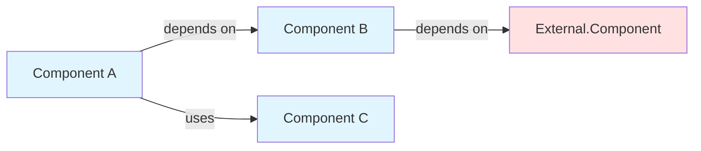
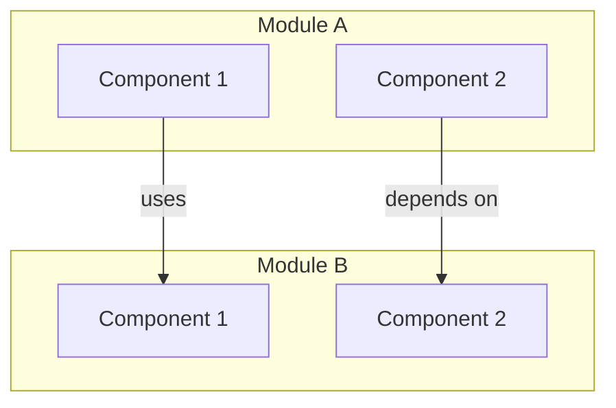

# GatomIA Documentation Generator Skill

## Overview

This skill enables Claude to generate comprehensive, repository-level documentation in the GatomIA style by analyzing module trees and dependency graphs. The system uses a hierarchical, recursive approach to create architecture-aware documentation with visual artifacts.

## Core Capabilities

- **Hierarchical Documentation Generation**: Process modules bottom-up, from leaf components to root-level overview
- **Dependency-Aware Analysis**: Understand cross-module relationships and data flows
- **Multi-Modal Synthesis**: Generate textual documentation with architecture diagrams, data-flow visualizations, and sequence diagrams
- **Recursive Processing**: Handle repositories of arbitrary size through dynamic decomposition
- **Cross-Reference Management**: Maintain coherence across module boundaries

## When to Use This Skill

Use this skill when:
- The user uploads `module_tree.json` and `dependency_graph.json` files
- The user requests "GatomIA-style documentation"
- The user asks to "generate repository documentation"
- The user wants architectural documentation with diagrams
- The user needs comprehensive, hierarchical codebase documentation

## Prerequisites

### Required Files

1. **module_tree.json**: Generated by `mia wiki analyze`
   ```json
   {
     "module_path": {
       "components": ["component_id_1", "component_id_2"],
       "path": "path/to/module",
       "children": { }
     }
   }
   ```

2. **dependency_graph.json**: Generated by `mia wiki analyze`
   ```json
   {
     "component_id": {
       "id": "component_id",
       "name": "ComponentName",
       "component_type": "class",
       "file_path": "/path/to/file.py",
       "depends_on": ["other_component_id"]
     }
   }
   ```

### Generating Analysis Files

If the user doesn't have analysis files:
```bash
mia wiki analyze --repo-path /path/to/repo --output ./docs
```

## Core Workflow

### Phase 1: Analysis & Understanding

1. **Parse Input Files**
   - Load and validate module_tree.json
   - Load and validate dependency_graph.json
   - Use `scripts/codewiki_analyzer.py` for parsing

2. **Analyze Module Hierarchy**
   - Identify leaf modules (no children)
   - Identify parent modules with children
   - Map components to their modules
   - Calculate module complexity

3. **Build Relationship Maps**
   - Create component -> module mapping
   - Build dependency lookup structures
   - Identify cross-module dependencies
   - Find entry points (zero-dependencies components)

### Phase 2: Leaf Module Documentation

For each leaf module (modules with no children):

1. **Component Analysis**
   - Extract all components in the module
   - Gather metadata from dependency graph
   - Identify component types and roles
   - Analyze dependencies (internal & external)

2. **Generate Component Documentation**
   ```markdown
   ## Component: [Name]

   **Type**: [class/function/module]
   **Path**: [file path]
   **Module**: [parent module path]

   ### Purpose
   [Inferred from dependencies and context]

   ### Dependencies
   - Internal: [components within same module]
   - External: [components from other modules]

   ### Used By
   [Components that depend on this one]
   ```

3. **Create Module-Level Documentation**
   - Overview section
   - Architecture diagram (Mermaid)
   - Component list
   - External dependencies
   - Dependents

### Phase 3: Parent Module Synthesis

For parent modules (bottom-up traversal):

1. **Aggregate Child Documentation**
   - Collect all child module docs
   - Identify common patterns
   - Extract architectural themes

2. **Synthesize High-Level Documentation**
   - Overview synthesized from children
   - Inter-module architecture diagram
   - Links to submodule documentation

### Phase 4: Repository Overview Generation

Final synthesis at root level:

1. **Generate Repository Overview**
   - Overall system purpose
   - System-level architecture diagram
   - Module structure overview
   - Getting started guide

## Available Scripts

### `scripts/codewiki_analyzer.py`

Main analysis engine. Usage:
```bash
python scripts/codewiki_analyzer.py <module_tree.json> <dependency_graph.json>
```

Features:
- Module tree parsing
- Dependency graph analysis
- Pattern detection
- Component purpose inference

### `scripts/orchestrator.py`

Documentation orchestration. Usage:
```bash
python scripts/orchestrator.py <module_tree.json> <dependency_graph.json> [output_dir]
```

Features:
- Bottom-up processing order
- Leaf/parent module documentation
- Cross-reference management

### `scripts/diagram_generator.py`

Mermaid diagram generation. Usage:
```bash
python scripts/diagram_generator.py <module_path> <module_tree.json> <dependency_graph.json>
```

Features:
- Architecture diagrams
- Sequence diagrams
- Data flow diagrams

## Documentation Templates

### Module Documentation
See `templates/module.md.template`

### Repository Overview
See `templates/overview.md.template`

## Diagram Generation Guidelines

### Component Dependency Diagrams


### Module Architecture Diagrams


## Analysis Heuristics

### Inferring Component Purpose

1. **From Dependencies**:
   - Many dependencies -> orchestrator/controller
   - No dependencies -> data model/utility
   - Specific type dependencies -> specialized processor

2. **From Dependents**:
   - Many dependents -> core/shared component
   - Few dependents -> specialized feature
   - No dependents -> entry point or unused

3. **From Name & Type**:
   - `*Manager` -> lifecycle/resource management
   - `*Service` -> business logic
   - `*Generator` -> creation/transformation
   - `*Analyzer` -> inspection/analysis
   - `*Parser` -> data transformation
   - `*Builder` -> construction pattern

## Processing Strategy

### For Small Repositories (< 50 components)
1. Process all leaf modules in single pass
2. Generate all diagrams up front
3. Synthesize parent modules
4. Create comprehensive overview

### For Medium Repositories (50-200 components)
1. Process leaf modules in batches by parent
2. Generate diagrams incrementally
3. Synthesize parent modules progressively
4. Assemble overview from parent docs

### For Large Repositories (> 200 components)
1. Process leaf modules in phases
2. Generate core diagrams first, details on-demand
3. Synthesize critical parent modules
4. Create overview with drill-down links

## Output Structure

```
docs/
├── README.md                 # Repository Overview
├── INDEX.md                  # Navigation index
├── architecture/
│   ├── overview.md          # System-level architecture
│   ├── diagrams/            # Architecture diagrams
│   └── data-flows.md        # Data flow documentation
└── modules/
    ├── module_a/
    │   └── README.md        # Module documentation
    └── module_b/
        └── README.md
```

## Error Handling

- **Missing Dependencies**: Note components that reference non-existent IDs
- **Circular Dependencies**: Identify and document circular patterns
- **Incomplete Data**: Handle missing metadata gracefully
- **Invalid Structure**: Validate input files and report issues

## Success Metrics

A successful GatomIA documentation generation includes:
- Complete coverage of all modules and components
- Clear hierarchical structure matching codebase
- Accurate dependency relationships
- Useful visual diagrams at multiple levels
- Actionable information for developers
- Easy navigation between documentation levels
- Consistent terminology and structure

---

**Skill Version**: 0.31.0
**Last Updated**: January 30, 2026
**Requires**: GatomIA CLI v0.31.0+, Python 3.9+
