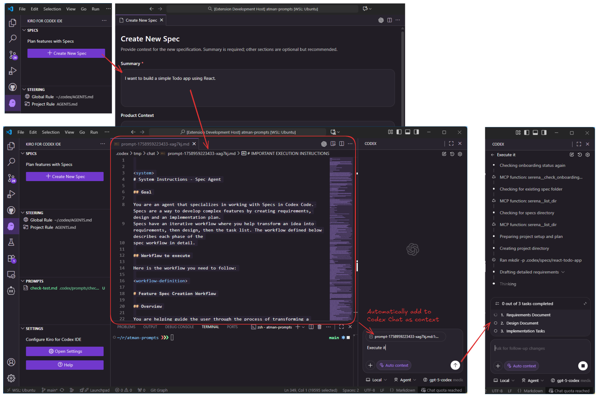
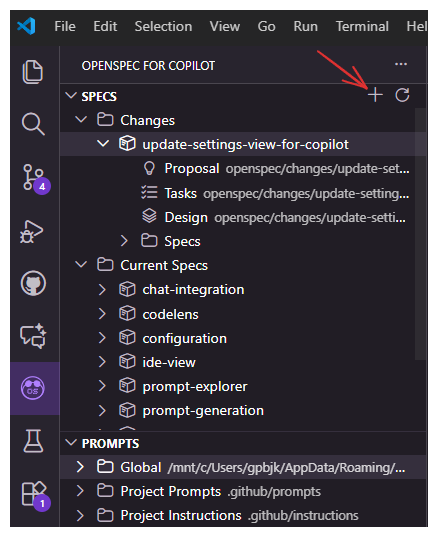
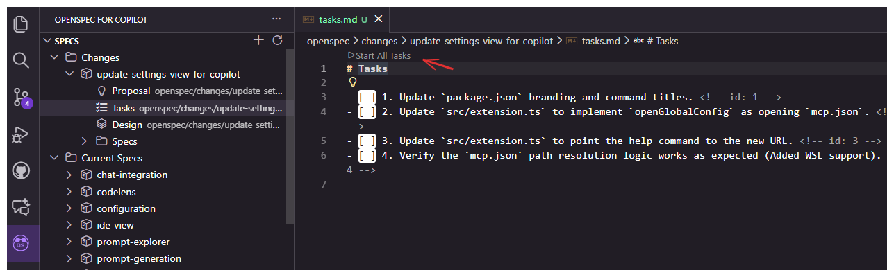
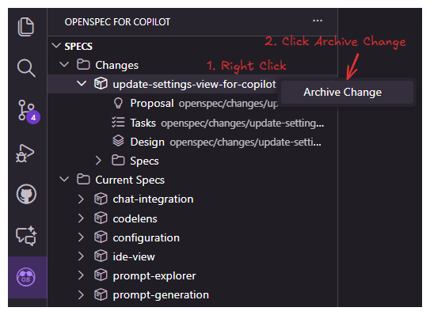

# OpenSpec for Copilot

[](https://marketplace.visualstudio.com/items?itemName=atman-dev.openspec-for-copilot)
[](https://marketplace.visualstudio.com/items?itemName=atman-dev.openspec-for-copilot)
[](https://github.com/atman-33/openspec-for-copilot/stargazers)
[](https://github.com/atman-33/openspec-for-copilot/issues)

OpenSpec for Copilot is a VS Code extension that brings Spec-Driven Development (SDD) to your workflow, leveraging [OpenSpec](https://github.com/Fission-AI/OpenSpec) prompts and **GitHub Copilot**.

It allows you to visually manage Specs, Steering documents (AGENTS.md), and custom prompts, seamlessly integrating with GitHub Copilot Chat to generate high-quality documentation and code.



## Features

### 📝 Spec Management

- **Create Specs**: Run `OpenSpec for Copilot: Create New Spec` (`openspec-for-copilot.spec.create`) to open the creation dialog. Define your summary, product context, and constraints.
- **Generate with Copilot**: The extension compiles your input into an optimized OpenSpec prompt and sends it to **GitHub Copilot Chat** to generate the full specification (Requirements, Design, Tasks).
- **Manage Specs**: Browse generated specs in the **Specs** view.
- **Execute Tasks**: Open `tasks.md` and use the "Start Task" CodeLens to send task context to GitHub Copilot Chat for implementation.

### 🧩 Prompt Management
- **Custom Prompts**: Manage Markdown prompts under `.github/prompts` (configurable).
- **Run Prompts**: Execute prompts directly from the tree view, passing the context to GitHub Copilot Chat.

## Installation

### Prerequisites
- Visual Studio Code 1.84.0 or newer.
- **[GitHub Copilot Chat](https://marketplace.visualstudio.com/items?itemName=GitHub.copilot-chat)** extension must be installed.
- **[OpenSpec](https://github.com/Fission-AI/OpenSpec)** must be globally installed and initialized.

### OpenSpec Global Installation and Initialization:

#### Step 1: Install the CLI globally

```shell
npm install -g @fission-ai/openspec@latest
```

Verify installation:

```shell
openspec --version
```

#### Step 2: Initialize OpenSpec in your project

Navigate to your project directory:

```shell
cd my-project
```

Run the initialization:

```shell
openspec init
```

### Marketplace
Search for "OpenSpec for Copilot" in the VS Code Marketplace and install the extension.

### From Local VSIX
1. Build the package with `npm run package` (produces `openspec-for-copilot-<version>.vsix`).
2. Install via `code --install-extension openspec-for-copilot-<version>.vsix`.

## Usage

### 1. Create a Spec
1. Open the **Specs** view in the Activity Bar.
2. Click **Create New Spec**.
3. Fill in the details (Product Context is required).
4. Click **Create Spec**. This will open GitHub Copilot Chat with a generated prompt.
5. Follow the chat instructions to generate the spec files.

   

### 2. Implement Tasks
1. Open a generated `tasks.md` file.
2. Click **Start All Tasks** above a checklist item.
3. GitHub Copilot Chat will open with the task context. Interact with it to implement the code.

   

### 3. Archive Change
1. Right-click on a Change ID in the **Specs** view.
2. Select **Archive Change** from the context menu.
3. The change will be moved to the archive.

   

## Configuration
All settings live under the `openspec-for-copilot` namespace.

| Setting | Type | Default | Purpose |
| --- | --- | --- | --- |
| `chatLanguage` | string | `English` | The language GitHub Copilot should use for responses. |
| `copilot.specsPath` | string | `openspec` | Workspace-relative path for generated specs. |
| `copilot.promptsPath` | string | `.github/prompts` | Workspace-relative path for Markdown prompts. |
| `views.specs.visible` | boolean | `true` | Show or hide the Specs explorer. |
| `views.prompts.visible` | boolean | `true` | Toggle the Prompts explorer. |
| `views.steering.visible` | boolean | `true` | Toggle the Steering explorer. |
| `views.settings.visible` | boolean | `true` | Toggle the Settings overview. |
| `customInstructions.global` | string | `""` | Global custom instructions appended to all prompts. |
| `customInstructions.createSpec` | string | `""` | Custom instructions for "Create Spec". |
| `customInstructions.startAllTask` | string | `""` | Custom instructions for "Start All Tasks". |
| `customInstructions.runPrompt` | string | `""` | Custom instructions for "Run Prompt". |

Paths accept custom locations inside the workspace; the extension mirrors watchers to match custom directories.

## Workspace Layout
```
.github/
├── prompts/                # Markdown prompts
openspec/
├── AGENTS.md               # Project-specific steering rules
├── project.md              # Project specification
├── <spec>/
│   ├── requirements.md
│   ├── design.md
│   └── tasks.md
LICENSE
src/
├── extension.ts            # Activation, command registration, tree providers
├── features/               # Spec and steering managers
├── providers/              # TreeDataProviders, CodeLens, webviews
├── services/               # Prompt loader (Handlebars templates)
├── utils/                  # Config manager, Copilot chat helpers
└── prompts/                # Prompt source markdown and generated TypeScript
webview-ui/                 # React + Vite webview bundle
scripts/
└── build-prompts.js        # Markdown → TypeScript prompt compiler
```

## Development
1. Install dependencies for both the extension and webview UI:
   - `npm run install:all`
2. Build prompts and bundle the extension:
   - `npm run build` (runs prompt compilation, extension bundle, and webview build)
3. Launch the development host:
   - Press `F5` inside VS Code or run the `Extension` launch configuration.
4. Live development:
   - `npm run watch` (TypeScript watch + webview dev server)
   - `npm --prefix webview-ui run dev` (webview in isolation)
5. Generate prompt modules when editing markdown under `src/prompts`:
   - `npm run build-prompts`

### Testing and Quality
- Unit tests: `npm test`, `npm run test:watch`, or `npm run test:coverage` (Vitest).
- Linting, formatting, and static checks: `npm run lint`, `npm run format`, `npm run check` (Ultracite toolchain).

### Packaging
- Produce a VSIX with `npm run package` (requires `vsce`).
- The output bundle lives in `dist/extension.js`; webview assets emit to `dist/webview/app/`.

## License
MIT License. See [`LICENSE`](LICENSE).

## Credits
Based on [OpenSpec](https://github.com/Fission-AI/OpenSpec) by Fission AI.
Originally forked from [kiro-for-codex-ide](https://github.com/notdp/kiro-for-codex-ide).
