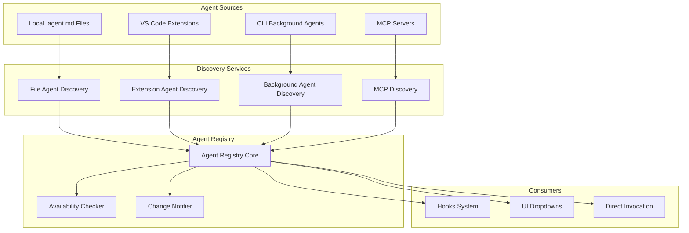
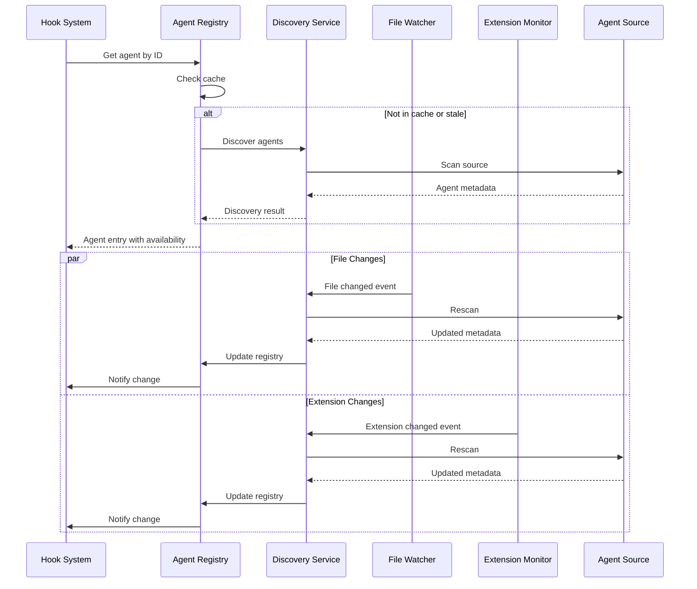

# Agents Management

## Overview
The Agents Management module provides a unified registry and discovery system for all available agents in the ecosystem. It integrates agents from multiple sources (local files, extensions, CLI tools) and provides a consistent interface for the [hooks_system](hooks_system.md) to invoke them. This module enables the "custom agent" action type in hooks.

**Business Value**: Centralizes agent management, enables dynamic agent discovery, and provides reliability guarantees for agent execution in automated workflows.

## Architecture & Design



**Key Patterns**:
- **Registry Pattern**: Centralized agent catalog with metadata
- **Discovery Pattern**: Dynamic detection of available agents
- **Observer Pattern**: Real-time updates on agent availability
- **Adapter Pattern**: Unified interface for diverse agent types

## Core Components

### Agent Registry (IAgentRegistry)
**Purpose**: Central catalog of all available agents with metadata and availability status.

**Business Rules**:
- Agent IDs follow format: `source:name` (e.g., `local:code-reviewer`, `extension:copilot-chat`)
- Supports filtering by type, source, and capabilities
- Maintains real-time availability status
- Provides grouping for UI presentation (local vs background)
- Emits change events for registry updates

### Agent Discovery Services
**Purpose**: Discover agents from various sources with validation and metadata extraction.

**Business Rules**:

#### File Agent Discovery (IFileAgentDiscovery)
- Scans `.agent.md` files in configured directories
- Parses agent metadata (name, description, capabilities)
- Validates agent definitions for required fields
- Monitors directory for file changes

#### Extension Agent Discovery (IExtensionAgentDiscovery)
- Scans VS Code extensions for `chatParticipants` contributions
- Extracts agent metadata from extension manifests
- Validates extension compatibility
- Monitors extension installation/updates

#### Background Agent Discovery
- Detects CLI tools and background processes
- Validates agent availability and version
- Monitors process lifecycle

### File Watcher Service (IFileWatcherService)
**Purpose**: Monitors agent directories for real-time updates.

**Business Rules**:
- Watches `.agent.md` files for changes (create, update, delete)
- Debounces file system events to prevent rapid updates
- Provides disposable event subscriptions
- Handles workspace trust boundaries

### Extension Monitor Service (IExtensionMonitorService)
**Purpose**: Tracks VS Code extension changes affecting agent availability.

**Business Rules**:
- Monitors extension installation, update, and removal
- Validates extension contributions on change
- Provides disposable event subscriptions
- Handles extension activation lifecycle

## Agent Types

### Local Agents
**Source**: `.agent.md` files in workspace
**Characteristics**:
- Defined in Markdown with YAML frontmatter
- Fully customizable by developers
- Workspace-specific configurations
- Fast discovery and execution

### Background Agents
**Source**: CLI tools and long-running processes
**Characteristics**:
- System-wide availability
- Often provide specialized capabilities
- May require installation/configuration
- Slower discovery (process checking)

### Extension Agents
**Source**: VS Code extensions
**Characteristics**:
- Provided by third-party extensions
- Quality varies by extension
- Requires extension activation
- May have licensing restrictions

### MCP Agents
**Source**: MCP (Model Context Protocol) servers
**Characteristics**:
- Tool-based interaction model
- Requires MCP server configuration
- Provides structured tool execution
- Supports parameter validation

## Integration with Hooks System

The agents management module is critical for the [hooks_system](hooks_system.md) custom action execution:

### Agent Selection in Hooks
```typescript
// In hook configuration
const customActionHook = {
    action: {
        type: "custom",
        params: {
            // New format (preferred)
            agentId: "local:code-reviewer",
            agentType: "local",
            
            // Legacy format (deprecated but supported)
            agentName: "code-reviewer",
            
            arguments: "Review {feature} implementation",
            cliOptions: { /* GitHub Copilot CLI options */ }
        }
    }
};
```

### Availability Checking
Before executing a hook with a custom agent:
1. Registry checks agent availability
2. Validates agent capabilities match requirements
3. Returns detailed error if agent unavailable
4. Hook execution proceeds only if agent is available

## Practical Examples

### Example 1: Local Agent Definition (.agent.md)
```markdown
---
name: code-reviewer
description: Automated code review agent
version: 1.0.0
capabilities:
  - code-review
  - security-scan
  - performance-check
author: Team DevOps
---

# Code Reviewer Agent

This agent performs automated code reviews focusing on:
- Code quality and standards
- Security vulnerabilities
- Performance optimizations

## Usage
@code-reviewer [file-path] [review-type]
```

### Example 2: Agent Discovery Implementation
```typescript
class AgentDiscoveryServiceImpl implements IAgentDiscoveryService {
    async discoverAll(): Promise<AgentDiscoveryResult[]> {
        const results: AgentDiscoveryResult[] = [];
        
        // Discover from all sources
        results.push(await this.discoverFromSource(AgentSourceEnum.LOCAL));
        results.push(await this.discoverFromSource(AgentSourceEnum.EXTENSION));
        results.push(await this.discoverFromSource(AgentSourceEnum.BACKGROUND));
        
        return results;
    }
    
    async discoverFromSource(source: AgentSourceEnum): Promise<AgentDiscoveryResult> {
        switch (source) {
            case AgentSourceEnum.LOCAL:
                return this.fileDiscovery.discoverAgents(this.agentsDir);
            case AgentSourceEnum.EXTENSION:
                return this.extensionDiscovery.discoverAgents();
            case AgentSourceEnum.BACKGROUND:
                return this.backgroundDiscovery.discoverAgents();
            default:
                throw new AgentRegistryError(
                    `Unknown agent source: ${source}`,
                    AgentRegistryErrorCode.UNKNOWN_SOURCE
                );
        }
    }
}
```

### Example 3: Hook with Agent Validation
```typescript
class HookExecutor {
    async executeCustomAction(hook: Hook, context: TemplateContext) {
        const params = hook.action.params as CustomActionParams;
        
        // Check agent availability
        const availability = await this.agentRegistry.checkAgentAvailability(
            params.agentId || `local:${params.agentName}`
        );
        
        if (!availability.available) {
            throw new HookExecutionError(
                `Agent unavailable: ${availability.reason}`,
                hook.id
            );
        }
        
        // Execute with validated agent
        return this.customActionExecutor.execute(params, context);
    }
}
```

## Data Flow



## Dependencies

### Internal Dependencies
- **[hooks_system](hooks_system.md)**: Primary consumer of agent registry
- **[ui_view_providers](ui_view_providers.md)**: For agent selection UI
- **[dependencies_management](dependencies_management.md)**: For agent dependency checking

### External Dependencies
- **VS Code Extension API**: For extension agent discovery
- **File System API**: For .agent.md file scanning
- **Process API**: For background agent detection
- **MCP Protocol**: For MCP server integration

## Error Handling

### AgentRegistryError Codes
- `UNKNOWN_SOURCE`: Invalid agent source specified
- `DISCOVERY_FAILED`: Agent discovery process failed
- `VALIDATION_FAILED`: Agent definition validation failed
- `UNAVAILABLE`: Agent currently unavailable
- `PARSE_ERROR`: Failed to parse agent metadata

### Recovery Strategies
1. **Cache Fallback**: Use cached agent data if discovery fails
2. **Retry Logic**: Exponential backoff for transient failures
3. **Graceful Degradation**: Continue with available agents if some fail
4. **User Notification**: Inform users of agent availability issues

## Performance Considerations

- **Caching**: Agent metadata cached with TTL
- **Lazy Discovery**: Agents discovered on first use
- **Incremental Updates**: Only changed agents rescanned
- **Background Scanning**: Non-blocking discovery operations

## Security

- **Agent Validation**: All agents validated before registration
- **Source Verification**: Agent sources verified for trustworthiness
- **Capability Isolation**: Agents run with appropriate permissions
- **Audit Logging**: All agent invocations logged
- **Input Sanitization**: Agent arguments sanitized before execution