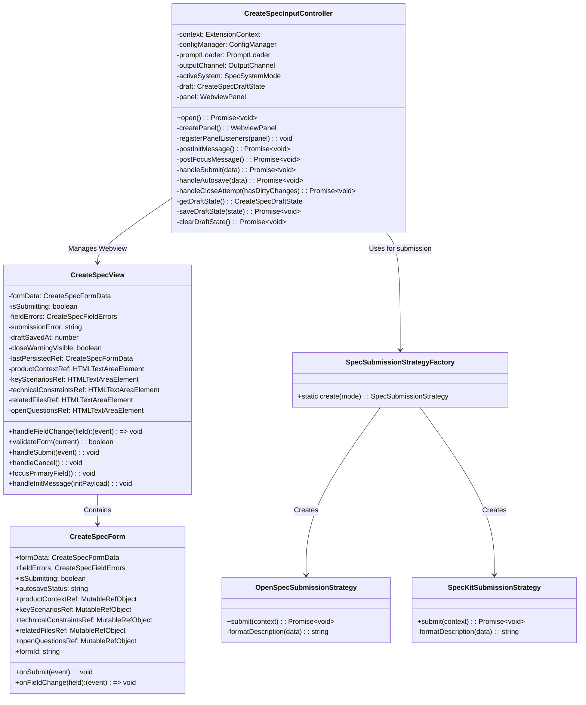
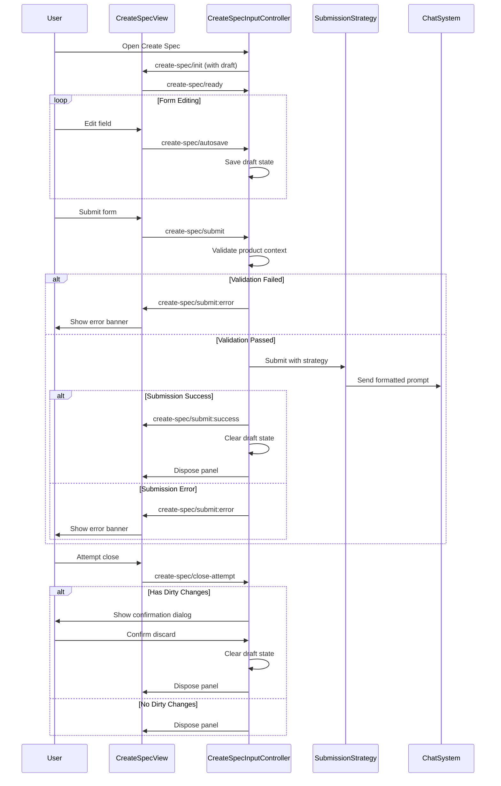

# Create Specification View

The Create Specification View module provides a comprehensive user interface and controller for creating new specifications within the VS Code extension. It handles form input, validation, draft saving, and submission to different specification systems (OpenSpec vs SpecKit).

## Overview

This module enables users to create detailed specifications with structured sections including product context, key scenarios, technical constraints, related files, and open questions. The system supports draft autosaving, validation, and submission to different backend systems based on configuration.

### Key Features
- **Multi-section form** with required and optional fields
- **Draft autosaving** with workspace state persistence
- **Form validation** with real-time error display
- **Dual submission strategies** (OpenSpec vs SpecKit)
- **Unsaved changes protection** with confirmation dialogs
- **Accessibility support** with proper ARIA attributes
- **Responsive status banners** for user feedback

## Architecture



## Components

### 1. CreateSpecInputController (Backend)

The main controller that manages the webview panel and handles communication between the VS Code extension and the React UI.

**Location:** `src/features/spec/create-spec-input-controller.ts`

**Dependencies:**
- `ExtensionContext` - VS Code extension context
- `ConfigManager` - Configuration management
- `PromptLoader` - Prompt template loading
- `OutputChannel` - Logging output
- `SpecSystemMode` - Active system configuration

**Key Methods:**
- `open()` - Opens or reveals the create spec panel
- `handleSubmit(data)` - Processes form submission
- `handleAutosave(data)` - Saves draft state
- `handleCloseAttempt(hasDirtyChanges)` - Manages unsaved changes

### 2. CreateSpecView (Frontend)

The main React component that renders the create specification form and manages UI state.

**Location:** `ui/src/features/create-spec-view/index.tsx`

**State Management:**
- `formData` - Current form values
- `isSubmitting` - Submission in progress flag
- `fieldErrors` - Validation errors
- `submissionError` - Submission error message
- `draftSavedAt` - Timestamp of last draft save
- `closeWarningVisible` - Close warning banner visibility

### 3. CreateSpecForm (Frontend)

Form component that renders individual textarea fields with labels and error handling.

**Location:** `ui/src/features/create-spec-view/components/create-spec-form.tsx`

**Form Fields:**
1. **Product Context** (Required) - Goal, background, and objectives
2. **Key Scenarios** - Acceptance criteria and user scenarios
3. **Technical Constraints** - Libraries, patterns, systems
4. **Related Files** - Impacted files and paths
5. **Open Questions** - Uncertainties and risks

### 4. StatusBanner (Frontend)

Reusable component for displaying status messages with different tones (info, warning, error).

**Location:** `ui/src/features/create-spec-view/components/status-banner.tsx`

### 5. Submission Strategies

**OpenSpecSubmissionStrategy:**
- Reads prompt template from `.github/prompts/openspec-proposal.prompt.md`
- Formats description and sends to chat with instruction type "createSpec"
- Requires workspace folder and prompt file

**SpecKitSubmissionStrategy:**
- Formats description and sends as `/speckit.specify` command
- Direct integration with SpecKit agent

## Data Types

### CreateSpecFormData
```typescript
interface CreateSpecFormData {
    productContext: string;      // Required: Goal, background, objectives
    keyScenarios: string;        // Optional: Acceptance criteria, user scenarios
    technicalConstraints: string; // Optional: Libraries, patterns, systems
    relatedFiles: string;        // Optional: Impacted files and paths
    openQuestions: string;       // Optional: Uncertainties and risks
}
```

### CreateSpecDraftState
```typescript
interface CreateSpecDraftState {
    formData: CreateSpecFormData; // Draft form data
    lastUpdated: number;          // Timestamp of last update
}
```

### CreateSpecInitPayload
```typescript
interface CreateSpecInitPayload {
    shouldFocusPrimaryField: boolean; // Whether to focus product context field
    draft?: CreateSpecDraftState;     // Optional draft state to restore
}
```

### CreateSpecFieldErrors
```typescript
interface CreateSpecFieldErrors {
    productContext?: string; // Validation error for required field
}
```

### Message Types

**Extension → Webview Messages:**
```typescript
type CreateSpecExtensionMessage =
    | { type: "create-spec/init"; payload: CreateSpecInitPayload }
    | { type: "create-spec/submit:success" }
    | { type: "create-spec/submit:error"; payload: { message: string } }
    | { type: "create-spec/confirm-close"; payload: { shouldClose: boolean } }
    | { type: "create-spec/focus" };
```

**Webview → Extension Messages:**
```typescript
type CreateSpecWebviewMessage =
    | { type: "create-spec/submit"; payload: CreateSpecFormData }
    | { type: "create-spec/autosave"; payload: CreateSpecFormData }
    | { type: "create-spec/close-attempt"; payload: { hasDirtyChanges: boolean } }
    | { type: "create-spec/cancel" }
    | { type: "create-spec/ready" };
```

## Business Rules & Validations

### 1. Form Validation Rules
- **Product Context is required** - Must contain non-whitespace content
- **All fields are trimmed** before submission
- **Empty optional fields** are allowed but formatted as empty strings

### 2. Draft Management Rules
- **Autosave on change** - Form changes trigger draft saving
- **Draft persistence** - Saved to workspace state with timestamp
- **Draft restoration** - Loaded on panel open if available
- **Draft clearing** - Cleared on successful submission or explicit discard

### 3. Submission Rules
- **System-specific formatting** - Different formatting for OpenSpec vs SpecKit
- **Error handling** - Submission errors shown in status banner
- **Success handling** - Panel closes on successful submission
- **Required prompt file** - OpenSpec requires `.github/prompts/openspec-proposal.prompt.md`

### 4. Close Protection Rules
- **Unsaved changes detection** - Compares current form with last persisted state
- **Beforeunload handler** - Prevents accidental tab/window closure
- **Confirmation dialog** - Modal warning for unsaved changes
- **Draft preservation** - Cancelled close keeps draft state

## Message Flow



## Examples

### 1. Opening the Create Spec Panel
```typescript
// In your extension code
const controller = new CreateSpecInputController({
    context: extensionContext,
    configManager: configManager,
    promptLoader: promptLoader,
    outputChannel: outputChannel,
    activeSystem: SPEC_SYSTEM_MODE.OPENSPEC
});

await controller.open();
```

### 2. Form Data Example
```typescript
const exampleSpec: CreateSpecFormData = {
    productContext: "Add user authentication to the application with email/password login and OAuth support for Google and GitHub. The system should support role-based access control (admin, user, guest).",
    keyScenarios: "1. User registers with email/password\n2. User logs in with OAuth provider\n3. Admin manages user roles\n4. User resets forgotten password\n5. Session timeout after 24 hours",
    technicalConstraints: "Use NextAuth.js for authentication, PostgreSQL for user storage, JWT for sessions, and implement rate limiting on auth endpoints. Must comply with GDPR and CCPA regulations.",
    relatedFiles: "src/app/auth/login/page.tsx, src/app/auth/register/page.tsx, src/lib/auth.ts, src/components/AuthProvider.tsx, prisma/schema.prisma",
    openQuestions: "Should we support biometric authentication? What are the password complexity requirements? How to handle account merging for users with multiple OAuth providers?"
};
```

### 3. Custom Submission Strategy
```typescript
// Implementing a custom submission strategy
class CustomSubmissionStrategy implements SpecSubmissionStrategy {
    async submit(context: SpecSubmissionContext): Promise<void> {
        // Custom formatting logic
        const formatted = this.customFormat(context);
        
        // Send to custom endpoint or service
        await this.sendToCustomService(formatted);
    }
    
    private customFormat(data: SpecSubmissionContext): string {
        return `SPECIFICATION REQUEST\n\n` +
               `CONTEXT: ${data.productContext}\n\n` +
               `SCENARIOS: ${data.keyScenarios}\n\n` +
               `CONSTRAINTS: ${data.technicalConstraints}\n\n` +
               `FILES: ${data.relatedFiles}\n\n` +
               `QUESTIONS: ${data.openQuestions}`;
    }
}
```

### 4. Handling Form Submission in UI
```typescript
// Example of form submission handling
const handleSubmit = async (formData: CreateSpecFormData) => {
    // Validate required field
    if (!formData.productContext.trim()) {
        setFieldErrors({ productContext: "Product Context is required." });
        return;
    }
    
    // Send to extension
    vscode.postMessage({
        type: "create-spec/submit",
        payload: formData
    });
    
    setIsSubmitting(true);
};
```

## Error Handling

### 1. Validation Errors
- **Product Context Required** - Shows error under field with red text
- **Field focus** - Automatically focuses on errored field
- **Clear on edit** - Errors clear when user starts typing

### 2. Submission Errors
- **Network/System errors** - Displayed in error status banner
- **Prompt file missing** - Specific error for OpenSpec system
- **Workspace not open** - Error when no workspace folder available

### 3. Draft Errors
- **Corrupted draft state** - Silently ignored, form resets to empty
- **Storage errors** - Logged to output channel,不影响用户体验

## Configuration

### System Mode Configuration
The module supports two specification systems:

1. **OpenSpec** (Default)
   - Requires `.github/prompts/openspec-proposal.prompt.md` file
   - Sends formatted description to chat with instruction type "createSpec"
   - Used for open specification workflows

2. **SpecKit**
   - Uses `/speckit.specify` command format
   - Direct integration with SpecKit agent
   - Used for SpecKit-based workflows

### Draft Configuration
- **Storage Key**: `createSpecDraftState`
- **Location**: Extension workspace state
- **Persistence**: Survives extension reload
- **Clear Trigger**: Successful submission or explicit discard

## Dependencies

### Core Dependencies
- **VS Code API** - Webview panels, workspace state, UI components
- **React** - Frontend UI framework
- **TypeScript** - Type safety and interfaces

### Internal Dependencies
- [specification_management](specification_management.md) - Specification types and submission strategies
- [ui_infrastructure](ui_infrastructure.md) - Webview bridge and page registry
- [utilities](utilities.md) - Configuration and telemetry utilities

### External Dependencies
- **NextAuth.js** - Example in technical constraints
- **PostgreSQL** - Example database system
- **JWT** - Example session management

## Testing Considerations

### Unit Tests
1. **Form validation** - Required field validation
2. **Draft management** - Save/load/clear operations
3. **Message handling** - Extension ↔ Webview communication
4. **Submission strategies** - Formatting and submission logic

### Integration Tests
1. **End-to-end flow** - Open → Fill → Submit → Close
2. **Error scenarios** - Validation failures, submission errors
3. **Draft persistence** - Across panel reopen
4. **System switching** - OpenSpec vs SpecKit behavior

### Accessibility Tests
1. **Keyboard navigation** - Tab order, field focus
2. **Screen reader** - ARIA labels, error announcements
3. **Color contrast** - Status banner colors
4. **Form validation** - Error message association

## Common Issues & Solutions

### Issue 1: "Required prompt file not found"
**Solution**: Ensure `.github/prompts/openspec-proposal.prompt.md` exists in workspace root when using OpenSpec system.

### Issue 2: Draft not restoring on reopen
**Solution**: Check workspace state storage and ensure draft state structure matches `CreateSpecDraftState` interface.

### Issue 3: Form submission hanging
**Solution**: Verify chat system is available and prompt loader can read template files.

### Issue 4: Unsaved changes warning not showing
**Solution**: Check `isDirty` calculation logic and beforeunload event handler.

## Related Documentation
- [specification_management](specification_management.md) - Specification types and review flow
- [ui_infrastructure](ui_infrastructure.md) - Webview infrastructure and bridge
- [agents_management](agents_management.md) - Agent system integration
- [preview_system](preview_system.md) - Preview and form systems