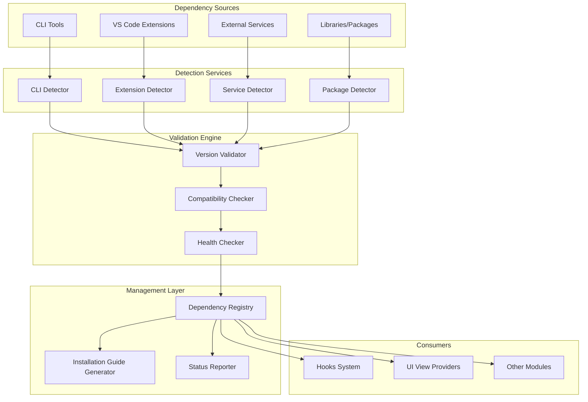
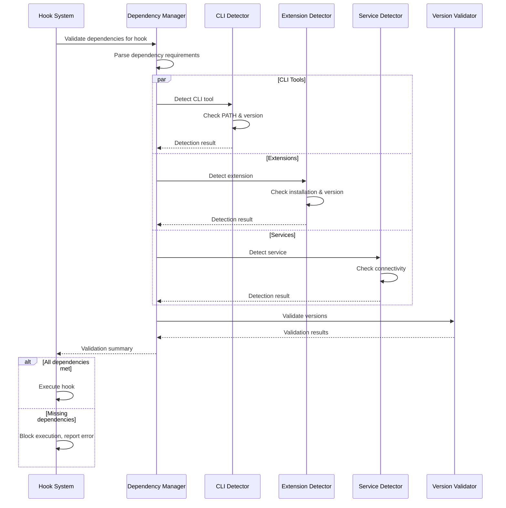

# Dependencies Management

## Overview

The Dependencies Management module detects, validates, and manages all external dependencies required by the system. It ensures that required CLI tools, VS Code extensions, services, and libraries are available and meet version requirements before attempting to execute hooks or other functionality. This module provides proactive dependency checking and helpful installation guidance.

**Business Value**: Prevents runtime failures by ensuring all dependencies are met, reduces support burden with clear installation instructions, and enables graceful degradation when optional dependencies are missing.

## Architecture & Design



**Key Patterns**:

- **Detector Pattern**: Specialized detectors for different dependency types
- **Validator Pattern**: Chain of validation checks (existence, version, compatibility)
- **Registry Pattern**: Centralized dependency state management
- **Guide Pattern**: Context-aware installation guidance generation

## Core Components

### CLIDetectionResult

**Purpose**: Represents the detection result for a CLI tool dependency.

**Structure**:

```typescript
interface CLIDetectionResult {
    toolName: string;           // Name of the CLI tool (e.g., 'git', 'node')
    detected: boolean;          // Whether the tool was found
    version?: string;           // Detected version (if available)
    path?: string;             // Full path to the executable
    meetsRequirement: boolean;  // Whether version meets minimum requirement
    requirement?: string;       // Required version (semver range)
    error?: string;            // Error message if detection failed
}
```

**Business Rules**:

- Tools are detected by checking PATH and common installation locations
- Version parsing handles different tool output formats
- Version comparison uses semantic versioning (semver)
- Missing tools generate installation commands specific to the OS

### Dependency Detection Services

#### CLI Tool Detector

**Purpose**: Detects command-line tools in the system PATH.

**Detection Methods**:

1. **PATH scanning**: Check for executable in system PATH
2. **Common locations**: Check standard installation directories
3. **Version commands**: Execute `--version`, `-v`, or tool-specific commands
4. **Fallback checks**: Alternative detection methods for tricky tools

**Business Rules**:

- Caches detection results with configurable TTL
- Handles permission errors gracefully
- Provides OS-specific installation guidance
- Validates executable permissions

#### Extension Detector

**Purpose**: Detects installed VS Code extensions.

**Detection Methods**:

1. **Extension API**: Query VS Code extension marketplace API
2. **Local scanning**: Check extension installation directories
3. **Manifest parsing**: Read extension manifest for metadata
4. **Activation checking**: Verify extension is properly activated

**Business Rules**:

- Handles both user and workspace extensions
- Validates extension compatibility with current VS Code version
- Checks extension activation status
- Provides extension installation commands

#### Service Detector

**Purpose**: Detects external services (databases, APIs, etc.).

**Detection Methods**:

1. **Port scanning**: Check if service is listening on expected port
2. **Health endpoints**: Call service health check endpoints
3. **Connection testing**: Attempt to establish connection
4. **Authentication testing**: Verify credentials work

**Business Rules**:

- Configurable timeouts for service detection
- Exponential backoff for connection attempts
- Credential validation without exposing secrets
- Service-specific health check implementations

### Validation Engine

**Purpose**: Validates dependencies meet all requirements.

**Validation Stages**:

1. **Existence Check**: Dependency is installed/available
2. **Version Check**: Meets minimum/maximum version requirements
3. **Compatibility Check**: Compatible with other dependencies
4. **Health Check**: Dependency is functioning correctly

**Business Rules**:

- Validation failures provide specific error messages
- Optional dependencies don't block system operation
- Required dependencies prevent feature usage if missing
- Validation results cached to improve performance

## Integration with Hooks System

The dependencies management module is critical for ensuring [hooks_system](hooks_system.md) actions can execute successfully:

### Pre-execution Dependency Checking

```typescript
class HookExecutorWithDependencyCheck {
    async executeHook(hook: Hook, context: TemplateContext) {
        // Check dependencies for this hook's action type
        const dependencies = this.getDependenciesForAction(hook.action.type);
        
        const validation = await this.dependencyManager.validateDependencies(
            dependencies,
            { requiredOnly: true }
        );
        
        if (!validation.allRequiredMet) {
            throw new DependencyError(
                `Missing required dependencies: ${validation.missing.join(', ')}`,
                validation.missing
            );
        }
        
        // Execute hook if dependencies are met
        return this.executeAction(hook.action, context);
    }
    
    private getDependenciesForAction(actionType: ActionType): Dependency[] {
        switch (actionType) {
            case 'git':
                return [{ type: 'cli', name: 'git', minVersion: '2.20.0' }];
            case 'mcp':
                return [
                    { type: 'service', name: 'mcp-server', optional: true },
                    { type: 'extension', name: 'github.copilot', required: true }
                ];
            case 'custom':
                return [
                    { type: 'extension', name: 'github.copilot-chat', required: true }
                ];
            default:
                return [];
        }
    }
}
```

### Dependency-aware Hook Configuration

```typescript
// Hook configuration with dependency requirements
const hookWithDependencies: Hook = {
    id: 'uuid',
    name: 'Git Commit on Spec Approval',
    enabled: true,
    trigger: { /* ... */ },
    action: {
        type: 'git',
        params: {
            operation: 'commit',
            messageTemplate: '...'
        },
        // Metadata about required dependencies
        dependencies: [
            {
                type: 'cli',
                name: 'git',
                minVersion: '2.20.0',
                installGuide: {
                    windows: 'winget install Git.Git',
                    macos: 'brew install git',
                    linux: 'sudo apt-get install git'
                }
            }
        ]
    }
};
```

## Practical Examples

### Example 1: CLI Tool Detection

```typescript
class CLIToolDetectorImpl {
    async detectTool(toolName: string): Promise<CLIDetectionResult> {
        const result: CLIDetectionResult = {
            toolName,
            detected: false,
            meetsRequirement: false
        };
        
        try {
            // Check if tool exists in PATH
            const path = await this.findInPath(toolName);
            if (!path) {
                result.error = `${toolName} not found in PATH`;
                return result;
            }
            
            result.path = path;
            result.detected = true;
            
            // Get version
            const version = await this.getVersion(toolName, path);
            if (version) {
                result.version = version;
                
                // Check if version meets requirement
                if (this.requirements[toolName]) {
                    result.meetsRequirement = semver.satisfies(
                        version,
                        this.requirements[toolName]
                    );
                    result.requirement = this.requirements[toolName];
                } else {
                    result.meetsRequirement = true; // No requirement specified
                }
            }
            
        } catch (error) {
            result.error = `Detection failed: ${error.message}`;
        }
        
        return result;
    }
}
```

### Example 2: Dependency Validation in UI

```typescript
// UI component for dependency status
class DependencyStatusComponent {
    async checkAndDisplayDependencies() {
        // Check all dependencies
        const message: DependenciesCheckMessage = {
            type: 'dependencies-check'
        };
        
        const result = await this.sendToProvider(message);
        
        // Group by status
        const groups = {
            met: result.dependencies.filter(d => d.status === 'met'),
            missing: result.dependencies.filter(d => d.status === 'missing'),
            outdated: result.dependencies.filter(d => d.status === 'outdated'),
            optional: result.dependencies.filter(d => d.optional)
        };
        
        // Display with appropriate actions
        this.renderDependencyList(groups);
        
        // Show installation options for missing dependencies
        if (groups.missing.length > 0) {
            this.showInstallationOptions(groups.missing);
        }
    }
    
    private showInstallationOptions(dependencies: Dependency[]) {
        // Generate OS-specific installation commands
        const commands = dependencies.map(dep => ({
            name: dep.name,
            command: this.getInstallCommand(dep),
            description: dep.description
        }));
        
        // Display in UI with copy-to-clipboard functionality
        this.renderInstallationCommands(commands);
    }
}
```

### Example 3: Graceful Degradation

```typescript
// Feature that works with or without optional dependency
class FeatureWithOptionalDependency {
    private dependencyAvailable: boolean = false;
    
    async initialize() {
        // Check for optional dependency
        const detection = await this.dependencyManager.checkDependency({
            type: 'cli',
            name: 'optional-tool',
            optional: true
        });
        
        this.dependencyAvailable = detection.detected && detection.meetsRequirement;
        
        if (!this.dependencyAvailable) {
            console.warn('Optional tool not available, using fallback implementation');
        }
    }
    
    async execute() {
        if (this.dependencyAvailable) {
            // Use enhanced functionality with dependency
            return this.executeWithDependency();
        } else {
            // Use basic functionality without dependency
            return this.executeWithoutDependency();
        }
    }
}
```

## Data Flow



## Dependency Types and Detection Strategies

### CLI Tools

**Examples**: `git`, `node`, `python`, `docker`
**Detection**: PATH scanning, version command execution
**Installation**: Package managers (apt, brew, chocolatey, etc.)

### VS Code Extensions

**Examples**: `github.copilot`, `github.copilot-chat`, custom extensions
**Detection**: Extension marketplace API, local installation scanning
**Installation**: VS Code extension installation commands

### External Services

**Examples**: Databases, APIs, MCP servers, authentication services
**Detection**: Network connectivity, health endpoints, authentication
**Installation**: Service-specific setup procedures

### Libraries/Packages

**Examples**: npm packages, Python packages, system libraries
**Detection**: Package manager queries, import/require testing
**Installation**: Package manager installation commands

## Dependencies

### Internal Dependencies

- **[hooks_system](hooks_system.md)**: For pre-execution dependency validation
- **[ui_view_providers](ui_view_providers.md)**: For dependency status UI
- **[agents_management](agents_management.md)**: For agent dependency checking

### External Dependencies

- **VS Code Extension API**: For extension detection
- **System APIs**: For process execution and PATH scanning
- **Network APIs**: For service connectivity testing
- **Package Managers**: For library detection (optional)

## Error Handling

### Dependency Error Types

1. **Missing Dependency**: Required tool/extension not installed
2. **Version Mismatch**: Installed version doesn't meet requirements
3. **Service Unavailable**: External service not reachable
4. **Permission Denied**: Insufficient permissions to access dependency
5. **Configuration Error**: Dependency misconfigured

### Recovery Strategies

- **Installation Guidance**: Provide specific installation commands
- **Version Upgrades**: Suggest upgrade commands for outdated dependencies
- **Alternative Features**: Offer fallback functionality when possible
- **Configuration Assistance**: Help users fix configuration issues

## Performance Considerations

- **Caching**: Cache detection results with appropriate TTLs
- **Parallel Detection**: Detect multiple dependencies concurrently
- **Lazy Validation**: Validate dependencies only when needed
- **Incremental Updates**: Only re-check changed dependencies
- **Background Checking**: Non-blocking dependency validation

## Security

- **Safe Command Execution**: Sanitize commands before execution
- **Permission Validation**: Check permissions before attempting operations
- **Credential Protection**: Never expose credentials in error messages
- **Input Validation**: Validate all user-provided dependency configurations
- **Audit Logging**: Log dependency checks and installation attempts
