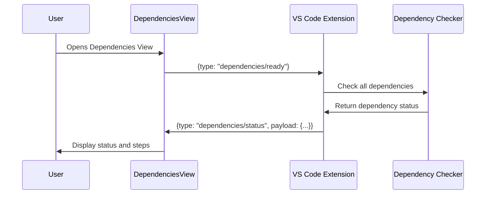
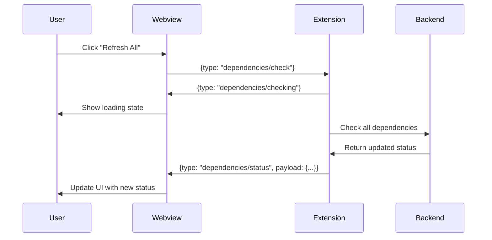
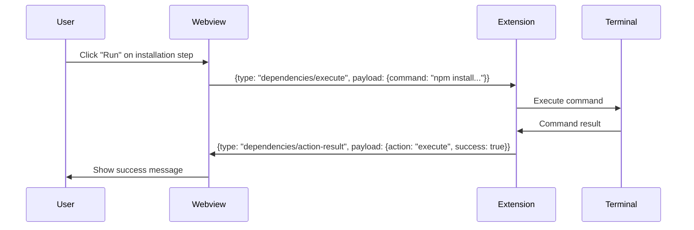

# Dependencies View

## Overview

The Dependencies View module provides a user interface for managing and installing required command-line dependencies for SpecKit and OpenSpec workflows. It allows users to check installation status, view installation steps, and execute commands directly from the VS Code extension.

This module implements a React-based webview that communicates with the extension backend through a structured message protocol to provide real-time dependency status updates and command execution capabilities.

## Components

### Core Types

#### DependencyStatus
```typescript
interface DependencyStatus {
    name: string;           // Dependency name (e.g., "speckit", "openspec")
    installed: boolean;     // Whether the dependency is installed
    version?: string;       // Installed version (if available)
    error?: string;         // Error message if check failed
    command: string;        // Installation command
}
```

#### InstallationStep
```typescript
interface InstallationStep {
    id: string;            // Unique identifier for the step
    title: string;         // Step title
    description: string;   // Detailed description
    command: string;       // Command to execute
    platform?: "darwin" | "linux" | "win32" | "all"; // Platform-specific step
}
```

### Message Protocol

#### Webview to Extension Messages (`DependenciesWebviewMessage`)
Messages sent from the webview to the extension backend:

```typescript
type DependenciesWebviewMessage =
    | { type: "dependencies/ready" }  // Webview ready, request initial status
    | { type: "dependencies/check" }  // Check all dependencies
    | { type: "dependencies/check-one"; payload: { name: string } }  // Check single dependency
    | { type: "dependencies/copy"; payload: { command: string } }    // Copy command to clipboard
    | { type: "dependencies/paste"; payload: { command: string } }   // Paste command to terminal
    | { type: "dependencies/execute"; payload: { command: string } }; // Execute command in terminal
```

#### Extension to Webview Messages (`DependenciesExtensionMessage`)
Messages sent from the extension to the webview:

```typescript
type DependenciesExtensionMessage =
    | {
        type: "dependencies/status";
        payload: {
            dependencies: DependencyStatus[];
            steps: InstallationStep[];
        };
      }
    | { type: "dependencies/updated"; payload: DependencyStatus }  // Single dependency updated
    | { type: "dependencies/checking"; payload: { name?: string } } // Checking in progress
    | { type: "dependencies/error"; payload: { message: string } }  // Error occurred
    | {
        type: "dependencies/action-result";
        payload: { action: string; success: boolean; message?: string };
      };
```

### UI Components

#### Main Component: `DependenciesView`
The primary React component that renders the dependency management interface.

**Key Features:**
- Displays dependency status with visual indicators
- Shows installation steps with actionable commands
- Provides refresh functionality for individual or all dependencies
- Supports command copying, pasting, and execution

**State Management:**
```typescript
const [dependencies, setDependencies] = useState<DependencyStatus[]>([]);
const [steps, setSteps] = useState<InstallationStep[]>([]);
const [isLoading, setIsLoading] = useState(true);
const [checkingName, setCheckingName] = useState<string | undefined>();
const [error, setError] = useState<string | undefined>();
const [actionMessage, setActionMessage] = useState<string | undefined>();
```

#### Subcomponent: `DependencyRow`
Renders individual dependency status rows with refresh capability.

**Props:**
```typescript
interface DependencyRowProps {
    dependency: DependencyStatus;
    checkingName?: string;
    onRefresh: (name: string) => void;
}
```

**Visual States:**
- ✅ Green checkmark for installed dependencies
- 🔄 Spinning icon for checking dependencies
- ❌ Red error icon for missing dependencies

#### Subcomponent: `InstallationStepCard`
Displays installation steps with command execution options.

**Props:**
```typescript
interface InstallationStepCardProps {
    step: InstallationStep;
    index: number;
    onCopy: (command: string) => void;
    onPaste: (command: string) => void;
    onExecute: (command: string) => void;
}
```

**Action Buttons:**
- **Copy**: Copies command to clipboard
- **Paste**: Pastes command to terminal
- **Run**: Executes command directly in terminal

## Examples

### Basic Usage Example

```typescript
// In your webview provider
import DependenciesView from "./dependencies-view";

// The component is automatically registered in the page registry
// and can be accessed via the "dependencies" page type
```

### Message Handling Example

```typescript
// Example of handling webview messages in the extension
import type { DependenciesWebviewMessage } from "./types";

function handleWebviewMessage(message: DependenciesWebviewMessage) {
    switch (message.type) {
        case "dependencies/ready":
            // Send initial status
            sendStatusUpdate();
            break;
        case "dependencies/check":
            // Check all dependencies
            checkAllDependencies();
            break;
        case "dependencies/check-one":
            // Check specific dependency
            checkDependency(message.payload.name);
            break;
        case "dependencies/execute":
            // Execute command in terminal
            executeCommand(message.payload.command);
            break;
    }
}
```

### Dependency Status Update Example

```typescript
// Example of sending status updates to the webview
const statusMessage: DependenciesExtensionMessage = {
    type: "dependencies/status",
    payload: {
        dependencies: [
            {
                name: "speckit",
                installed: true,
                version: "1.2.3",
                command: "npm install -g @speckit/cli"
            },
            {
                name: "openspec",
                installed: false,
                error: "Not found in PATH",
                command: "npm install -g openspec"
            }
        ],
        steps: [
            {
                id: "install-speckit",
                title: "Install SpecKit CLI",
                description: "Global installation via npm",
                command: "npm install -g @speckit/cli",
                platform: "all"
            }
        ]
    }
};

// Send to webview
webview.postMessage(statusMessage);
```

## Message Flow

### Initialization Sequence



### Dependency Check Flow



### Command Execution Flow



## Business Rules and Validations

### Dependency Checking Rules

1. **Version Validation**: 
   - Dependencies must meet minimum version requirements
   - Version strings are parsed and compared semantically

2. **Installation Status**:
   - A dependency is considered "installed" if:
     - The CLI tool is found in system PATH
     - Executable version check succeeds
     - No permission errors occur during execution

3. **Error Handling**:
   - Network timeouts: 30-second timeout for remote checks
   - Permission errors: Reported with actionable guidance
   - Version mismatches: Warn about incompatible versions

### Command Execution Rules

1. **Security Validation**:
   - Commands are validated against allowed patterns
   - No arbitrary command execution allowed
   - Only pre-defined installation commands can be executed

2. **Platform Compatibility**:
   - Platform-specific commands are filtered based on OS
   - `platform` field in `InstallationStep` determines availability
   - Fallback to "all" platform commands when specific ones unavailable

3. **User Confirmation**:
   - Execution of potentially destructive commands requires confirmation
   - Progress feedback is provided during execution
   - Results are displayed with clear success/error indicators

### UI State Management Rules

1. **Loading States**:
   - Show loading indicator when checking all dependencies
   - Show individual loading indicator for single dependency checks
   - Clear loading states on completion or error

2. **Error Display**:
   - Errors are displayed in a dedicated error panel
   - Error messages are user-friendly and actionable
   - Errors clear on subsequent successful operations

3. **Success Feedback**:
   - Action success messages display for 3 seconds
   - Visual indicators update immediately on status changes
   - "All installed" banner shows when all dependencies are satisfied

## Integration Points

### With `dependencies_management` Module
- Uses `CLIDetectionResult` interface for dependency checking results
- Integrates with dependency checking services for status verification

### With `ui_view_providers` Module
- Implements provider message interfaces (`DependenciesReadyMessage`, etc.)
- Registered as "dependencies" page type in the page registry
- Uses the same message bridge pattern as other views

### With `welcome_setup` Module
- Shares `DependencyStatus` type structure
- Consistent dependency checking logic across modules
- Similar installation step presentation patterns

## Common Use Cases

### 1. First-time Setup
```typescript
// User opens extension for the first time
// Dependencies view shows missing dependencies
// User follows installation steps
// All dependencies become installed
```

### 2. Dependency Update Check
```typescript
// User wants to update to latest versions
// Clicks "Refresh All" to check current status
// Views available updates in installation steps
// Executes update commands
```

### 3. Troubleshooting Installation
```typescript
// Installation fails
// Error message displays with details
// User can copy error for support
// Retry installation with modified commands
```

## Testing Considerations

### Unit Tests Should Verify:
1. Message serialization/deserialization
2. UI state transitions
3. Command validation logic
4. Platform-specific filtering

### Integration Tests Should Verify:
1. End-to-end message flow
2. Actual command execution
3. Dependency detection accuracy
4. Error handling scenarios

## Related Documentation

- [dependencies_management.md](dependencies_management.md): Backend dependency checking services
- [ui_view_providers.md](ui_view_providers.md): Webview provider infrastructure
- [welcome_setup.md](welcome_setup.md): Welcome screen with dependency status
- [preview_system.md](preview_system.md): Similar webview message patterns