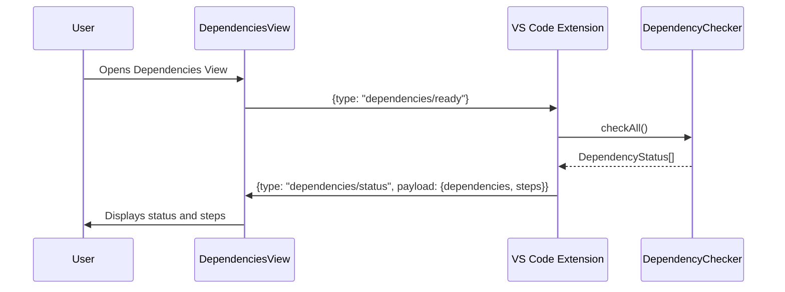
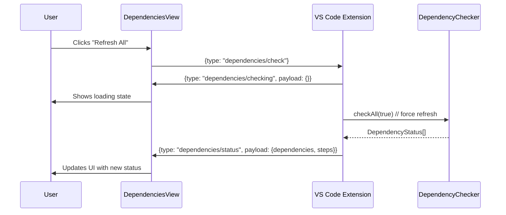
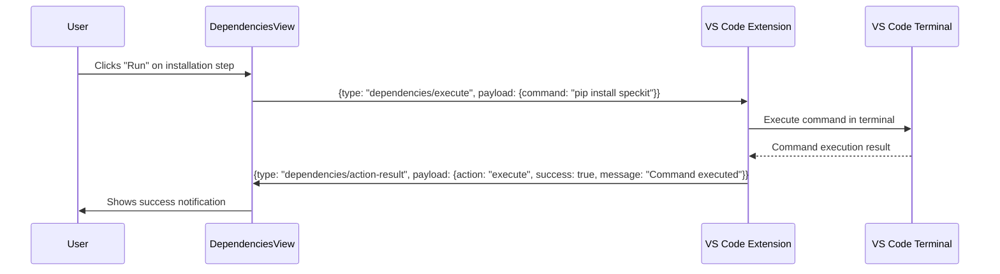

# Dependencies View

## Overview

The Dependencies View module provides a user interface for managing and installing required command-line dependencies for GatomIA workflows. It allows users to check installation status, view version information, and execute installation commands for tools like SpecKit and OpenSpec.

## Components

### Core Types

#### `DependencyStatus`
Represents the installation status of a single dependency.

```typescript
interface DependencyStatus {
    name: string;           // Display name of the dependency
    installed: boolean;     // Whether the dependency is installed
    version?: string;       // Installed version (if available)
    error?: string;         // Error message if check failed
    command: string;        // Installation command
}
```

#### `InstallationStep`
Represents a step in the installation process.

```typescript
interface InstallationStep {
    id: string;            // Unique identifier for the step
    title: string;         // Step title
    description: string;   // Detailed description
    command: string;       // Command to execute
    platform?: "darwin" | "linux" | "win32" | "all"; // Platform-specific step
}
```

### Message Types

#### Webview to Extension Messages (`DependenciesWebviewMessage`)
Messages sent from the webview to the VS Code extension.

```typescript
type DependenciesWebviewMessage =
    | { type: "dependencies/ready" }  // Webview ready for initial data
    | { type: "dependencies/check" }  // Check all dependencies
    | { type: "dependencies/check-one"; payload: { name: string } }  // Check single dependency
    | { type: "dependencies/copy"; payload: { command: string } }    // Copy command to clipboard
    | { type: "dependencies/paste"; payload: { command: string } }   // Paste command to terminal
    | { type: "dependencies/execute"; payload: { command: string } }; // Execute command in terminal
```

#### Extension to Webview Messages (`DependenciesExtensionMessage`)
Messages sent from the extension to the webview.

```typescript
type DependenciesExtensionMessage =
    | {
        type: "dependencies/status";
        payload: {
            dependencies: DependencyStatus[];
            steps: InstallationStep[];
        };
      }
    | { type: "dependencies/updated"; payload: DependencyStatus }  // Single dependency updated
    | { type: "dependencies/checking"; payload: { name?: string } } // Checking in progress
    | { type: "dependencies/error"; payload: { message: string } }  // Error occurred
    | {
        type: "dependencies/action-result";
        payload: { action: string; success: boolean; message?: string };
      };
```

### UI Components

#### `DependenciesView`
Main React component that renders the dependencies management interface.

**Features:**
- Displays status of all dependencies with visual indicators
- Shows installation steps with copy/paste/execute actions
- Provides refresh functionality for individual or all dependencies
- Shows error messages and success notifications
- Responsive loading states during dependency checks

#### `DependencyRow`
Component that renders a single dependency row in the status list.

**Props:**
```typescript
interface DependencyRowProps {
    dependency: DependencyStatus;    // Dependency status data
    checkingName?: string;           // Name of dependency currently being checked
    onRefresh: (name: string) => void; // Refresh callback
}
```

#### `InstallationStepCard`
Component that renders an installation step with command and actions.

**Props:**
```typescript
interface InstallationStepCardProps {
    step: InstallationStep;          // Step data
    index: number;                   // Step number (1-based)
    onCopy: (command: string) => void;    // Copy command callback
    onPaste: (command: string) => void;   // Paste command callback
    onExecute: (command: string) => void; // Execute command callback
}
```

## Examples

### Basic Usage

```typescript
// In a React component
import { DependenciesView } from "@/features/dependencies-view";

function App() {
    return (
        <div className="app">
            <DependenciesView />
        </div>
    );
}
```

### Message Handling Example

```typescript
// Extension-side message handling
import type { DependenciesWebviewMessage } from "@/features/dependencies-view/types";

function handleWebviewMessage(message: DependenciesWebviewMessage) {
    switch (message.type) {
        case "dependencies/ready":
            // Send initial status
            sendStatusUpdate();
            break;
        case "dependencies/check":
            // Check all dependencies
            checkAllDependencies();
            break;
        case "dependencies/check-one":
            // Check specific dependency
            checkDependency(message.payload.name);
            break;
        case "dependencies/copy":
            // Copy command to clipboard
            vscode.env.clipboard.writeText(message.payload.command);
            break;
        case "dependencies/paste":
            // Paste command to active terminal
            pasteToTerminal(message.payload.command);
            break;
        case "dependencies/execute":
            // Execute command in terminal
            executeInTerminal(message.payload.command);
            break;
    }
}
```

### Dependency Status Example

```typescript
// Example dependency status data
const dependencies: DependencyStatus[] = [
    {
        name: "SpecKit CLI",
        installed: true,
        version: "1.2.3",
        command: "pip install speckit"
    },
    {
        name: "OpenSpec CLI",
        installed: false,
        error: "Command not found",
        command: "npm install -g openspec"
    }
];

// Example installation steps
const steps: InstallationStep[] = [
    {
        id: "install-python",
        title: "Install Python",
        description: "Ensure Python 3.8+ is installed on your system",
        command: "python --version",
        platform: "all"
    },
    {
        id: "install-speckit",
        title: "Install SpecKit CLI",
        description: "Install the SpecKit command-line tool",
        command: "pip install speckit",
        platform: "all"
    }
];
```

## Flows

### Initialization Flow



### Dependency Check Flow



### Command Execution Flow



## Business Rules and Validations

### Dependency Checking Rules

1. **Cache Validation**: Dependency checks are cached for 60 seconds (configurable via `CACHE_TTL_MS`)
2. **Force Refresh**: Users can force refresh by clicking "Refresh All" button
3. **Individual Checks**: Single dependency checks bypass cache
4. **Timeout Handling**: CLI checks timeout after 5 seconds (1 second in test environments)

### Installation Step Rules

1. **Platform Specificity**: Steps can be marked as platform-specific (`darwin`, `linux`, `win32`, or `all`)
2. **Command Validation**: Commands should be executable shell commands
3. **Step Ordering**: Steps are displayed in the order provided by the extension

### UI State Management Rules

1. **Loading States**: Show loading indicators during dependency checks
2. **Error Display**: Show error messages in dedicated error containers
3. **Success Notifications**: Show temporary success notifications for actions
4. **Button States**: Disable buttons during operations to prevent double-clicks

## Integration Points

### Related Modules

- **[dependencies_management](dependencies_management.md)**: Provides `DependencyChecker` service for CLI detection
- **[ui_view_providers](ui_view_providers.md)**: Provides `DependenciesViewProvider` for webview communication
- **[welcome_setup](welcome_setup.md)**: Shares dependency status types and checking logic

### Dependencies

The module depends on:
- React for UI components
- VS Code webview API for extension communication
- `@/bridge/vscode` for message passing
- `DependencyStatus` and `InstallationStep` types from the extension

## Error Handling

### Common Error Scenarios

1. **CLI Not Found**: When a required CLI tool is not installed
2. **Network Issues**: When installation commands fail due to network problems
3. **Permission Errors**: When commands require elevated privileges
4. **Version Mismatch**: When installed version doesn't meet requirements

### Error Display

Errors are displayed in the UI with:
- Red error containers for general errors
- Red text for individual dependency errors
- Clear error messages with actionable information
- Automatic error clearing on successful operations

## Testing Considerations

### Unit Testing

1. **Component Rendering**: Test that components render correctly with various states
2. **Message Handling**: Test message sending and receiving logic
3. **State Updates**: Test UI state changes in response to messages
4. **Button Interactions**: Test click handlers and disabled states

### Integration Testing

1. **Extension Communication**: Test end-to-end message flow with the extension
2. **Dependency Checking**: Test integration with `DependencyChecker` service
3. **Command Execution**: Test command execution in terminal environments

## Performance Considerations

1. **Caching**: Dependency checks are cached to improve performance
2. **Lazy Loading**: UI components load only when needed
3. **Debounced Actions**: User actions are handled efficiently
4. **Memory Management**: Event listeners are properly cleaned up

## Accessibility

The UI includes:
- Semantic HTML structure
- ARIA labels for interactive elements
- Keyboard navigation support
- Color contrast compliance
- Screen reader compatibility