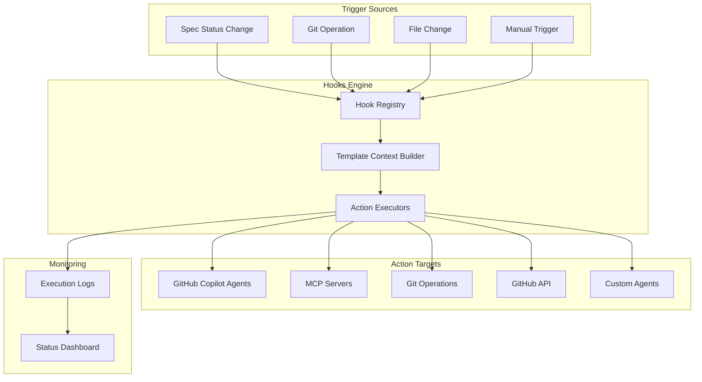
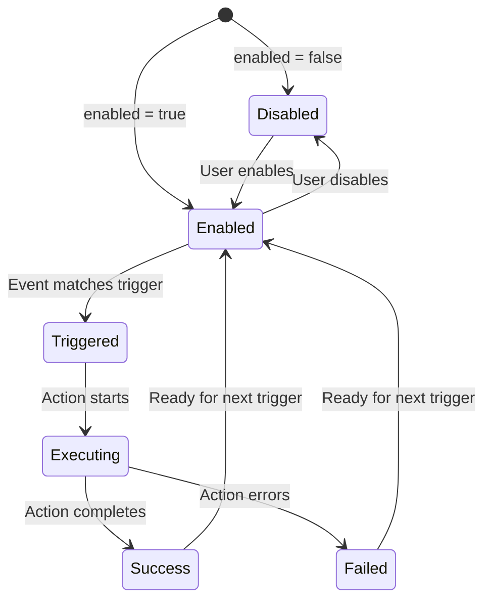
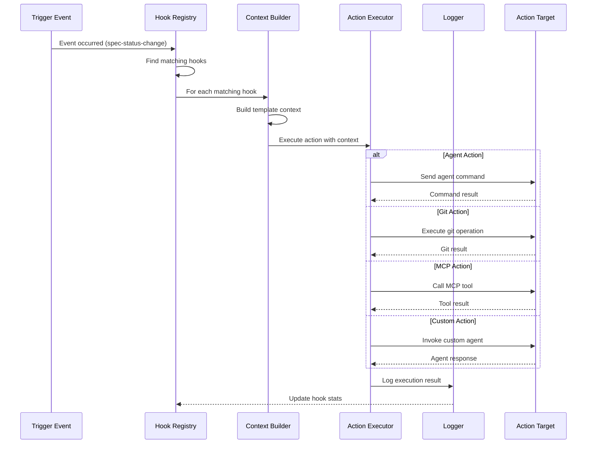

# Hooks System

## Overview
The Hooks System is an event-driven automation framework that enables developers to define custom workflows triggered by specific development activities. Think of it as "IFTTT for developers" - when a certain event occurs (like a spec status change, git commit, or file save), the system automatically executes configured actions (like running agents, executing MCP tools, or creating GitHub issues).

**Business Value**: Automates repetitive development tasks, enforces team workflows, and integrates disparate tools into cohesive workflows without manual intervention.

## Architecture & Design



**Key Patterns**:
- **Observer Pattern**: Hooks observe specific events and react accordingly
- **Strategy Pattern**: Different action executors for different action types
- **Builder Pattern**: TemplateContextBuilder constructs execution context
- **Repository Pattern**: Hook registry manages persistent hook definitions

## Core Components

### Hook
**Purpose**: Defines a single automation rule with trigger conditions and action configuration.

**Business Rules**:
- Hook names must be ≤ 100 characters
- UUID v4 format required for IDs
- Enabled by default (`enabled: true`)
- Execution count increments on each successful run
- Last execution timestamp tracks most recent run

**State Machine**:


### HookExecutionLog
**Purpose**: Tracks execution history for auditing, debugging, and monitoring.

**Business Rules**:
- Each execution generates a unique `executionId` for chain correlation
- `chainDepth` tracks nested/sequential hook executions (0 = first in chain)
- Duration calculated only when completed (`completedAt - triggeredAt`)
- Context snapshot preserves trigger state for debugging
- Error details captured for failed executions

### TemplateContextBuilder
**Purpose**: Constructs execution context with template variables for action parameterization.

**Business Rules**:
- Always includes `timestamp` (ISO format) and `triggerType`
- Standard variables: `user`, `branch`, `feature` (optional)
- Spec-specific variables: `specId`, `specPath`, `oldStatus`, `newStatus`, `changeAuthor`
- Supports custom dynamic variables from trigger events
- Prevents overwriting standard variables with custom ones

### CustomActionExecutor
**Purpose**: Executes custom agent actions by invoking GitHub Copilot chat participants.

**Business Rules**:
- Agent names must be alphanumeric with hyphens only
- Agent names cannot start or end with hyphens
- Template variables in arguments are expanded before execution
- Prompts follow format: `@agentName arguments`
- Validates parameters before execution attempt

### Agent Discovery System
**Purpose**: Discovers and manages available agents from multiple sources.

**Business Rules**:
- Two agent types: `local` (.agent.md files) and `background` (CLI/extension)
- Agent IDs follow format: `source:name` (e.g., `local:code-reviewer`)
- Registry maintains real-time availability status
- Supports dynamic discovery from file changes and extension updates

## Action Types

### Agent Actions
Execute built-in GitHub Copilot agents with specific commands:
```typescript
interface AgentActionParams {
    command: string; // e.g., '/speckit.clarify', '/speckit.refine'
}
```

### Git Actions
Perform Git operations with templated commit messages:
```typescript
interface GitActionParams {
    operation: GitOperation; // 'commit', 'push', 'pull', etc.
    messageTemplate: string; // Supports {branch}, {feature}, etc.
    pushToRemote?: boolean; // Auto-push after commit
}
```

### GitHub Actions
Interact with GitHub API for issue/PR management:
```typescript
interface GitHubActionParams {
    operation: GitHubOperation; // 'create-issue', 'create-pr', 'close-issue'
    repository?: string; // 'owner/repo' (defaults to current)
    titleTemplate?: string; // Templated title
    bodyTemplate?: string; // Templated body
    issueNumber?: number; // For update/close operations
}
```

### MCP Actions
Execute MCP (Model Context Protocol) tools with parameter mapping:
```typescript
interface MCPActionParams {
    modelId?: string; // LLM model (gpt-4o, claude-3-5-sonnet)
    prompt: string; // Instruction for the agent
    selectedTools: SelectedMCPTool[]; // Multiple tool selection
    parameterMappings?: ParameterMapping[]; // Template → parameter mapping
    timeout?: number; // 1000-300000ms override
}
```

### Custom Actions
Invoke custom agents with full CLI option support:
```typescript
interface CustomActionParams {
    agentId?: string; // "source:name" format (preferred)
    agentName?: string; // Legacy support
    agentType?: "local" | "background"; // Type override
    prompt?: string; // Agent instruction
    selectedTools?: SelectedMCPTool[]; // MCP tools for agent
    arguments?: string; // Template string with {variables}
    cliOptions?: CopilotCliOptions; // Full CLI parameter support
}
```

## Practical Examples

> [!TIP]
> Hooks shine when automating repetitive workflows. Start with simple triggers and expand as you identify patterns.

### Example 1: Auto-Clarify on Spec Creation
```typescript
const clarifyHook: Hook = {
    id: "uuid-v4-here",
    name: "Auto-Clarify New Specs",
    enabled: true,
    trigger: {
        type: "spec-status-change",
        conditions: {
            oldStatus: "draft",
            newStatus: "ready-for-review"
        }
    },
    action: {
        type: "agent",
        params: {
            command: "/speckit.clarify"
        }
    },
    createdAt: Date.now(),
    modifiedAt: Date.now(),
    executionCount: 0
};
```

### Example 2: Git Commit on Spec Approval
```typescript
const gitCommitHook: Hook = {
    id: "uuid-v4-here",
    name: "Commit Approved Specs",
    enabled: true,
    trigger: {
        type: "spec-status-change",
        conditions: {
            oldStatus: "in-review",
            newStatus: "approved"
        }
    },
    action: {
        type: "git",
        params: {
            operation: "commit",
            messageTemplate: "feat: {feature} - Spec approved\n\nSpec ID: {specId}\nApproved by: {changeAuthor}",
            pushToRemote: true
        }
    },
    createdAt: Date.now(),
    modifiedAt: Date.now(),
    executionCount: 0
};
```

### Example 3: Custom Agent with MCP Tools
```typescript
const codeReviewHook: Hook = {
    id: "uuid-v4-here",
    name: "Code Review on PR",
    enabled: true,
    trigger: {
        type: "git-operation",
        conditions: {
            operation: "pull-request-created"
        }
    },
    action: {
        type: "custom",
        params: {
            agentId: "local:code-reviewer",
            arguments: "Review PR #{prNumber} for {branch}",
            cliOptions: {
                temperature: 0.7,
                maxTokens: 2000
            }
        }
    },
    createdAt: Date.now(),
    modifiedAt: Date.now(),
    executionCount: 0
};
```

## Data Flow



## Template Variables Reference

| Variable | Type | Available For | Description |
|----------|------|---------------|-------------|
| `timestamp` | string | All triggers | ISO timestamp of trigger |
| `triggerType` | string | All triggers | Type of trigger event |
| `user` | string | All triggers | User who triggered event |
| `branch` | string | Git triggers | Current branch name |
| `feature` | string | Spec triggers | Feature name from spec |
| `specId` | string | Spec triggers | Unique spec identifier |
| `specPath` | string | Spec triggers | File path to spec |
| `oldStatus` | string | Spec status change | Previous spec status |
| `newStatus` | string | Spec status change | New spec status |
| `changeAuthor` | string | Spec status change | User who changed status |
| `prNumber` | number | PR triggers | Pull request number |
| `commitHash` | string | Commit triggers | Git commit hash |
| `fileName` | string | File triggers | Changed file name |

**Usage in templates**: `{variableName}` - e.g., `"Commit for {feature} by {user}"`

## Dependencies

### Internal Dependencies
- **[specification_management](specification_management.md)**: For spec status change triggers
- **[agents_management](agents_management.md)**: For agent discovery and execution
- **[ui_view_providers](ui_view_providers.md)**: For hooks management UI
- **[dependencies_management](dependencies_management.md)**: For dependency checking

### External Dependencies
- **GitHub Copilot Chat API**: For agent command execution
- **MCP (Model Context Protocol)**: For tool execution via MCP servers
- **Git CLI**: For git operations
- **GitHub REST API**: For issue/PR operations
- **VS Code Extension API**: For extension integration

## Error Handling

The hooks system implements comprehensive error handling:

1. **Validation Errors**: Parameter validation before execution
2. **Execution Errors**: Action failures during execution
3. **Timeout Errors**: Configurable timeouts for long-running actions
4. **Dependency Errors**: Missing required tools or services

All errors are logged with full context for debugging and do not crash the system - failed hooks can be retried or disabled.

## Performance Considerations

- **Caching**: MCP server discovery and agent registry are cached
- **Concurrency**: MCP execution pool manages concurrent tool executions
- **Batching**: Multiple hooks for same event execute sequentially
- **Monitoring**: Execution logs track performance metrics for optimization

## Security

- **Template Injection Prevention**: Context variables are sanitized
- **Agent Validation**: Only validated agents can be executed
- **Permission Boundaries**: Actions respect VS Code workspace trust
- **Audit Trail**: Full execution logging for compliance