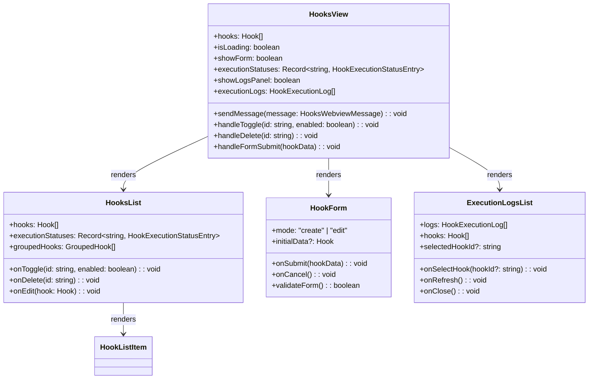
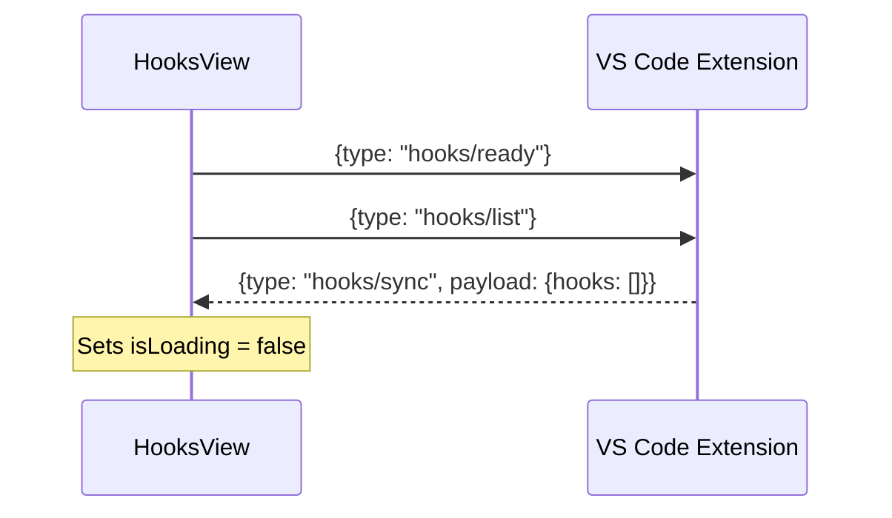
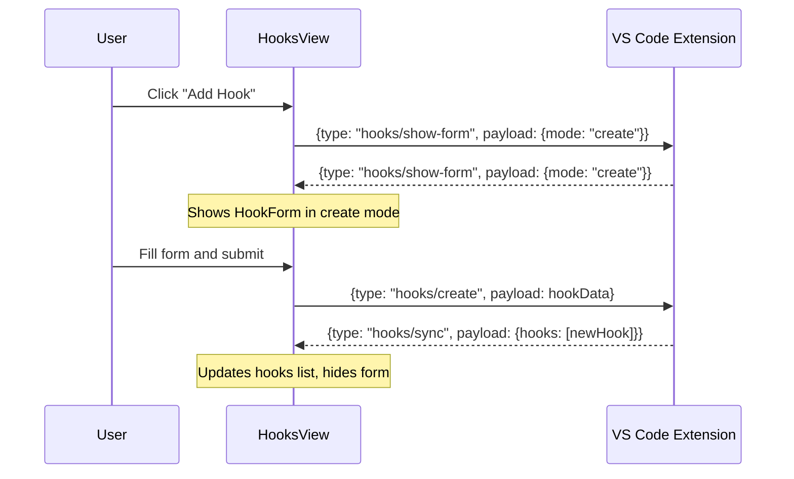
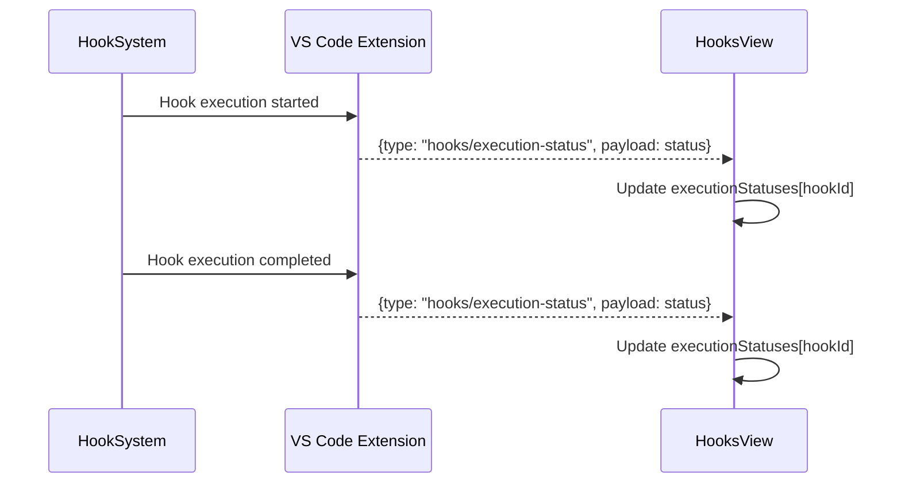
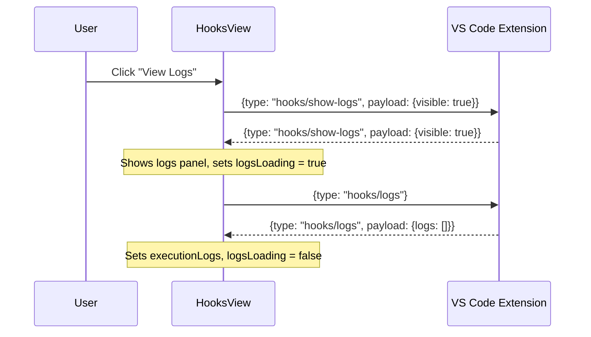

# Hooks View

The Hooks View module provides a React-based webview interface for managing automation hooks within the VS Code extension. It enables users to create, edit, delete, and monitor hooks that trigger automated actions based on agent operations.

## Overview

The Hooks View is the primary user interface for configuring automation hooks that respond to agent workflow events. It communicates with the extension backend via message passing and provides real-time status updates on hook executions.

### Key Features

- **Hook Management**: Create, edit, delete, and toggle hooks
- **Real-time Status**: Monitor execution status of active hooks
- **Execution Logs**: View detailed logs of hook executions
- **Form Validation**: Built-in validation for all hook configurations
- **Grouped Organization**: Hooks organized by action type for better discoverability

## Architecture



## Components

### Main Components

#### `HooksView` (Root Component)
The main container component that orchestrates the entire hooks interface.

**Props**: None (manages internal state)

**State Management**:
- `hooks`: Array of all hooks
- `isLoading`: Loading state for initial data fetch
- `showForm`: Controls form visibility
- `editingHook`: Currently edited hook (if any)
- `executionStatuses`: Real-time execution status per hook
- `showLogsPanel`: Controls logs panel visibility
- `executionLogs`: Array of execution logs
- `selectedHookForLogs`: Currently selected hook for logs filtering

**Key Methods**:
- `sendMessage()`: Sends messages to extension backend
- `requestLogs()`: Requests execution logs for a specific hook or all hooks
- `handleToggle()`: Toggles hook enabled/disabled state
- `handleDelete()`: Deletes a hook
- `handleFormSubmit()`: Submits hook form data

#### `HooksList`
Displays all hooks grouped by action type with collapsible sections.

**Props**:
```typescript
interface HooksListProps {
    hooks: Hook[];
    isLoading: boolean;
    onToggle: (id: string, enabled: boolean) => void;
    onDelete: (id: string) => void;
    onEdit: (hook: Hook) => void;
    executionStatuses: Record<string, HookExecutionStatusEntry>;
}
```

**Action Groups**:
1. **Agent Commands** (`type: "agent"`): Trigger SpecKit/OpenSpec commands
2. **Git Operations** (`type: "git"`): Commit/push operations
3. **GitHub Tools** (`type: "github"`): GitHub MCP integration
4. **Custom Agents** (`type: "custom"`): Custom agent executions
5. **Custom Tools** (`type: "mcp"`): MCP tool executions

#### `HookForm`
Form component for creating and editing hooks with validation.

**Props**:
```typescript
interface HookFormProps {
    mode: "create" | "edit";
    initialData?: Hook;
    onSubmit: (hookData: Omit<Hook, "id" | "createdAt" | "modifiedAt" | "executionCount" | "lastExecutedAt">) => void;
    onCancel: () => void;
}
```

**Form Fields**:
1. **Name**: Required, max 100 characters
2. **Enabled**: Checkbox for active state
3. **Trigger Configuration**: Agent, operation, and timing
4. **Action Configuration**: Type-specific parameters

**Validation Rules**:
- Agent commands: Must start with `/speckit.` or `/openspec.`, max 200 chars
- Git operations: Message template required
- GitHub operations: Repository format validation
- Custom actions: Agent ID or prompt validation
- MCP actions: Tool selection and prompt validation

#### `ExecutionLogsList`
Displays execution logs with filtering capabilities.

**Props**:
```typescript
interface ExecutionLogsListProps {
    hooks: Hook[];
    logs: HookExecutionLog[];
    isLoading: boolean;
    selectedHookId?: string;
    onSelectHook: (hookId?: string) => void;
    onRefresh: () => void;
    onClose: () => void;
}
```

**Log Display**:
- Hook name and trigger timestamp
- Execution status with color coding
- Chain depth and duration
- Error messages (if any)
- Execution ID for debugging

### Supporting Components

#### `HookListItem`
Individual hook item in the list with status indicators and actions.

#### `TriggerActionSelector`
Component for selecting trigger conditions (agent, operation, timing).

#### `McpActionPicker`
Interface for selecting MCP tools and servers.

#### `McpToolsSelector`
Tool selection interface for MCP actions.

#### `ArgumentTemplateEditor`
Editor for template-based arguments with variable suggestions.

#### `AgentTypeSelector`
Component for selecting agent types (SpecKit/OpenSpec).

## Message Protocol

### Webview to Extension (`HooksWebviewMessage`)

```typescript
type HooksWebviewMessage =
    | { type: "hooks/ready"; command?: "hooks.ready" }
    | { type: "hooks/list"; command?: "hooks.list" }
    | {
          type: "hooks/create";
          command?: "hooks.create";
          payload: Omit<Hook, "id" | "createdAt" | "modifiedAt" | "executionCount">;
      }
    | {
          type: "hooks/update";
          command?: "hooks.update";
          payload: { id: string; updates: Partial<Hook> };
      }
    | { type: "hooks/delete"; command?: "hooks.delete"; payload: { id: string } }
    | {
          type: "hooks/toggle";
          command?: "hooks.toggle";
          payload: { id: string; enabled: boolean };
      }
    | {
          type: "hooks/logs";
          command?: "hooks.logs";
          payload?: { hookId?: string };
      };
```

### Extension to Webview (`HooksExtensionMessage`)

```typescript
type HooksExtensionMessage =
    | {
          type: "hooks/sync";
          command?: "hooks.sync";
          payload: { hooks: Hook[] };
      }
    | {
          type: "hooks/created";
          command?: "hooks.created";
          payload: { hook: Hook };
      }
    | {
          type: "hooks/updated";
          command?: "hooks.updated";
          payload: { hook: Hook };
      }
    | {
          type: "hooks/deleted";
          command?: "hooks.deleted";
          payload: { id: string };
      }
    | {
          type: "hooks/error";
          command?: "hooks.error";
          payload: {
              message: string;
              validationErrors?: Array<{ field: string; message: string }>;
          };
      }
    | {
          type: "hooks/execution-status";
          command?: "hooks.execution-status";
          payload: HookExecutionStatusPayload;
      }
    | {
          type: "hooks/logs";
          command?: "hooks.logs";
          payload: { logs: HookExecutionLog[] };
      }
    | {
          type: "hooks/show-form";
          command?: "hooks.show-form";
          payload?: { mode?: "create" | "edit"; hook?: Hook };
      }
    | {
          type: "hooks/show-logs";
          command?: "hooks.show-logs";
          payload: { visible: boolean; hookId?: string };
      };
```

## Data Types

### Core Types

#### `HookExecutionStatusEntry`
```typescript
interface HookExecutionStatusEntry extends HookExecutionStatusPayload {
    updatedAt: number;
}
```

#### `Hook` (from hooks_system module)
```typescript
interface Hook {
    // Identity
    id: string; // UUID v4 format
    name: string; // User-friendly name (max 100 chars)

    // Configuration
    enabled: boolean; // Active state (default: true)
    trigger: TriggerCondition; // When to execute
    action: ActionConfig; // What to execute

    // Metadata
    createdAt: number; // Unix timestamp (milliseconds)
    modifiedAt: number; // Unix timestamp (milliseconds)
    lastExecutedAt?: number; // Unix timestamp (milliseconds)
    executionCount: number; // Total executions (default: 0)
}
```

#### `HookExecutionLog` (from hooks_system module)
```typescript
interface HookExecutionLog {
    // Identity
    id: string; // UUID for this log entry
    hookId: string; // Reference to executed hook

    // Execution context
    executionId: string; // UUID for this execution chain
    chainDepth: number; // Position in hook chain (0-based)

    // Timing
    triggeredAt: number; // Unix timestamp (milliseconds)
    completedAt?: number; // Unix timestamp (milliseconds)
    duration?: number; // Milliseconds (completedAt - triggeredAt)

    // Result
    status: ExecutionStatus;
    error?: ExecutionError;

    // Context snapshot
    contextSnapshot: TemplateContext;
}
```

## Usage Examples

### Creating a Hook Programmatically

```typescript
// Example: Create a hook that runs after specification completion
const hookData = {
    name: "Auto-commit specs",
    enabled: true,
    trigger: {
        agent: "speckit",
        operation: "specify",
        timing: "after",
        waitForCompletion: true
    },
    action: {
        type: "git",
        parameters: {
            operation: "commit",
            messageTemplate: "docs: Update specification for {feature}",
            pushToRemote: false
        } as GitActionParams
    }
};

// Send create message
sendMessage({
    type: "hooks/create",
    payload: hookData
});
```

### Toggling Hook State

```typescript
// Enable/disable a hook
const handleToggleHook = (hookId: string, enabled: boolean) => {
    sendMessage({
        type: "hooks/toggle",
        payload: { id: hookId, enabled }
    });
};

// Example usage
handleToggleHook("hook-123", false); // Disable hook
```

### Requesting Execution Logs

```typescript
// Get logs for all hooks
sendMessage({ type: "hooks/logs" });

// Get logs for specific hook
sendMessage({ 
    type: "hooks/logs", 
    payload: { hookId: "hook-123" } 
});
```

### Handling Form Submission

```typescript
const handleSubmit = (formData) => {
    // Validation happens in HookForm component
    onSubmit(formData);
};

// The form data structure varies by action type
const agentHookData = {
    name: "Run clarification",
    enabled: true,
    trigger: {
        agent: "speckit",
        operation: "research",
        timing: "after"
    },
    action: {
        type: "agent",
        parameters: {
            command: "/speckit.clarify"
        } as AgentActionParams
    }
};
```

## Message Flows

### Initialization Flow



### Hook Creation Flow



### Execution Status Updates



### Logs Viewing Flow



## Business Rules and Validations

### Hook Name Validation
- **Required**: Hook name cannot be empty
- **Max Length**: 100 characters maximum
- **Uniqueness**: Not enforced by UI (handled by backend)

### Trigger Configuration
- **Agent Selection**: Must be either "speckit" or "openspec"
- **Operation**: Must be a valid operation type from the system
- **Timing**: Must be "before" or "after"
- **Wait for Completion**: Only applicable for "before" timing

### Action-Specific Validations

#### Agent Actions
- **Command Format**: Must start with `/speckit.` or `/openspec.`
- **Command Length**: Maximum 200 characters
- **Command Required**: Cannot be empty

#### Git Actions
- **Message Template**: Required field
- **Operation**: Must be "commit" or "push"
- **Push to Remote**: Optional boolean

#### GitHub Actions
- **Repository Format**: Optional, must be "owner/repo" if provided
- **Title/Body Templates**: Required for creation operations
- **Issue Number**: Required for update/close operations

#### Custom Actions
- **Agent ID**: Required (format: "source:name")
- **Prompt**: Required for legacy agents
- **Arguments**: Optional template string

#### MCP Actions
- **Prompt**: Required instruction text
- **Selected Tools**: At least one tool must be selected
- **Model ID**: Optional, must be valid GitHub model

### Form State Management
- **Edit Mode**: Pre-fills form with existing hook data
- **Create Mode**: Starts with default values
- **Validation**: Real-time validation with error display
- **Submission**: Disables submit button during submission

## Integration Points

### Dependencies

#### Internal Modules
- **hooks_system**: Core hook types and execution logic
- **ui_view_providers**: Message provider interfaces
- **ui_components**: Shared UI components

#### External Dependencies
- **React**: UI framework
- **VS Code Webview API**: Message passing
- **TypeScript**: Type safety

### Message Providers
The module integrates with `hook-view-provider` for message handling. See [hook-view-provider documentation](ui_view_providers.md) for detailed provider interfaces.

### State Synchronization
- **Real-time Updates**: Execution status updates via WebSocket-like messaging
- **Batch Updates**: Hook list synchronized on changes
- **Error Handling**: Validation errors displayed in context

## Error Handling

### Validation Errors
```typescript
// Example validation error response
{
    type: "hooks/error",
    payload: {
        message: "Validation failed",
        validationErrors: [
            { field: "name", message: "Hook name is required" },
            { field: "action", message: "Command must start with /speckit. or /openspec." }
        ]
    }
}
```

### Runtime Errors
- **Network Errors**: Displayed as toast notifications
- **Permission Errors**: Shown with resolution suggestions
- **System Errors**: Logged to console with user-friendly message

### Error Recovery
- **Form Errors**: Keep form data intact for correction
- **Submission Errors**: Maintain submission state for retry
- **Connection Errors**: Auto-retry with exponential backoff
- **Data Corruption**: Reset to last known good state

## Development Notes

### Component Structure
```
hooks-view/
├── index.tsx              # Main container component
├── types.ts              # TypeScript definitions
├── components/
│   ├── hooks-list.tsx    # Hook list with grouping
│   ├── hook-form.tsx     # Create/edit form
│   ├── hook-list-item.tsx # Individual hook item
│   ├── execution-logs-list.tsx # Logs display
│   ├── trigger-action-selector.tsx
│   ├── mcp-action-picker.tsx
│   ├── mcp-tools-selector.tsx
│   ├── argument-template-editor.tsx
│   ├── agent-type-selector.tsx
│   └── cli-options/      # CLI option components
└── hooks/
    └── use-mcp-servers.ts # Custom hook for MCP servers
```

### Testing Considerations
- **Unit Tests**: Test form validation logic
- **Integration Tests**: Test message passing flows
- **UI Tests**: Test component rendering and interactions
- **Error Cases**: Test error handling and recovery

### Performance Optimizations
- **Memoization**: Use React.memo for list items
- **Virtualization**: Consider for large hook lists
- **Debouncing**: For search/filter operations
- **Lazy Loading**: For complex form sections

## UI Components Reference

### MCP Action Picker
```typescript
interface MCPActionPickerProps {
    servers?: MCPServer[];
    loading?: boolean;
    error?: string;
    disabled?: boolean;
    onSelectionChange?: (selection: MCPActionSelection | null) => void;
}
```

**Features**:
- Server discovery and selection
- Tool filtering by category
- Multi-tool selection support
- Real-time server status indicators

### MCP Tools Selector
```typescript
interface MCPToolsSelectorProps {
    servers: MCPServer[];
    selectedTools: SelectedMCPTool[];
    onSelectionChange: (selectedTools: SelectedMCPTool[]) => void;
    disabled?: boolean;
}
```

**Features**:
- Visual tool grouping by server
- Tool descriptions and parameter previews
- Search and filter capabilities
- Selection limit enforcement

### Copilot CLI Options Panel
```typescript
interface CopilotCliOptionsPanelProps {
    /** Current CLI options */
    value: CopilotCliOptions;
    /** Called when options change */
    onChange: (value: CopilotCliOptions) => void;
    /** Whether the options are disabled */
    disabled?: boolean;
}
```

**Features**:
- Model selection dropdown
- Temperature and token limit controls
- System prompt configuration
- Output format options

## Action Types Reference

### MCP Action Parameters
```typescript
interface MCPActionParams {
    // Model and instruction
    modelId?: string;              // Optional: LLM model ID from GitHub subscription
    prompt: string;                // Instruction/action text for the agent to execute

    // Selected tools (multiple selection supported)
    selectedTools: SelectedMCPTool[]; // Array of selected MCP tools

    // Legacy fields (backward compatibility)
    serverId?: string;             // MCP server identifier (deprecated)
    toolName?: string;             // Tool to execute (deprecated)
    parameterMappings?: ParameterMapping[]; // How to map parameters
    timeout?: number;              // Optional timeout override (1000-300000ms)
}
```

### Custom Action Parameters
```typescript
interface CustomActionParams {
    // Agent Registry Integration
    agentId?: string;              // Agent ID from agent registry (format: "source:name")
    agentType?: "local" | "background"; // Explicit type override

    // Legacy GitHub Copilot agent support
    agentName?: string;            // Custom agent identifier (deprecated)
    prompt?: string;               // Instruction/action text for the agent
    selectedTools?: SelectedMCPTool[]; // Optional: MCP tools available to agent
    arguments?: string;            // Template string with {variable} syntax

    // GitHub Copilot CLI Options
    cliOptions?: CopilotCliOptions; // All CLI parameters supported by GitHub Copilot
}
```

### Git Action Parameters
```typescript
interface GitActionParams {
    operation: GitOperation;
    messageTemplate: string;       // Supports template variables
    pushToRemote?: boolean;        // Auto-push after commit (default: false)
}
```

### GitHub Action Parameters
```typescript
interface GitHubActionParams {
    operation: GitHubOperation;
    repository?: string;           // Format: 'owner/repo' (optional)
    titleTemplate?: string;        // For issue/PR creation
    bodyTemplate?: string;         // For issue/PR creation
    issueNumber?: number;          // For close/update operations
}
```

## Performance Considerations

### Real-time Updates
- **Throttling**: Execution status updates throttled to 1-second intervals
- **Debouncing**: Form input validation debounced by 300ms
- **Virtualization**: Large hook lists use virtual scrolling

### Data Loading
- **Lazy Loading**: MCP tools loaded on-demand when picker opened
- **Pagination**: Execution logs paginated (50 items per page)
- **Caching**: Server discovery results cached for 5 minutes

### Memory Management
- **Log Retention**: Only last 1000 execution logs kept in memory
- **Cleanup**: Unused component state cleaned up on unmount
- **Optimization**: Memoized calculations for frequently updated data

## Testing Guidelines

### Unit Tests
```typescript
// Example: Testing hook form validation
describe("HookForm validation", () => {
    it("validates required fields", () => {
        const formData = { name: "", trigger: {}, action: {} };
        const errors = validateHookForm(formData);
        expect(errors).toContain("Name is required");
    });

    it("validates MCP action parameters", () => {
        const formData = {
            name: "Test Hook",
            trigger: { agent: "speckit", operation: "clarify", timing: "after" },
            action: { type: "mcp", parameters: { prompt: "", selectedTools: [] } }
        };
        const errors = validateHookForm(formData);
        expect(errors).toContain("Prompt is required for MCP actions");
        expect(errors).toContain("At least one MCP tool must be selected");
    });
});
```

### Integration Tests
- **Message Flow**: Test complete message sequences
- **State Synchronization**: Verify UI updates match backend state
- **Error Handling**: Test error scenarios and recovery

### E2E Tests
- **User Workflows**: Complete hook creation and management flows
- **Cross-browser**: Test in different VS Code webview environments
- **Performance**: Measure load times and responsiveness

## Development Guidelines

### Adding New Action Types
1. Define action parameters interface
2. Create form component for the action type
3. Add validation rules
4. Update message handlers
5. Add to action type selector

### Customizing UI Components
- Use existing component props interfaces
- Follow VS Code design guidelines
- Maintain accessibility standards
- Support dark/light themes

### Debugging Tips
- **Message Logging**: Enable verbose message logging in development
- **State Inspection**: Use React DevTools for state debugging
- **Network Tracing**: Monitor WebSocket connections for real-time updates

## Migration Notes

### Version Compatibility
- **v0.30+**: Supports multi-tool MCP actions
- **v0.31+**: Agent registry integration for custom actions
- **v0.32+**: Real-time execution status updates

### Breaking Changes
- **Deprecated Fields**: `serverId` and `toolName` in MCP actions
- **API Changes**: Message type format updates
- **Data Migration**: Hook data migration scripts available

## Related Documentation
- [hooks_system.md](hooks_system.md) - Core hook system and execution engine
- [ui_view_providers.md](ui_view_providers.md) - Message provider interfaces
- [mcp_hooks_integration.md](mcp_hooks_integration.md) - MCP integration details
- [agents_management.md](agents_management.md) - Agent registry and discovery
- [mcp_system.md](mcp_system.md) - MCP server and tool integration