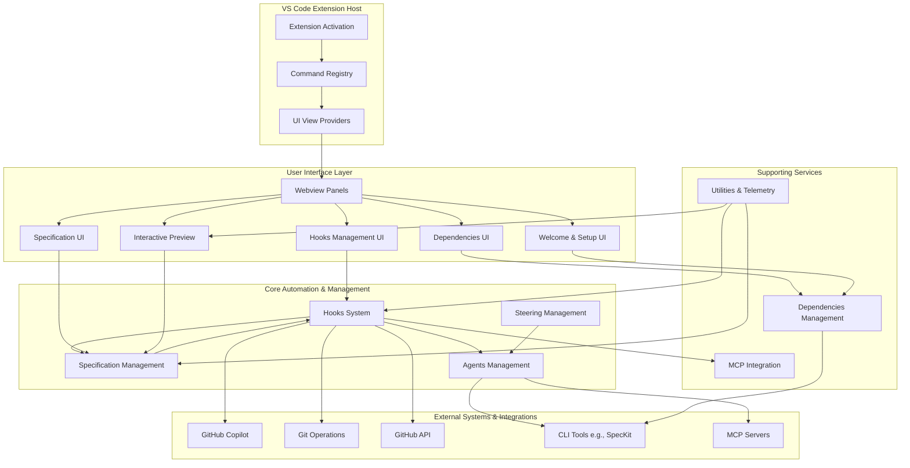

# Gatomia Vscode

## Overview

Gatomia Vscode is a comprehensive VS Code extension designed to augment the software development lifecycle with AI-powered automation and structured workflows. It integrates with tools like GitHub Copilot and the Model Context Protocol (MCP) to create an event-driven system that automates repetitive tasks, manages specifications, and orchestrates AI agents based on developer activities.

**Core Purpose**: To bridge the gap between human intent and AI execution by providing a framework for defining, triggering, and managing automated workflows (hooks) that respond to development events, thereby increasing productivity and enforcing team standards.

## End-To-End Architecture

The extension is built on a modular architecture that separates core automation logic, user interfaces, and integration services.

**Data Flow**:
1.  User interactions in VS Code (commands, file changes) trigger events.
2.  The **Hooks System** listens for these events and executes configured actions (run agents, call MCP tools, etc.).
3.  Actions are performed by the **Agents Management** system or via **MCP Integration**.
4.  The **Specification** and **Steering Management** modules provide structured content that can trigger or be targeted by hooks.
5.  All modules are supported by **Dependencies Management** and **Utilities** (telemetry, notifications).
6.  The **UI Layer** (React webviews) provides interfaces for configuration and monitoring, communicating with the core via message-passing bridges.

## Core Modules Documentation

The repository is organized into several core modules, each with dedicated documentation:

| Module | Path | Description | Key Components |
| :--- | :--- | :--- | :--- |
| **Hooks System** | `src/features/hooks` | Event-driven automation framework ("IFTTT for developers"). | `Hook`, `TemplateContextBuilder`, `CustomActionExecutor`, `IMCPClientService` |
| **Specification Management** | `src/features/spec` | Lifecycle management for software specifications and review workflows. | `Specification`, `SpecSubmissionStrategyFactory`, `ReviewFlowEventType` |
| **Agents Management** | `src/features/agents` | Registry and discovery system for AI agents from various sources. | `ResourceCache`, `IAgentDiscoveryService`, `AgentAvailabilityChangedEvent` |
| **Steering Management** | `src/features/steering` | Tools for creating AI agent constitutions and guidance documents. | `CreateSteeringWebviewMessage`, `CreateSteeringFieldErrors` |
| **Dependencies Management** | `src/services` | Detection and validation of required CLI tools and services. | `CLIDetectionResult` |
| **UI Infrastructure** | `ui/src` | Foundation for webview communication and routing. | `Window` (VSCode Bridge), `SupportedPage` (Page Registry) |
| **UI View Providers** | `src/providers` | VS Code providers for webview panels and sidebars. | `HookViewProvider`, `DependenciesViewProvider`, `InteractiveViewProvider` |
| **Preview System** | `src/features/preview` | Interactive document preview with form editing. | `PreviewStore`, `FormStore`, `FormBridge` |
| **Welcome Setup** | `src/features/welcome` | Onboarding screen with dependency checks and configuration. | `WelcomeStore`, `WelcomeScreenState` |
| **Utilities** | `src/utils` | Cross-cutting services: MCP integration, telemetry, notifications. | `MCPConfig`, `TelemetryStore`, `NotificationUtils` |
| **UI Components** | `ui/src/components` | Reusable React components for webviews. | Form controls, CLI option panels, MCP selectors. |
| **Hooks View** | `ui/src/features/hooks-view` | React UI for managing automation hooks. | `HooksWebviewMessage`, `HookExecutionStatusEntry` |
| **Dependencies View** | `ui/src/features/dependencies-view` | React UI for checking and installing dependencies. | `DependenciesWebviewMessage`, `DependencyStatus` |
| **Create Spec View** | `ui/src/features/create-spec-view` | React UI for creating new specifications. | `CreateSpecFieldErrors` |
| **Spec Explorer** | `ui/src/features/spec-explorer` | React UI for browsing and reviewing specifications. | `SpecExplorerStore`, `SpecExplorerService` |

For detailed documentation on any module, refer to its individual documentation file (e.g., `hooks_system.md`). The architecture emphasizes separation of concerns, with the backend extension logic in `src/` and the frontend React applications in `ui/src/`.