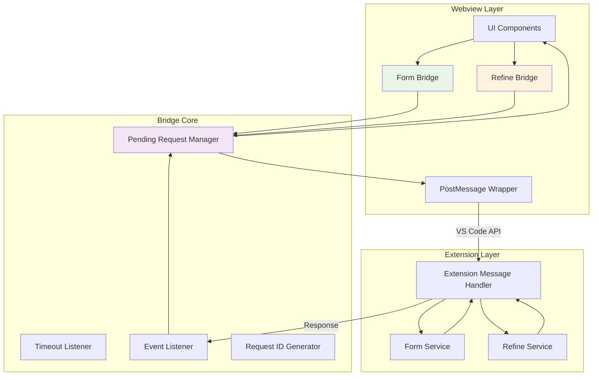
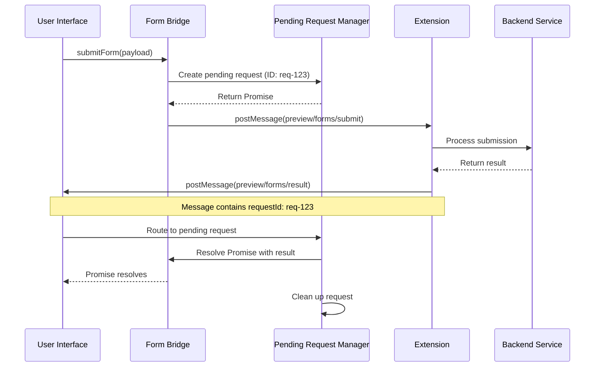
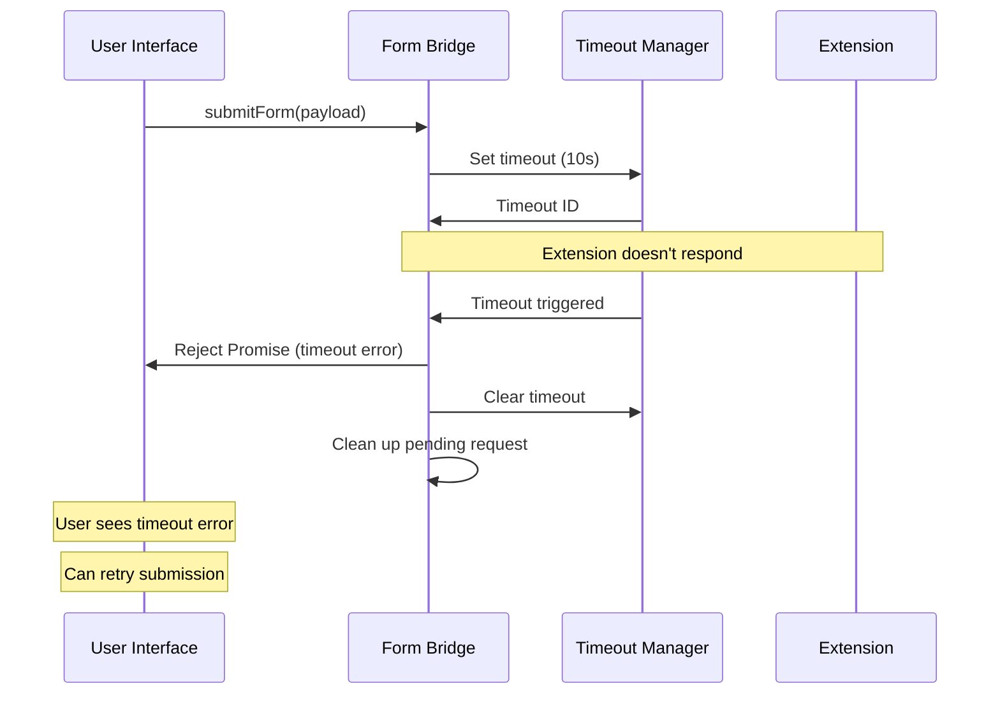

# Preview Bridge APIs

## Overview
The Bridge APIs provide a clean, Promise-based interface for communication between the webview UI and the VS Code extension backend. They handle request tracking, timeout management, and error handling, abstracting away the complexities of the VS Code message passing system.

**Business Value**: Simplifies asynchronous operations between webview and extension, providing a developer-friendly API that handles edge cases like timeouts, duplicate requests, and error recovery automatically.

## Architecture & Design


**Key Patterns**:
- **Promise Wrapper Pattern**: Converts callback-based APIs to Promise-based
- **Request Tracking**: Maps request IDs to Promise resolvers
- **Timeout Management**: Automatic cleanup of stale requests
- **Singleton Listeners**: Single event listener for all bridge operations

## Core Components

### Form Bridge API
**Purpose**: Handles form submission from webview to extension with request tracking and timeout handling.

**Business Rules**:
- Each submission requires a unique request ID
- Default timeout of 10 seconds
- Only submits if there are changed fields
- Returns structured success/error responses

**Interface**:
```typescript
interface FormBridge {
    submitForm(payload: FormSubmissionPayload): Promise<FormSubmissionResult>;
}

interface FormSubmissionPayload {
    documentId: string;
    sessionId: string;
    fields: FormFieldDelta[];
    submittedAt: string;
    requestId?: string;
}

interface FormSubmissionResult {
    requestId: string;
    status: "success" | "error";
    message?: string;
}
```

### Refine Bridge API
**Purpose**: Manages document refinement requests for reporting issues or requesting updates.

**Business Rules**:
- Supports four predefined issue types
- Can target specific document sections
- Includes dependency tracking for updates
- Handles both manual and automated refinements

**Interface**:
```typescript
interface RefineBridge {
    submitRefinement(input: SubmitRefinementInput): Promise<SubmitRefinementResult>;
}

interface SubmitRefinementInput {
    documentId: string;
    documentType: string;
    documentVersion?: string;
    sectionRef?: string;
    issueType: PreviewRefinementIssueType;
    description: string;
}

interface SubmitRefinementResult {
    requestId: string;
    status: "success" | "error";
    message?: string;
}
```

### Pending Request Manager
**Purpose**: Internal component that tracks pending requests and maps responses to Promise resolvers.

**Business Rules**:
- Each request gets a unique ID
- Requests timeout after configurable period
- Clean up completed or timed out requests
- Prevent memory leaks from abandoned requests

## Practical Examples

> [!TIP]
> The Bridge APIs are designed to be simple and intuitive. Here's how to use them effectively:

### Basic Form Submission
```typescript
import { submitForm } from "@/features/preview/api/form-bridge";

async function handleFormSubmit(formData: FormData) {
    try {
        const result = await submitForm({
            documentId: "spec-123",
            sessionId: "session-456",
            fields: [
                {
                    fieldId: "priority",
                    value: "High",
                    dirty: true
                },
                {
                    fieldId: "status",
                    value: "In Progress",
                    dirty: true
                }
            ],
            submittedAt: new Date().toISOString()
        });
        
        if (result.status === "success") {
            showSuccess("Form submitted successfully");
        } else {
            showError(`Submission failed: ${result.message}`);
        }
    } catch (error) {
        if (error.message.includes("timeout")) {
            showError("Submission timed out. Please try again.");
        } else if (error.message.includes("No fields changed")) {
            showWarning("No changes to submit");
        } else {
            showError(`Error: ${error.message}`);
        }
    }
}
```

### Document Refinement Request
```typescript
import { submitRefinement } from "@/features/preview/api/refine-bridge";

async function reportDocumentIssue() {
    const issueDescription = document.getElementById("issue-description").value;
    const issueType = document.getElementById("issue-type").value;
    const sectionRef = document.getElementById("section-ref").value;
    
    try {
        const result = await submitRefinement({
            documentId: "spec-123",
            documentType: "specification",
            issueType: issueType,
            description: issueDescription,
            sectionRef: sectionRef || undefined
        });
        
        if (result.status === "success") {
            showSuccess("Refinement request submitted successfully");
            // Clear form
            document.getElementById("issue-description").value = "";
        } else {
            showError(`Failed to submit: ${result.message}`);
        }
    } catch (error) {
        showError(`Error: ${error.message}`);
    }
}
```

### Custom Timeout Configuration
```typescript
// You can create a wrapper for custom timeout handling
async function submitFormWithCustomTimeout(
    payload: FormSubmissionPayload,
    timeoutMs: number = 30000
): Promise<FormSubmissionResult> {
    const originalSubmit = submitForm;
    
    // Monkey patch the internal timeout (not recommended for production)
    // Better approach: Create a custom bridge instance
    return new Promise((resolve, reject) => {
        const timer = setTimeout(() => {
            reject(new Error(`Custom timeout after ${timeoutMs}ms`));
        }, timeoutMs);
        
        originalSubmit(payload)
            .then(result => {
                clearTimeout(timer);
                resolve(result);
            })
            .catch(error => {
                clearTimeout(timer);
                reject(error);
            });
    });
}

// Or create a custom bridge factory
function createFormBridge(options: { timeoutMs: number }) {
    // Implementation would duplicate the bridge logic with custom timeout
    // This shows the pattern for extensibility
}
```

### Error Recovery Patterns
```typescript
async function submitWithRetry(
    submitFn: () => Promise<any>,
    maxRetries: number = 3
) {
    let lastError: Error;
    
    for (let attempt = 1; attempt <= maxRetries; attempt++) {
        try {
            return await submitFn();
        } catch (error) {
            lastError = error;
            
            // Don't retry on certain errors
            if (error.message.includes("No fields changed")) {
                throw error; // Immediate failure
            }
            
            // Exponential backoff
            if (attempt < maxRetries) {
                const delay = Math.pow(2, attempt) * 1000; // 2s, 4s, 8s
                await new Promise(resolve => setTimeout(resolve, delay));
            }
        }
    }
    
    throw lastError;
}

// Usage
try {
    await submitWithRetry(() => submitForm(formPayload));
} catch (error) {
    showError(`Failed after retries: ${error.message}`);
}
```

## Data Flow

### Request/Response Lifecycle


### Timeout Handling Sequence


## Integration Points

### With Form Store
```typescript
// Integration example
class FormStoreWithBridge {
    private formStore: FormStore;
    
    async submitToBackend() {
        const payload = this.formStore.prepareSubmission();
        if (!payload) {
            throw new Error("No changes to submit");
        }
        
        this.formStore.setSubmitting(true);
        
        try {
            const result = await submitForm(payload);
            
            if (result.status === "success") {
                this.formStore.markSubmitted();
                return { success: true, message: result.message };
            } else {
                throw new Error(result.message || "Submission failed");
            }
        } catch (error) {
            this.formStore.setSubmitting(false);
            throw error;
        }
    }
}
```

### With React Components
```typescript
// Custom hook for form submission
function useFormSubmission(formStore: FormStore) {
    const [isSubmitting, setIsSubmitting] = useState(false);
    const [submitError, setSubmitError] = useState<string | null>(null);
    
    const submitForm = useCallback(async () => {
        setIsSubmitting(true);
        setSubmitError(null);
        
        try {
            const payload = formStore.prepareSubmission();
            if (!payload) {
                setSubmitError("No changes to submit");
                return;
            }
            
            const result = await submitFormBridge(payload);
            
            if (result.status === "success") {
                formStore.markSubmitted();
                // Success handling
            } else {
                setSubmitError(result.message || "Submission failed");
            }
        } catch (error) {
            setSubmitError(error.message);
        } finally {
            setIsSubmitting(false);
        }
    }, [formStore]);
    
    return { submitForm, isSubmitting, submitError };
}
```

### With Error Boundary
```typescript
// Error boundary for bridge failures
class BridgeErrorBoundary extends React.Component {
    state = { hasError: false, error: null };
    
    static getDerivedStateFromError(error) {
        return { hasError: true, error };
    }
    
    componentDidCatch(error, errorInfo) {
        // Log bridge errors
        console.error("Bridge error:", error, errorInfo);
        
        // Send to error tracking service
        trackBridgeError(error, {
            componentStack: errorInfo.componentStack,
            timestamp: new Date().toISOString()
        });
    }
    
    render() {
        if (this.state.hasError) {
            return (
                <div className="bridge-error">
                    <h3>Connection Error</h3>
                    <p>Unable to communicate with the extension.</p>
                    <button onClick={() => window.location.reload()}>
                        Reload Preview
                    </button>
                </div>
            );
        }
        
        return this.props.children;
    }
}
```

## Error Handling Strategies

### Timeout Recovery
```typescript
// Smart timeout recovery
async function submitWithSmartRetry(payload: FormSubmissionPayload) {
    const baseTimeout = 10000; // 10 seconds
    const maxRetries = 2;
    
    for (let retry = 0; retry <= maxRetries; retry++) {
        const timeout = baseTimeout * Math.pow(2, retry); // 10s, 20s, 40s
        
        try {
            return await Promise.race([
                submitForm(payload),
                new Promise((_, reject) => 
                    setTimeout(() => reject(new Error("timeout")), timeout)
                )
            ]);
        } catch (error) {
            if (retry === maxRetries || !error.message.includes("timeout")) {
                throw error;
            }
            // Continue to next retry
        }
    }
}
```

### Network Error Handling
```typescript
// Detect different error types
function handleBridgeError(error: Error) {
    const message = error.message.toLowerCase();
    
    if (message.includes("timeout")) {
        return {
            type: "timeout",
            userMessage: "The request timed out. Please try again.",
            retryable: true
        };
    }
    
    if (message.includes("no fields changed")) {
        return {
            type: "no_changes",
            userMessage: "No changes were made to submit.",
            retryable: false
        };
    }
    
    if (message.includes("permission") || message.includes("unauthorized")) {
        return {
            type: "permission",
            userMessage: "You don't have permission to perform this action.",
            retryable: false
        };
    }
    
    // Default error
    return {
        type: "unknown",
        userMessage: "An unexpected error occurred.",
        retryable: true
    };
}
```

## Performance Considerations

### Request Pool Management
```typescript
// Limit concurrent requests
class RequestPool {
    private maxConcurrent: number;
    private activeRequests: number = 0;
    private queue: Array<() => Promise<any>> = [];
    
    constructor(maxConcurrent: number = 3) {
        this.maxConcurrent = maxConcurrent;
    }
    
    async submit<T>(request: () => Promise<T>): Promise<T> {
        if (this.activeRequests < this.maxConcurrent) {
            this.activeRequests++;
            try {
                return await request();
            } finally {
                this.activeRequests--;
                this.processQueue();
            }
        } else {
            return new Promise((resolve, reject) => {
                this.queue.push(async () => {
                    try {
                        resolve(await request());
                    } catch (error) {
                        reject(error);
                    }
                });
            });
        }
    }
    
    private processQueue() {
        while (this.queue.length > 0 && this.activeRequests < this.maxConcurrent) {
            const request = this.queue.shift();
            if (request) {
                this.activeRequests++;
                request().finally(() => {
                    this.activeRequests--;
                    this.processQueue();
                });
            }
        }
    }
}

// Usage
const requestPool = new RequestPool(3);
const result = await requestPool.submit(() => submitForm(payload));
```

### Memory Management
```typescript
// Clean up pending requests
function cleanupStaleRequests() {
    const now = Date.now();
    const staleThreshold = 5 * 60 * 1000; // 5 minutes
    
    // In a real implementation, you'd track request timestamps
    // and clean up requests older than staleThreshold
}

// Auto-cleanup on page unload
window.addEventListener("beforeunload", () => {
    // Reject all pending requests
    pendingRequests.forEach(request => {
        request.reject(new Error("Page unloading"));
    });
    pendingRequests.clear();
});
```

## Testing Strategies

### Mocking Bridge APIs for Tests
```typescript
// Test setup
const mockFormBridge = {
    submitForm: jest.fn()
};

// Mock implementation
mockFormBridge.submitForm.mockImplementation((payload) => {
    return Promise.resolve({
        requestId: payload.requestId || "mock-request-id",
        status: "success",
        message: "Mock submission successful"
    });
});

// Test case
test("should submit form via bridge", async () => {
    const payload = createTestPayload();
    const result = await mockFormBridge.submitForm(payload);
    
    expect(mockFormBridge.submitForm).toHaveBeenCalledWith(payload);
    expect(result.status).toBe("success");
    expect(result.requestId).toBeDefined();
});
```

### Integration Tests
```typescript
describe("Bridge Integration", () => {
    let bridge: FormBridge;
    
    beforeEach(() => {
        bridge = createFormBridge();
    });
    
    test("should handle timeout", async () => {
        // Mock extension to not respond
        mockExtensionResponse(undefined, 15000); // 15s delay
        
        await expect(bridge.submitForm(testPayload))
            .rejects
            .toThrow("timeout");
    });
    
    test("should map response to correct request", async () => {
        const request1 = bridge.submitForm(payload1);
        const request2 = bridge.submitForm(payload2);
        
        // Simulate responses out of order
        simulateExtensionResponse(payload2.requestId);
        simulateExtensionResponse(payload1.requestId);
        
        const results = await Promise.all([request1, request2]);
        expect(results[0].requestId).toBe(payload1.requestId);
        expect(results[1].requestId).toBe(payload2.requestId);
    });
});
```