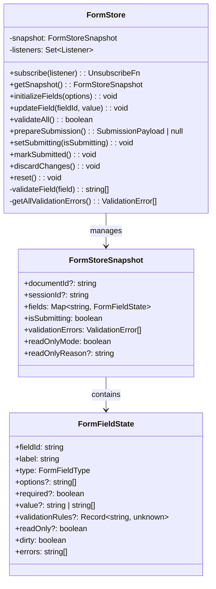
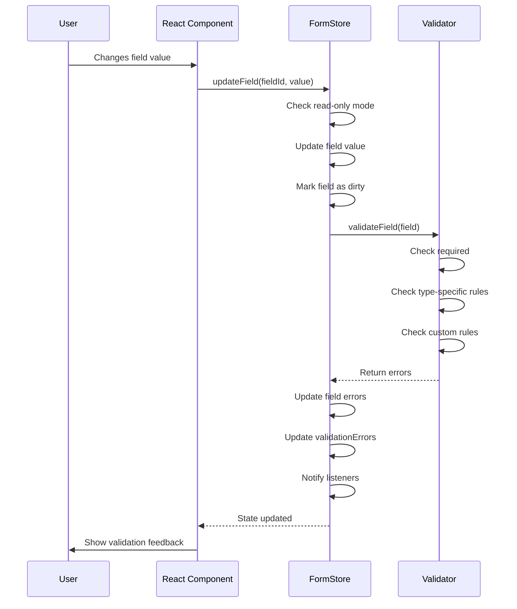
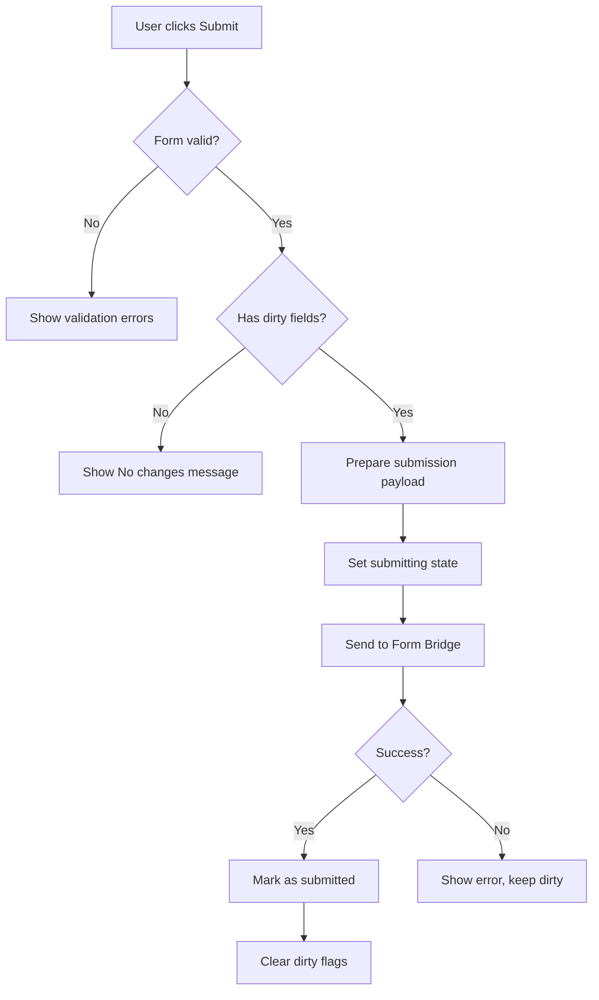

# Form Store System

## Overview
The Form Store is a specialized state management system that handles interactive forms embedded within document previews. It provides a robust framework for tracking field changes, validating user input, and preparing data for submission—all while maintaining a clean separation between UI state and business logic.

**Business Value**: Enables real-time form editing within document previews without requiring page reloads, providing a seamless editing experience similar to modern web applications.

## Architecture & Design


**Key Patterns**:
- **Observer Pattern**: Notifies listeners of state changes
- **Immutable Updates**: Creates new snapshots for state changes
- **Validation Chain**: Cascading validation rules
- **Dirty Tracking**: Only tracks modified fields

## Core Components

### FormStore Class
**Purpose**: Central manager for all form-related state and operations.

**Business Rules**:
- Fields can only be updated when not in read-only mode
- Validation runs automatically on field updates
- Only dirty fields are included in submissions
- Form must be valid before submission

**Key Methods**:
- `initializeFields()`: Sets up form from document payload
- `updateField()`: Updates field value with validation
- `prepareSubmission()`: Creates payload for backend submission
- `validateAll()`: Runs validation on all fields

### Form Field Types
The system supports five field types with specific validation rules:

| Type | Description | Validation Rules |
|------|-------------|------------------|
| `text` | Single-line text input | min/max length, patterns |
| `textarea` | Multi-line text input | min/max length |
| `dropdown` | Single selection from options | Must be in options list |
| `multiselect` | Multiple selections from options | All selections must be valid |
| `checkbox` | Boolean toggle | None |

### Validation System
**Three-tier Validation Approach**:
1. **Required Field Validation**: Checks if required fields have values
2. **Type-specific Validation**: Field-type specific rules (dropdown options, etc.)
3. **Custom Validation**: User-defined rules via `validationRules`

**Custom Validation Rules**:
```typescript
// Example validation rules
const validationRules = {
    minLength: 3,
    maxLength: 50,
    pattern: "^[A-Za-z0-9_]+$",
    patternMessage: "Only alphanumeric characters and underscores allowed"
};
```

## Practical Examples

> [!TIP]
> The Form Store is designed for React integration. Here's how to use it effectively:

### Basic Usage with React
```typescript
import { formStore } from "@/features/preview/stores/form-store";
import { useSyncExternalStore } from "react";

function FormComponent() {
    const snapshot = useSyncExternalStore(
        formStore.subscribe,
        formStore.getSnapshot,
        formStore.getSnapshot
    );
    
    const handleFieldChange = (fieldId: string, value: string) => {
        formStore.updateField(fieldId, value);
    };
    
    const handleSubmit = async () => {
        if (!formStore.validateAll()) {
            showErrors(snapshot.validationErrors);
            return;
        }
        
        const payload = formStore.prepareSubmission();
        if (payload) {
            formStore.setSubmitting(true);
            try {
                await submitForm(payload);
                formStore.markSubmitted();
            } catch (error) {
                formStore.setSubmitting(false);
            }
        }
    };
    
    return (
        <form>
            {Array.from(snapshot.fields.values()).map(field => (
                <FormField
                    key={field.fieldId}
                    field={field}
                    onChange={handleFieldChange}
                    disabled={snapshot.isSubmitting || snapshot.readOnlyMode}
                />
            ))}
        </form>
    );
}
```

### Custom Field Validation
```typescript
// Creating a form with custom validation
formStore.initializeFields({
    documentId: "doc-123",
    sessionId: "session-456",
    fields: [
        {
            fieldId: "username",
            label: "Username",
            type: "text",
            required: true,
            validationRules: {
                minLength: 3,
                maxLength: 20,
                pattern: "^[a-zA-Z0-9_]+$",
                patternMessage: "Only letters, numbers, and underscores allowed"
            }
        },
        {
            fieldId: "priority",
            label: "Priority",
            type: "dropdown",
            options: ["Low", "Medium", "High"],
            required: true
        }
    ]
});

// The store will automatically validate these rules
formStore.updateField("username", "ab"); // Error: minLength violation
formStore.updateField("username", "valid_name"); // Success
formStore.updateField("priority", "Invalid"); // Error: not in options
```

### Read-Only Mode Management
```typescript
// Setting read-only mode
formStore.setReadOnlyMode(true, "Document is locked for review");

// Checking permissions in UI components
function EditableField({ fieldId }) {
    const snapshot = formStore.getSnapshot();
    const field = snapshot.fields.get(fieldId);
    
    if (snapshot.readOnlyMode) {
        return (
            <div className="read-only-field">
                <label>{field.label}</label>
                <div className="value">{field.value}</div>
                {snapshot.readOnlyReason && (
                    <div className="reason">{snapshot.readOnlyReason}</div>
                )}
            </div>
        );
    }
    
    if (field.readOnly) {
        return (
            <div className="field-read-only">
                <label>{field.label}</label>
                <input value={field.value} readOnly />
                <span className="hint">This field cannot be edited</span>
            </div>
        );
    }
    
    return <EditableInput field={field} />;
}
```

### Form Submission Workflow
```typescript
async function submitFormWithRetry(maxRetries = 3) {
    let retries = 0;
    
    while (retries < maxRetries) {
        try {
            const payload = formStore.prepareSubmission();
            if (!payload) {
                throw new Error("No changes to submit");
            }
            
            formStore.setSubmitting(true);
            const result = await submitForm(payload);
            
            if (result.status === "success") {
                formStore.markSubmitted();
                return { success: true, message: result.message };
            } else {
                throw new Error(result.message || "Submission failed");
            }
        } catch (error) {
            retries++;
            
            if (retries === maxRetries) {
                formStore.setSubmitting(false);
                return { 
                    success: false, 
                    error: error.message,
                    retries
                };
            }
            
            // Exponential backoff
            await new Promise(resolve => 
                setTimeout(resolve, 1000 * Math.pow(2, retries))
            );
        }
    }
}
```

## Data Flow

### Field Update Sequence


### Submission Preparation Flow


## Integration Points

### With Preview System
- **Document Loading**: Initializes forms from document payload
- **Staleness Handling**: Discards changes when document becomes stale
- **Permission Sync**: Updates read-only mode based on document permissions

### With Form Bridge
- **Payload Preparation**: Creates properly formatted submission data
- **Error Handling**: Manages submission state during async operations
- **Result Processing**: Updates store based on submission results

### With UI Components
- **State Binding**: Provides reactive state for form components
- **Validation Feedback**: Supplies error messages for display
- **Submission Control**: Manages submit button states

## Error Handling Strategies

### Validation Errors
```typescript
// Displaying validation errors
function ValidationSummary() {
    const snapshot = formStore.getSnapshot();
    
    if (snapshot.validationErrors.length === 0) {
        return null;
    }
    
    return (
        <div className="validation-errors">
            <h4>Please fix the following errors:</h4>
            <ul>
                {snapshot.validationErrors.map(error => (
                    <li key={`${error.fieldId}-${error.message}`}>
                        <strong>{getFieldLabel(error.fieldId)}</strong>: {error.message}
                    </li>
                ))}
            </ul>
        </div>
    );
}

function getFieldLabel(fieldId: string): string {
    const snapshot = formStore.getSnapshot();
    return snapshot.fields.get(fieldId)?.label || fieldId;
}
```

### Submission Errors
```typescript
// Handling submission failures
async function handleSubmit() {
    try {
        await submitFormWorkflow();
    } catch (error) {
        if (error.message.includes("timeout")) {
            showRetryPrompt();
        } else if (error.message.includes("permission")) {
            formStore.setReadOnlyMode(true, error.message);
            showPermissionError();
        } else {
            showGenericError(error.message);
        }
    }
}
```

## Performance Optimizations

### Efficient State Updates
- **Batched Updates**: Multiple field changes in single transaction
- **Selective Re-renders**: Only affected components update
- **Memoized Selectors**: Efficient field access patterns

### Memory Management
```typescript
// Proper cleanup in React components
function FormContainer() {
    useEffect(() => {
        const unsubscribe = formStore.subscribe(() => {
            // Handle updates
        });
        
        return () => {
            unsubscribe();
            // Reset form when component unmounts
            formStore.reset();
        };
    }, []);
    
    // Component implementation
}
```

## Testing Patterns

### Unit Testing Form Store
```typescript
describe("FormStore", () => {
    let store: FormStore;
    
    beforeEach(() => {
        store = new FormStore();
    });
    
    test("should validate required fields", () => {
        store.initializeFields({
            documentId: "test",
            sessionId: "session",
            fields: [{
                fieldId: "name",
                label: "Name",
                type: "text",
                required: true
            }]
        });
        
        expect(store.validateAll()).toBe(false);
        
        store.updateField("name", "John");
        expect(store.validateAll()).toBe(true);
    });
    
    test("should track dirty fields", () => {
        // Test implementation
    });
});
```

### Integration Testing
```typescript
describe("Form Submission Integration", () => {
    test("should submit only dirty fields", async () => {
        // Setup form with multiple fields
        // Update only some fields
        // Verify submission payload contains only dirty fields
    });
});
```