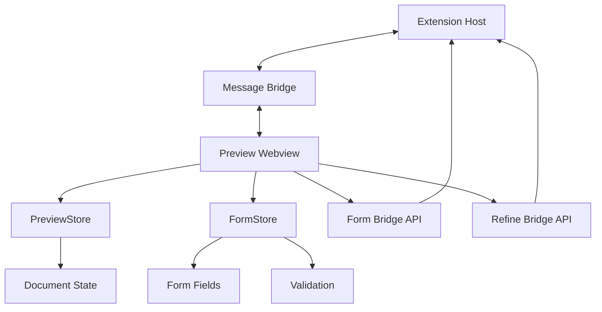
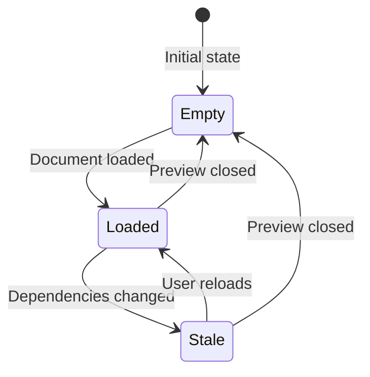
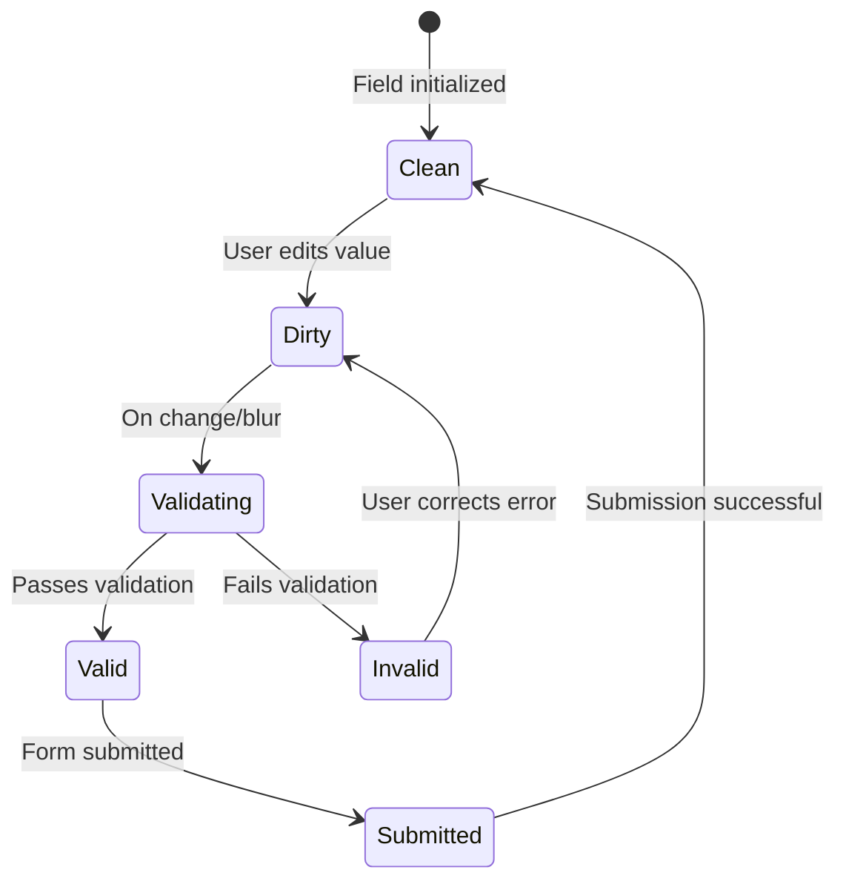
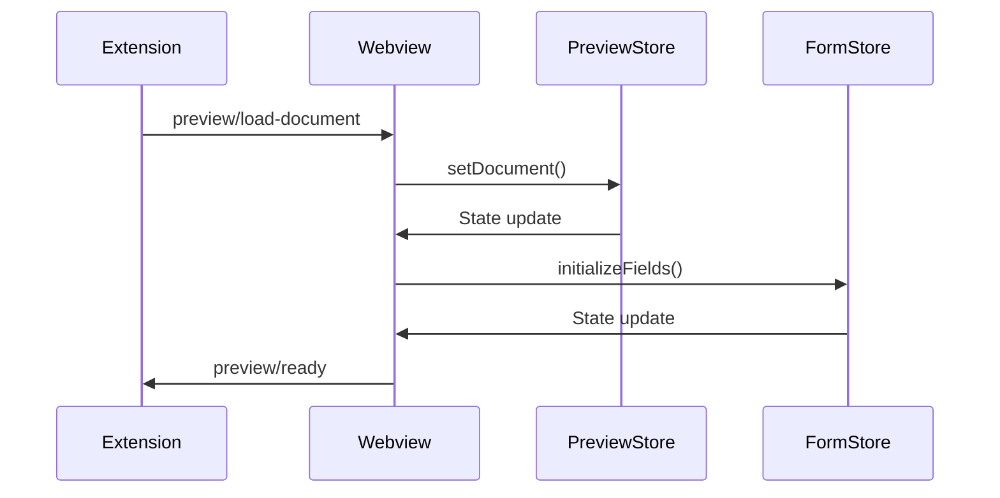
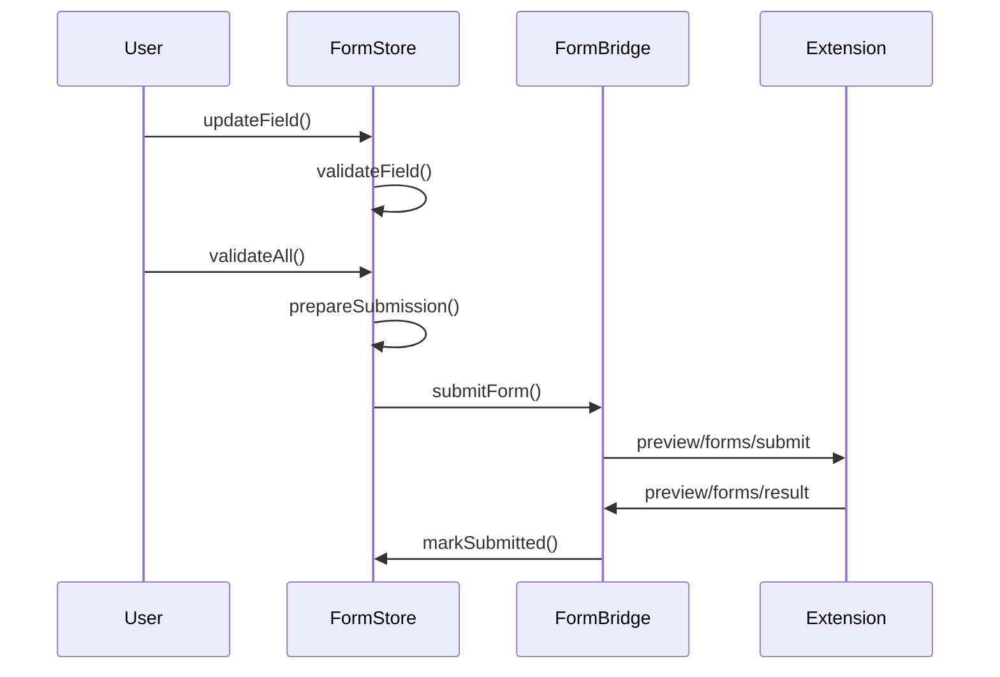
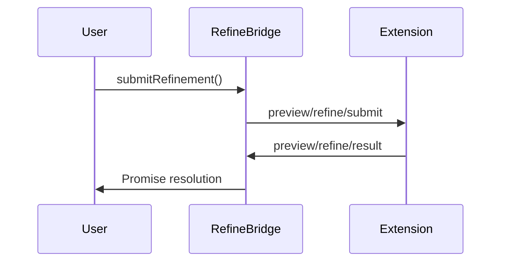

# Preview System

The Preview System provides real-time document rendering with interactive forms, validation, and refinement capabilities. It enables users to view, edit, and refine various document types within the VS Code extension.

## Overview

The Preview System is a bidirectional communication system between the VS Code extension and webview that handles:

1. **Document Rendering**: Display formatted documents with sections, diagrams, and metadata
2. **Interactive Forms**: Form fields embedded within documents with validation and submission
3. **Refinement Requests**: Submit feedback or requests to improve document content
4. **State Management**: Track document state, form changes, and user permissions

## Architecture



## Core Components

### Message Types

#### Extension → Webview Messages (`PreviewExtensionMessage`)

| Type | Payload | Description |
|------|---------|-------------|
| `preview/load-document` | `PreviewDocumentPayload` | Load a new document into the preview |
| `preview/show-placeholder` | `{ reason?: string }` | Show placeholder/stale content |
| `preview/forms/result` | `{ requestId, status, message? }` | Form submission result |
| `preview/refine/result` | `{ requestId, status, message? }` | Refinement submission result |

#### Webview → Extension Messages (`PreviewWebviewMessage`)

| Type | Payload | Description |
|------|---------|-------------|
| `preview/ready` | None | Webview initialized and ready |
| `preview/request-reload` | None | Request document reload |
| `preview/edit-attempt` | `{ reason?: string }` | User attempted to edit |
| `preview/open-in-editor` | None | Open document in editor |
| `preview/forms/submit` | `FormSubmissionPayload` | Submit form changes |
| `preview/refine/submit` | `RefinementRequestPayload` | Submit refinement request |
| `preview/execute-task-group` | `{ groupName: string }` | Execute task group |
| `preview/open-file` | `{ filePath: string }` | Open linked file |

### Data Structures

#### Document Types

```typescript
type PreviewDocumentType =
  | "task"
  | "spec"
  | "plan"
  | "research"
  | "dataModel"
  | "api"
  | "quickstart"
  | "checklist";
```

#### Document Artifact

```typescript
interface DocumentArtifact {
  documentId: string;
  documentType: PreviewDocumentType;
  title: string;
  filePath?: string;
  version?: string;
  owner?: string;
  updatedAt?: string;
  renderStandard: string;
  sessionId: string;
  isOutdated?: boolean;
  outdatedInfo?: {
    outdatedSince: number;
    changedDependencies: Array<{
      documentId: string;
      documentType: PreviewDocumentType;
    }>;
  };
  sections: PreviewSection[];
  diagrams: DiagramBlock[];
  forms: FormField[];
  rawContent: string;
  metadata: Record<string, unknown>;
  permissions?: DocumentPermissions;
}
```

#### Form Field

```typescript
interface FormField {
  fieldId: string;
  label: string;
  type: "checkbox" | "dropdown" | "text" | "textarea" | "multiselect";
  options?: string[];
  required?: boolean;
  value?: string | string[];
  validationRules?: Record<string, unknown>;
  readOnly?: boolean;
}
```

## Stores

**Purpose**: Manages the current document preview state and handles staleness detection.

```typescript
class PreviewStore {
  // Subscribe to store changes
  subscribe(listener: () => void): () => void;
  
  // Get current snapshot
  getSnapshot(): PreviewStoreSnapshot;
  
  // Set current document
  setDocument(document: PreviewDocumentPayload): void;
  
  // Mark document as stale
  markStale(reason?: string): void;
}
```

**Business Rules**:

- Only one document can be previewed at a time
- Documents become stale when underlying dependencies change
- Stale documents show a warning but remain viewable

**State Machine**:



**Snapshot Structure:**

```typescript
interface PreviewStoreSnapshot {
  document?: PreviewDocumentPayload;
  staleReason?: string;
}
```

### Form Store

**Purpose**: Manages interactive form state within previewed documents, including validation, dirty tracking, and submission preparation.

```typescript
class FormStore {
  // Subscribe to form changes
  subscribe(listener: () => void): () => void;
  
  // Get current form snapshot
  getSnapshot(): FormStoreSnapshot;
  
  // Initialize form from document payload
  initializeFields(options: InitializeFieldsOptions): void;
  
  // Update a single field value
  updateField(fieldId: string, value: string | string[]): void;
  
  // Validate all fields
  validateAll(): boolean;
  
  // Prepare submission payload
  prepareSubmission(): FormSubmissionPayload | null;
  
  // Mark submission as in progress
  setSubmitting(isSubmitting: boolean): void;
  
  // Mark submission as successful
  markSubmitted(): void;
  
  // Discard pending changes
  discardChanges(): void;
  
  // Check for unsaved changes
  hasDirtyFields(): boolean;
  
  // Reset form state
  reset(): void;
  
  // Enable/disable read-only mode
  setReadOnlyMode(readOnly: boolean, reason?: string): void;
}
```

**Business Rules**:

- Fields can be marked as read-only based on user permissions
- Only dirty fields are submitted to minimize data transfer
- Validation runs on field change and before submission
- Forms in read-only mode reject all updates

**State Machine** (Field Lifecycle):



**Snapshot Structure:**

```typescript
interface FormStoreSnapshot {
  documentId?: string;
  sessionId?: string;
  fields: Map<string, FormFieldState>;
  isSubmitting: boolean;
  lastSubmittedAt?: string;
  validationErrors: ValidationError[];
  readOnlyMode: boolean;
  readOnlyReason?: string;
}
```

## APIs

### Form Bridge API

Handles form submission to the extension with request/response tracking.

```typescript
// Submit form changes
function submitForm(payload: FormSubmissionPayload): Promise<FormSubmissionResult>;

// Form submission payload
interface FormSubmissionPayload {
  documentId: string;
  sessionId: string;
  fields: FormFieldDelta[];
  submittedAt: string;
  requestId?: string;
}

// Form submission result
interface FormSubmissionResult {
  requestId: string;
  status: "success" | "error";
  message?: string;
}
```

### Refine Bridge API

Handles refinement requests for document improvements.

```typescript
// Submit refinement request
function submitRefinement(input: SubmitRefinementInput): Promise<SubmitRefinementResult>;

// Refinement input
interface SubmitRefinementInput {
  documentId: string;
  documentType: string;
  documentVersion?: string;
  sectionRef?: string;
  issueType: PreviewRefinementIssueType;
  description: string;
}

// Refinement result
interface SubmitRefinementResult {
  requestId: string;
  status: "success" | "error";
  message?: string;
}
```

## Examples

### Basic Usage

```typescript
// Initialize preview with a document
const document: PreviewDocumentPayload = {
  documentId: "spec-123",
  documentType: "spec",
  title: "API Specification",
  sessionId: "session-456",
  sections: [{ id: "overview", title: "Overview", body: "..." }],
  forms: [
    {
      fieldId: "priority",
      label: "Priority",
      type: "dropdown",
      options: ["low", "medium", "high"],
      required: true
    }
  ],
  permissions: { canEditForms: true }
};

// Load document into preview
previewStore.setDocument(document);

// Initialize form fields
formStore.initializeFields({
  documentId: "spec-123",
  sessionId: "session-456",
  fields: document.forms,
  readOnlyMode: !document.permissions?.canEditForms
});
```

### Form Submission

```typescript
// Update a form field
formStore.updateField("priority", "high");

// Validate and prepare submission
if (formStore.validateAll()) {
  const payload = formStore.prepareSubmission();
  if (payload) {
    formStore.setSubmitting(true);
    
    try {
      const result = await submitForm(payload);
      if (result.status === "success") {
        formStore.markSubmitted();
      } else {
        console.error("Form submission failed:", result.message);
      }
    } catch (error) {
      console.error("Form submission error:", error);
    } finally {
      formStore.setSubmitting(false);
    }
  }
}
```

### Refinement Request

```typescript
// Submit a refinement request
try {
  const result = await submitRefinement({
    documentId: "spec-123",
    documentType: "spec",
    issueType: "missingDetail",
    description: "Need more details about authentication requirements",
    sectionRef: "authentication"
  });
  
  if (result.status === "success") {
    console.log("Refinement submitted successfully");
  }
} catch (error) {
  console.error("Refinement submission failed:", error);
}
```

### React Integration

```tsx
import { useSyncExternalStore } from "react";
import { previewStore } from "./stores/preview-store";
import { formStore } from "./stores/form-store";

function PreviewComponent() {
  const previewSnapshot = useSyncExternalStore(
    previewStore.subscribe,
    previewStore.getSnapshot
  );
  
  const formSnapshot = useSyncExternalStore(
    formStore.subscribe,
    formStore.getSnapshot
  );
  
  const { document, staleReason } = previewSnapshot;
  const { fields, isSubmitting, validationErrors } = formSnapshot;
  
  if (!document) {
    return <div>Loading...</div>;
  }
  
  if (staleReason) {
    return <div className="stale-warning">{staleReason}</div>;
  }
  
  return (
    <div>
      <h1>{document.title}</h1>
      
      {/* Render document sections */}
      {document.sections?.map(section => (
        <section key={section.id}>
          <h2>{section.title}</h2>
          <div dangerouslySetInnerHTML={{ __html: section.body || "" }} />
        </section>
      ))}
      
      {/* Render form fields */}
      {Array.from(fields.values()).map(field => (
        <FormFieldComponent
          key={field.fieldId}
          field={field}
          onChange={(value) => formStore.updateField(field.fieldId, value)}
          disabled={isSubmitting || field.readOnly}
        />
      ))}
      
      {/* Show validation errors */}
      {validationErrors.length > 0 && (
        <div className="validation-errors">
          {validationErrors.map(error => (
            <div key={`${error.fieldId}-${error.message}`}>
              {error.message}
            </div>
          ))}
        </div>
      )}
    </div>
  );
}
```

## Business Rules & Validations

### Form Validation Rules

1. **Required Fields**: Fields marked as `required` must have a non-empty value
2. **Selection Validation**: Dropdown and multiselect values must be in the `options` array
3. **Custom Validations**: Support for `validationRules` including:
   - `minLength`: Minimum character length for text fields
   - `maxLength`: Maximum character length for text fields
   - `pattern`: Regex pattern validation with custom error message

### Permission Rules

1. **Read-Only Mode**: When `readOnlyMode` is true or `permissions.canEditForms` is false:
   - Form fields cannot be updated
   - Form submissions are rejected
   - UI shows read-only indicators

2. **Document Staleness**: When a document is marked as stale:
   - Form submissions may be blocked
   - User is prompted to reload
   - Read-only mode may be enforced

### Submission Rules

1. **Dirty Fields Only**: Only fields marked as `dirty` are included in submissions
2. **Validation Required**: All fields must pass validation before submission
3. **Session Consistency**: Submissions require valid `documentId` and `sessionId`
4. **Timeout Handling**: Form and refinement submissions timeout after 10 seconds

## Message Flows

### Document Loading Flow

**Process:** When the extension loads a document into the preview, the following sequence occurs:



### Form Submission Flow

**Process:** When a user updates a form field and submits, the following sequence occurs:



### Refinement Request Flow

**Process:** When a user submits a refinement request, the following sequence occurs:



## Error Handling

### Form Submission Errors

| Error Type | Cause | Recovery |
|------------|-------|----------|
| Validation Error | Field validation failed | Fix field values and retry |
| Read-Only Error | Form in read-only mode | Check permissions |
| Missing IDs | No documentId or sessionId | Reload document |
| Timeout | No response in 10s | Check extension connectivity |
| Network Error | Message passing failed | Retry submission |

### Refinement Submission Errors

| Error Type | Cause | Recovery |
|------------|-------|----------|
| Invalid Issue Type | Unknown issue type | Use valid issue types |
| Missing Description | Empty description | Provide refinement details |
| Timeout | No response in 10s | Check extension connectivity |

## Integration Points

### Related Modules

- **[hooks_system](hooks_system.md)**: For custom actions and form submissions
- **[specification_management](specification_management.md)**: For specification document types
- **[ui_view_providers](ui_view_providers.md)**: For view provider integration
- **[dependencies_management](dependencies_management.md)**: For dependency tracking

### Extension Integration

The Preview System integrates with the VS Code extension through:

1. **Message Passing**: Bidirectional communication via `postMessage`
2. **State Synchronization**: Document and form state kept in sync
3. **Permission Management**: Extension controls form edit permissions
4. **Event Handling**: User interactions forwarded to extension

## Best Practices

### Form Design

1. **Use Appropriate Field Types**: Match field types to data requirements
2. **Provide Clear Labels**: Help users understand what to enter
3. **Set Validation Rules**: Prevent invalid data submissions
4. **Handle Read-Only States**: Gracefully disable editing when needed

### Performance

1. **Minimal State Updates**: Only update changed fields
2. **Debounced Validation**: Avoid validation on every keystroke
3. **Efficient Rendering**: Use React memoization for form fields
4. **Cleanup Listeners**: Remove event listeners on unmount

### Security

1. **Input Validation**: Validate on client and server
2. **Permission Checks**: Enforce read-only mode when appropriate
3. **Session Validation**: Verify document session consistency
4. **Error Sanitization**: Don't expose internal errors to users
