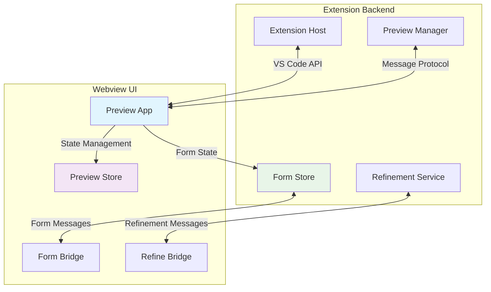
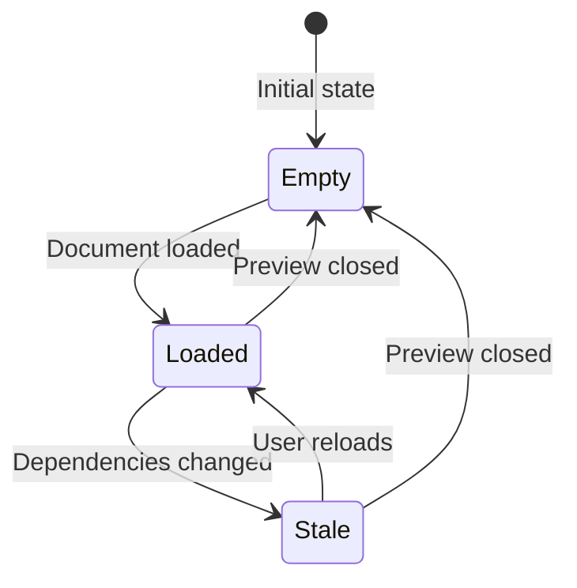
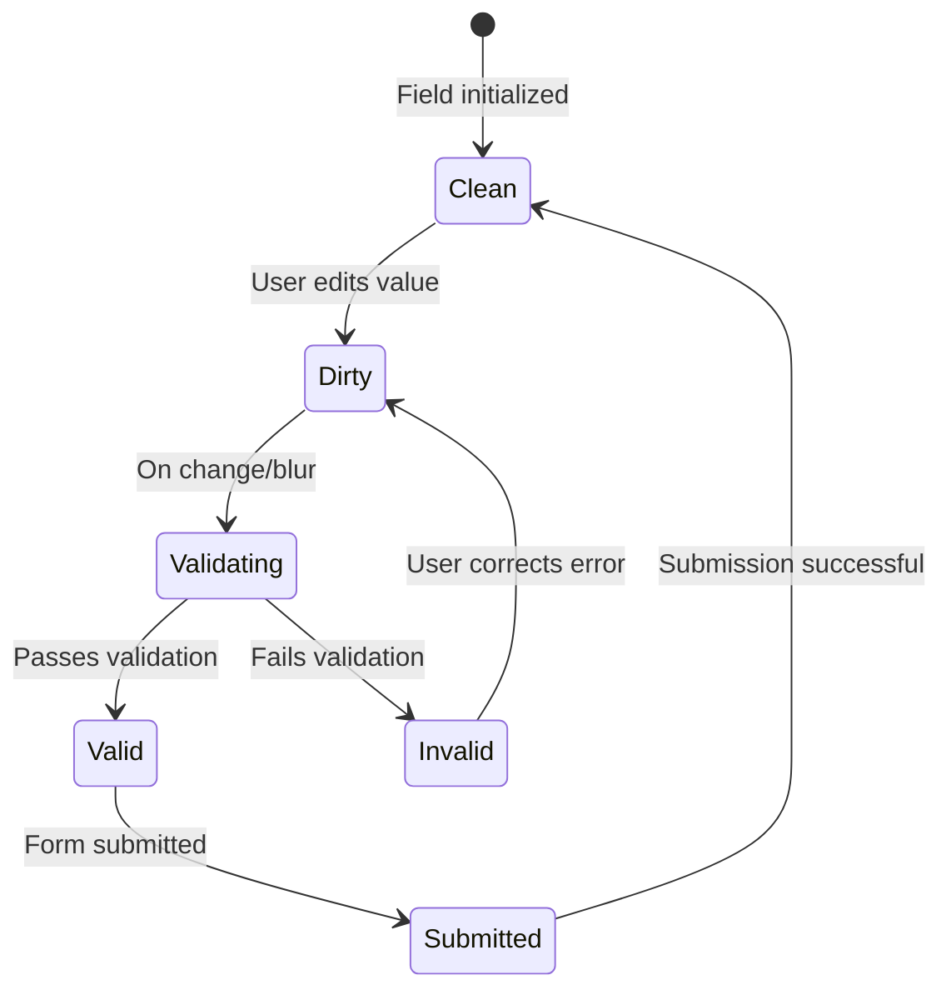
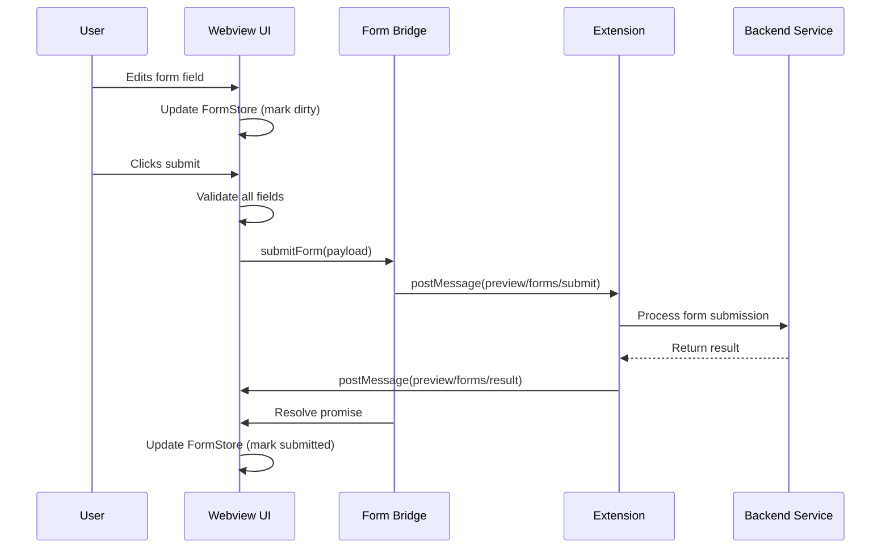
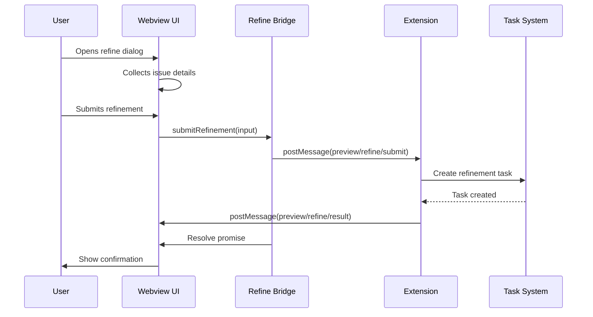

# Preview System

## Overview
The Preview System is a bi-directional communication framework that enables interactive document previews within VS Code. It allows users to view formatted documents, edit embedded forms, submit refinements, and execute task groups—all without leaving the preview pane. The system bridges the webview UI with the extension backend through a structured message protocol.

**Business Value**: Enables real-time collaboration on specifications, tasks, and documentation by providing an interactive preview that goes beyond static rendering to include form editing and feedback collection.

## Architecture & Design


**Key Patterns**:
- **Message Bridge Pattern**: Bidirectional communication between webview and extension
- **Store Pattern**: Centralized state management for preview and form data
- **Promise-based API**: Async operations with request/response tracking
- **Validation-first Forms**: Client-side validation before submission

## Core Components

### Preview Store
**Purpose**: Manages the current document preview state and handles staleness detection.

**Business Rules**:
- Only one document can be previewed at a time
- Documents become stale when underlying dependencies change
- Stale documents show a warning but remain viewable

**State Machine**:


### Form Store
**Purpose**: Manages interactive form state within previewed documents, including validation, dirty tracking, and submission preparation.

**Business Rules**:
- Fields can be marked as read-only based on user permissions
- Only dirty fields are submitted to minimize data transfer
- Validation runs on field change and before submission
- Forms in read-only mode reject all updates

**State Machine** (Field Lifecycle):


### Form Bridge API
**Purpose**: Provides a Promise-based interface for form submissions with request tracking and timeout handling.

**Business Rules**:
- Each submission gets a unique request ID for tracking
- Default timeout of 10 seconds for submissions
- Only submits fields marked as dirty
- Rejects submissions with no changed fields

### Refine Bridge API
**Purpose**: Handles document refinement requests for reporting issues or requesting updates.

**Business Rules**:
- Supports four issue types: missing detail, incorrect info, missing asset, other
- Can target specific document sections
- Tracks refinement requests for user feedback
- Supports both manual refinements and dependency-triggered updates

## Practical Examples

> [!TIP]
> The Preview System enables interactive document workflows. Here's how to use it effectively:

### Loading a Document Preview
```typescript
// Extension side - sending document to preview
const document: DocumentArtifact = {
    documentId: "spec-123",
    documentType: "spec",
    title: "API Specification",
    renderStandard: "<h1>API Spec</h1>...",
    sessionId: "session-456",
    forms: [
        {
            fieldId: "priority",
            label: "Priority",
            type: "dropdown",
            options: ["Low", "Medium", "High"],
            value: "Medium"
        }
    ],
    permissions: {
        canEditForms: true
    }
};

// Send to webview
webview.postMessage({
    type: "preview/load-document",
    payload: document
});
```

### Submitting Form Changes
```typescript
// Webview side - using the Form Store
import { formStore } from "@/features/preview/stores/form-store";
import { submitForm } from "@/features/preview/api/form-bridge";

// Initialize form from document
formStore.initializeFields({
    documentId: "spec-123",
    sessionId: "session-456",
    fields: document.forms,
    readOnlyMode: !document.permissions?.canEditForms
});

// Update a field
formStore.updateField("priority", "High");

// Submit changes
const payload = formStore.prepareSubmission();
if (payload) {
    try {
        const result = await submitForm(payload);
        if (result.status === "success") {
            formStore.markSubmitted();
            console.log("Form submitted successfully");
        }
    } catch (error) {
        console.error("Form submission failed:", error);
    }
}
```

### Requesting Document Refinement
```typescript
// Webview side - reporting an issue
import { submitRefinement } from "@/features/preview/api/refine-bridge";

async function reportMissingDetail() {
    try {
        const result = await submitRefinement({
            documentId: "spec-123",
            documentType: "spec",
            issueType: "missingDetail",
            description: "Missing authentication details in API endpoint section",
            sectionRef: "authentication"
        });
        
        if (result.status === "success") {
            showNotification("Refinement request submitted");
        }
    } catch (error) {
        showError("Failed to submit refinement");
    }
}
```

### Handling Read-Only Mode
```typescript
// Check permissions before allowing edits
const snapshot = formStore.getSnapshot();

if (snapshot.readOnlyMode) {
    console.warn(`Cannot edit: ${snapshot.readOnlyReason || "Read-only mode"}`);
    return;
}

// Or conditionally render UI
function FormFieldComponent({ fieldId }) {
    const snapshot = formStore.getSnapshot();
    const field = snapshot.fields.get(fieldId);
    
    if (!field || field.readOnly || snapshot.readOnlyMode) {
        return <ReadOnlyField field={field} />;
    }
    
    return <EditableField field={field} />;
}
```

## Data Flow

### Form Submission Sequence


### Document Refinement Flow


## Dependencies

### Internal Dependencies
- **[hooks_system](hooks_system.md)**: For MCP server integration in form actions
- **[specification_management](specification_management.md)**: For spec document previews
- **[ui_view_providers](ui_view_providers.md)**: For webview provider infrastructure
- **[utilities](utilities.md)**: For telemetry and notification utilities

### External Dependencies
- **React**: UI framework for webview components
- **VS Code Webview API**: For extension-webview communication
- **Markdown Renderer**: For document content rendering
- **Crypto API**: For request ID generation

## Integration Points

### With Task System
The Preview System integrates with the task system through:
1. **Task Group Execution**: Clicking task group buttons in preview executes related tasks
2. **Refinement Tasks**: Document refinements create tasks in the task system
3. **Form Updates**: Form submissions can trigger task updates

### With Document Management
- **Document Loading**: Fetches and renders documents with embedded forms
- **Version Tracking**: Manages document versions and staleness
- **Permission Enforcement**: Respects document editing permissions

### With UI Components
- **Form Components**: Renders interactive form fields
- **Refine Dialog**: Provides UI for refinement requests
- **Document Outline**: Shows document structure navigation

## Error Handling

### Common Error Scenarios
1. **Form Submission Errors**:
   - Validation failures (client-side)
   - Permission errors (read-only mode)
   - Network/timeout errors

2. **Refinement Errors**:
   - Invalid issue types
   - Missing required fields
   - Backend processing errors

3. **Preview Errors**:
   - Document loading failures
   - Stale document warnings
   - Render errors

### Recovery Strategies
- **Form Errors**: Show validation messages, preserve user input
- **Submission Timeouts**: Retry with exponential backoff
- **Permission Errors**: Switch to read-only mode with explanation
- **Document Errors**: Show fallback UI with error details

## Performance Considerations

### Optimization Techniques
1. **Selective Submission**: Only submit dirty fields
2. **Client-side Validation**: Validate before sending to backend
3. **Request Batching**: Group related form updates
4. **Lazy Loading**: Load document sections on demand

### Memory Management
- **Store Cleanup**: Reset stores when preview closes
- **Listener Management**: Proper cleanup of event listeners
- **Request Tracking**: Clean up pending requests on timeout

## Testing Strategy

### Unit Tests
- Form validation logic
- Store state transitions
- Bridge API error handling

### Integration Tests
- Webview-extension message flow
- Form submission end-to-end
- Refinement request processing

### UI Tests
- Form rendering in different states
- Read-only mode behavior
- Error state displays