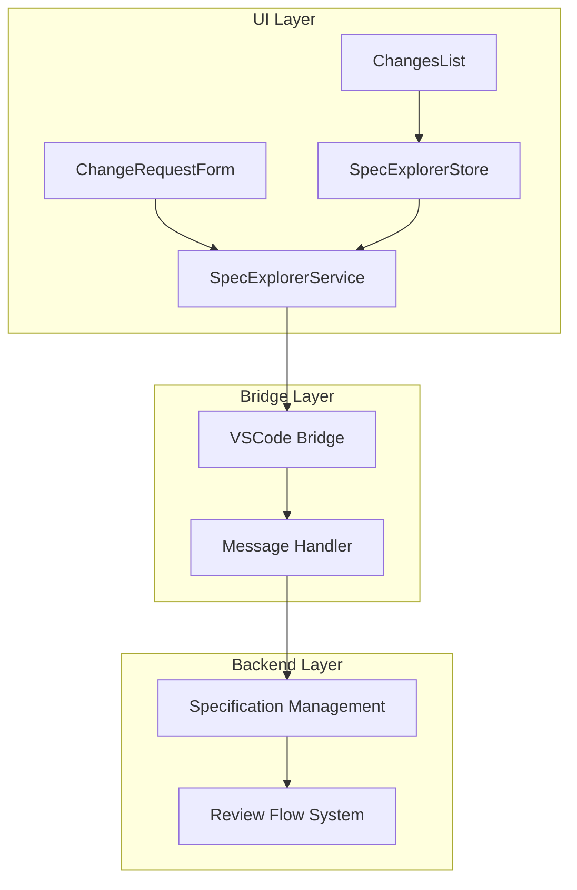
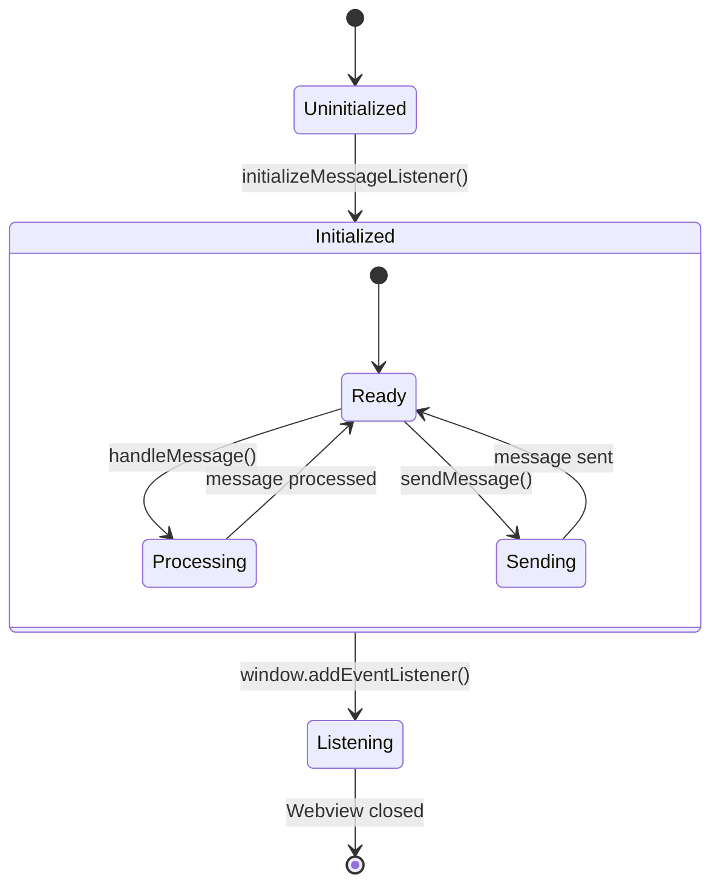
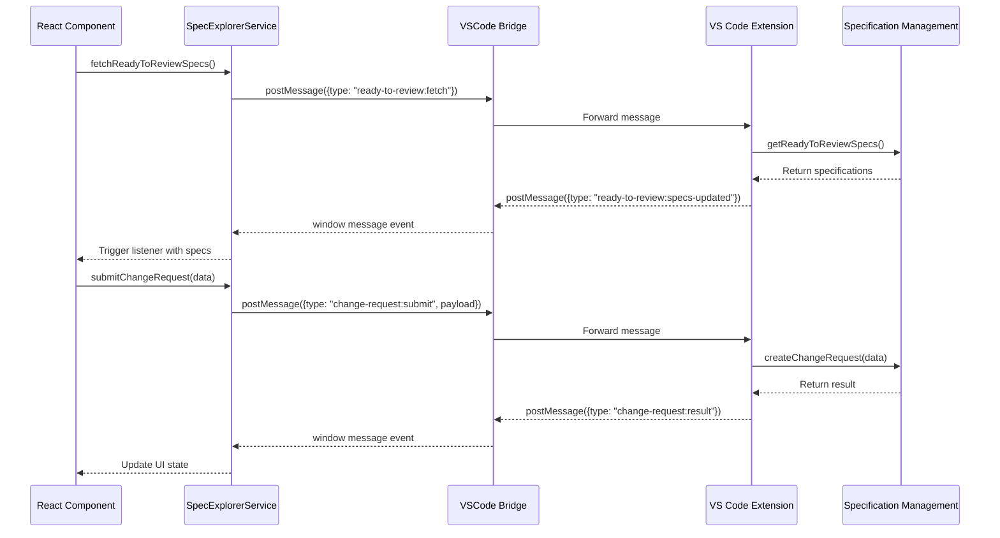

# Specification Explorer

## Overview
The Specification Explorer module provides a React-based UI for managing software specifications within VS Code. It enables developers to browse, review, and file change requests against specifications, integrating with the broader specification management system. This module serves as the primary interface for specification lifecycle management, connecting the backend specification system with frontend user interactions.

## Architecture & Design
- **Component Diagram**: 


- **Key Patterns**: 
  - **Store Pattern**: Centralized state management with `SpecExplorerStore`
  - **Bridge Pattern**: Communication between webview and extension host via `SpecExplorerService`
  - **Observer Pattern**: Event-driven updates with message listeners
  - **Repository Pattern**: Data fetching and persistence through service layer

## Core Components

### SpecExplorerService
- **Purpose**: Manages communication between the React UI and VS Code extension host.
- **Business Rules**:
  - Only initializes message listeners in VS Code webview context
  - Handles message routing with type-based subscriptions
  - Implements 5-second timeout for async operations
  - Validates message structure before processing

- **State Machine**:


### SpecExplorerStore
- **Purpose**: Centralized state management for specification data in the UI.
- **Business Rules**:
  - Maintains separate collections for review and archived specs
  - Provides immutable state updates via copy-on-write
  - Supports fine-grained updates for individual specifications
  - Implements React-compatible subscription model

- **State Structure**:
```typescript
interface SpecExplorerState {
    reviewSpecs: Specification[];      // Active specs ready for review
    archivedSpecs: Specification[];    // Archived specifications
}
```

### Specification Model
- **Purpose**: Core data structure representing a software specification in the UI context.
- **Business Rules**:
  - Each spec must have a unique ID and title
  - Status follows simplified lifecycle: `current` → `readyToReview` → `reopened`
  - Links must include at minimum a `specPath` for local file access
  - Change requests are optional but provide detailed change tracking

```typescript
interface Specification {
    id: string;                        // Unique identifier
    title: string;                     // Human-readable title
    owner: string;                     // Specification owner
    status: SpecStatus;                // Current lifecycle state
    completedAt: Date | null;          // Completion timestamp
    updatedAt: Date;                   // Last update timestamp
    links: { specPath: string; docUrl?: string }; // Document references
    changeRequests?: ChangeRequest[];  // Associated change requests
}
```

### ChangeRequest Model
- **Purpose**: Represents requested changes to a specification.
- **Business Rules**:
  - Severity levels: `low`, `medium`, `high`, `critical`
  - Status tracks processing: `open`, `blocked`, `inProgress`, `addressed`
  - Must reference parent specification via `specId`
  - Tasks array tracks associated work items
  - Notes field provides additional context for changes

```typescript
interface ChangeRequest {
    id: string;                        // Unique identifier
    specId: string;                    // Parent specification ID
    title: string;                     // Change request title
    description: string;               // Detailed description
    severity: ChangeRequestSeverity;   // Impact level
    status: ChangeRequestStatus;       // Current processing state
    tasks: any[];                      // Associated tasks (simplified in UI)
    submitter: string;                 // Who submitted the change
    createdAt: Date;                   // Creation timestamp
    updatedAt: Date;                   // Last update timestamp
    sentToTasksAt: Date | null;        // When tasks were created
    notes?: string;                    // Additional context
}
```

## Practical Examples

> [!TIP]
> The SpecExplorer module integrates seamlessly with React hooks for reactive state management.

### Initializing the Explorer
```typescript
// In your React component
import { useEffect } from 'react';
import { specExplorerService } from '../services/spec-explorer';
import { useSpecExplorerStore, specExplorerActions } from '../stores/spec-explorer-store';

function SpecExplorerComponent() {
    // Use selector pattern to get specific state slices
    const reviewSpecs = useSpecExplorerStore(state => state.reviewSpecs);
    const archivedSpecs = useSpecExplorerStore(state => state.archivedSpecs);
    
    useEffect(() => {
        // Initialize message listeners
        specExplorerService.initializeMessageListener();
        
        // Fetch initial data and update store
        specExplorerService.fetchReadyToReviewSpecs()
            .then(specs => specExplorerActions.setReviewSpecs(specs));
        
        specExplorerService.fetchChangeRequests()
            .then(items => {
                // Process change requests and update UI state
            });
        
        // Subscribe to real-time updates
        const unsubscribe = specExplorerService.on(
            'ready-to-review:specs-updated',
            (payload) => {
                specExplorerActions.setReviewSpecs(payload.specs);
            }
        );
        
        return () => unsubscribe();
    }, []);
    
    return (
        <div>
            <h2>Ready for Review: {reviewSpecs.length}</h2>
            <h2>Archived: {archivedSpecs.length}</h2>
        </div>
    );
}
```

### Filing a Change Request
```typescript
// User initiates change request
function handleFileChangeRequest(specId: string) {
    specExplorerService.fileChangeRequest(specId);
}

// User submits completed change request
function submitChangeRequest() {
    specExplorerService.submitChangeRequest({
        specId: 'spec-123',
        title: 'Update authentication flow',
        description: 'Need to add OAuth2 support for third-party integrations',
        severity: 'high',
        submitter: 'developer@example.com'
    });
}

// React to submission response
useEffect(() => {
    const unsubscribe = specExplorerService.on(
        'change-request:submitted',
        (result) => {
            if (result.success) {
                showNotification('Change request filed successfully');
            } else {
                showError(`Failed: ${result.error}`);
            }
        }
    );
    
    return () => unsubscribe();
}, []);
```

### Navigating to Specifications
```typescript
// Open spec document in editor
function openSpecDocument(specId: string) {
    specExplorerService.navigateToSpec(specId, 'spec');
}

// Open associated plan document
function openPlanDocument(specId: string) {
    specExplorerService.navigateToSpec(specId, 'plan');
}

// Open design document
function openDesignDocument(specId: string) {
    specExplorerService.navigateToSpec(specId, 'design');
}
```

## Data Flow



## Dependencies

### Internal Dependencies
- **[specification_management](specification_management.md)**: Core specification types and lifecycle management
- **[review_flow](specification_management.md#review-flow)**: Review workflow and status transitions
- **[ui_components](ui_components.md)**: Reusable UI components for spec exploration
- **[ui_infrastructure](ui_infrastructure.md)**: VS Code bridge and page registry

### External Dependencies
- **React**: UI framework and hooks
- **VS Code API**: Webview communication bridge
- **TypeScript**: Type safety and interface definitions

## Integration Points

### Singleton Pattern
The module uses singleton patterns for both service and store instances:

```typescript
// Service singleton - one instance per webview
export const specExplorerService = new SpecExplorerService();

// Store singleton - shared state across components
const store = new SpecExplorerStore();
```

This ensures:
1. **Single source of truth** for communication with extension host
2. **Consistent state** across all UI components
3. **Efficient resource usage** with shared instances
4. **Simplified testing** with predictable instance management

### Type Safety Strategy
The module uses local type aliases to avoid importing from extension context:

```typescript
// Local type aliases to avoid importing from extension context
export type SpecStatus = "current" | "readyToReview" | "reopened";
export type ChangeRequestStatus = "open" | "blocked" | "inProgress" | "addressed";
export type ChangeRequestSeverity = "low" | "medium" | "high" | "critical";
```

This approach:
1. **Decouples UI from backend** - UI can evolve independently
2. **Avoids circular dependencies** - No direct imports from extension
3. **Maintains type safety** - Full TypeScript support
4. **Simplifies testing** - Mock data doesn't require full backend types

### Message Types
The module communicates using these message types:

```typescript
export type SpecExplorerMessage =
  | { type: "ready-to-review:fetch" }
  | { type: "ready-to-review:specs-updated"; payload: { specs: Specification[] } }
  | { type: "changes:fetch" }
  | { 
      type: "changes:updated"; 
      payload: { 
        items: Array<{ spec: Specification; changeRequest: ChangeRequest }> 
      } 
    }
  | { type: "change-request:file"; payload: { specId: string } }
  | { 
      type: "change-request:submit"; 
      payload: {
        specId: string;
        title: string;
        description: string;
        severity: "low" | "medium" | "high" | "critical";
        submitter: string;
      } 
    }
  | { 
      type: "change-request:submitted"; 
      payload: { success: boolean; error?: string } 
    }
  | { 
      type: "spec:navigate"; 
      payload: { specId: string; target: "spec" | "plan" | "design" } 
    };
```

### Store Integration
```typescript
// Custom hook for React integration with selector pattern
export function useSpecExplorerStore<T>(
    selector: (state: SpecExplorerState) => T
): T {
    return useSyncExternalStore(
        (listener) => store.subscribe(listener),
        () => selector(store.getState()),
        () => selector(store.getState())
    );
}

// Pre-defined actions for store manipulation
export const specExplorerActions = {
    setReviewSpecs: (specs: Specification[]) => store.setReviewSpecs(specs),
    setArchivedSpecs: (specs: Specification[]) => store.setArchivedSpecs(specs),
    updateSpec: (specId: string, updates: Partial<Specification>) =>
        store.updateSpec(specId, updates),
    reset: () => store.reset(),
};
```

## Error Handling

The module implements robust error handling:
1. **Timeout Protection**: 5-second timeout for all async operations
2. **Message Validation**: Type-safe message handling with TypeScript
3. **Graceful Degradation**: Empty arrays returned on failure
4. **Connection Recovery**: Automatic re-initialization on webview reload

## Performance Considerations

1. **Lazy Loading**: Specifications fetched on-demand
2. **Selective Updates**: Store only notifies when state actually changes
3. **Memory Management**: Clean unsubscribe patterns in React effects
4. **Batch Operations**: Multiple specs updated in single store operation

## Testing Strategy

### Unit Testing Patterns
```typescript
// Example test for SpecExplorerService
describe('SpecExplorerService', () => {
    let service: SpecExplorerService;
    
    beforeEach(() => {
        service = new SpecExplorerService();
        // Mock window.vscode API
        (window as any).acquireVsCodeApi = jest.fn(() => ({
            postMessage: jest.fn()
        }));
    });
    
    test('should handle message subscriptions', () => {
        const mockListener = jest.fn();
        const unsubscribe = service.on('ready-to-review:specs-updated', mockListener);
        
        // Simulate message from extension
        service.handleMessage({ 
            type: 'ready-to-review:specs-updated', 
            payload: { specs: [] } 
        });
        
        expect(mockListener).toHaveBeenCalledWith({ specs: [] });
        
        unsubscribe();
        service.handleMessage({ 
            type: 'ready-to-review:specs-updated', 
            payload: { specs: [{ id: 'test' }] } 
        });
        
        expect(mockListener).toHaveBeenCalledTimes(1); // Unsubscribed
    });
    
    test('should timeout after 5 seconds', async () => {
        jest.useFakeTimers();
        
        const fetchPromise = service.fetchReadyToReviewSpecs();
        
        // Advance timers by 5 seconds
        jest.advanceTimersByTime(5000);
        
        const result = await fetchPromise;
        expect(result).toEqual([]);
        
        jest.useRealTimers();
    });
});

// Example test for SpecExplorerStore
describe('SpecExplorerStore', () => {
    let store: SpecExplorerStore;
    
    beforeEach(() => {
        store = new SpecExplorerStore();
    });
    
    test('should update spec in both collections', () => {
        const mockSpec = { id: 'spec-1', title: 'Test Spec' } as Specification;
        store.setReviewSpecs([mockSpec]);
        store.setArchivedSpecs([{ ...mockSpec, id: 'spec-2' }]);
        
        store.updateSpec('spec-1', { title: 'Updated Title' });
        
        const state = store.getState();
        expect(state.reviewSpecs[0].title).toBe('Updated Title');
        expect(state.archivedSpecs[0].title).toBe('Test Spec'); // spec-2 unchanged
    });
});
```

### Integration Testing
```typescript
// Test the React hook integration
describe('useSpecExplorerStore', () => {
    test('should select specific state slices', () => {
        const TestComponent = () => {
            const reviewSpecs = useSpecExplorerStore(state => state.reviewSpecs);
            return <div>{reviewSpecs.length}</div>;
        };
        
        // Render with mocked store
        // Verify selector pattern works correctly
    });
});
```

## Migration & Compatibility

When updating this module:
1. **Backward Compatibility**: Maintain existing message types
2. **Type Safety**: Use TypeScript interfaces for all new messages
3. **Store Migration**: Provide migration path for existing state
4. **Documentation**: Update message type documentation in this file