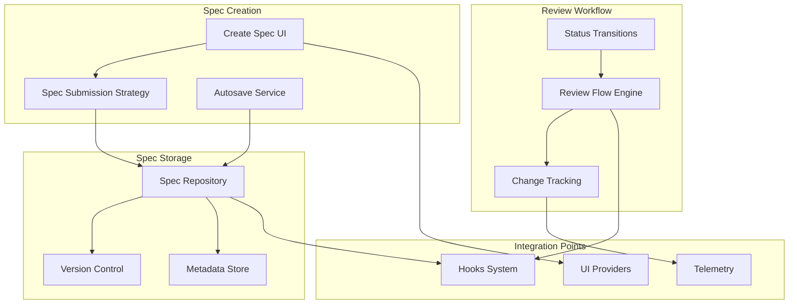
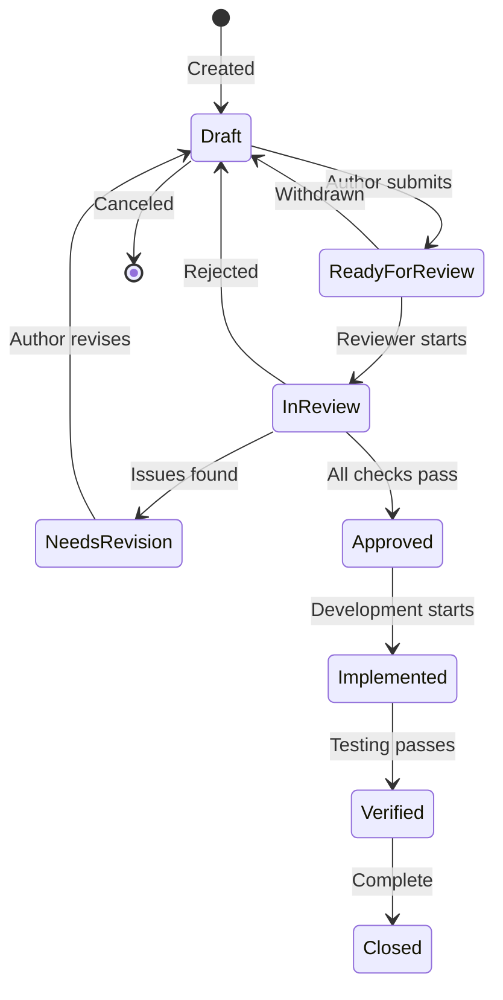
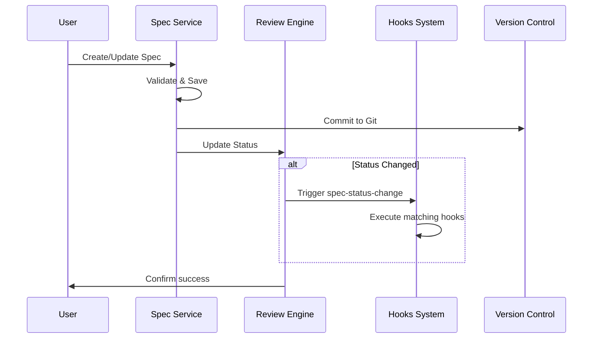

# Specification Management

## Overview
The Specification Management module handles the complete lifecycle of software specifications - from creation through review to approval. It provides structured workflows for teams to collaborate on requirements, track changes, and maintain audit trails. This module integrates with the [hooks_system](hooks_system.md) to enable automated workflows triggered by spec status changes.

**Business Value**: Standardizes requirement documentation, enforces review processes, and provides traceability from requirements to implementation.

## Architecture & Design



**Key Patterns**:
- **State Pattern**: Spec status transitions with validation rules
- **Strategy Pattern**: Different submission strategies for different environments
- **Observer Pattern**: Notify hooks system of status changes
- **Repository Pattern**: Centralized spec storage with versioning

## Core Components

### Specification
**Purpose**: Represents a software requirement specification with lifecycle management.

**Business Rules**:
- Each spec has a unique identifier
- Status transitions follow predefined workflow
- Version history tracks all changes
- Metadata includes creation date, author, and modification history

**State Machine**:


### SpecSubmissionStrategyFactory
**Purpose**: Creates appropriate submission strategies based on environment and context.

**Business Rules**:
- Determines submission method (direct save, API call, etc.)
- Validates spec content before submission
- Handles error recovery and retry logic
- Provides progress feedback during submission

### Review Flow Engine
**Purpose**: Manages the review workflow including status transitions and validation.

**Business Rules**:
- Enforces valid status transitions
- Validates review completion criteria
- Tracks review assignments and deadlines
- Generates review notifications and reminders

## Integration with Hooks System

The specification management module is a primary trigger source for the [hooks_system](hooks_system.md). Key integration points:

### Trigger Events
1. **Spec Status Change**: When a spec moves between states (e.g., `draft` → `ready-for-review`)
2. **Spec Created**: When a new specification is created
3. **Spec Updated**: When spec content is modified
4. **Review Assigned**: When a reviewer is assigned
5. **Review Completed**: When all reviews are submitted

### Context Variables Provided
When triggering hooks, the following context variables are available:

| Variable | Type | Description |
|----------|------|-------------|
| `specId` | string | Unique spec identifier |
| `specPath` | string | File system path to spec |
| `oldStatus` | string | Previous status (for status changes) |
| `newStatus` | string | New status (for status changes) |
| `changeAuthor` | string | User who made the change |
| `feature` | string | Feature name from spec metadata |
| `reviewers` | string[] | Array of assigned reviewers |

## Practical Examples

### Example: Auto-Assign Reviewers
```typescript
// Hook triggered when spec enters "ready-for-review" status
const autoReviewHook = {
    trigger: {
        type: "spec-status-change",
        conditions: {
            oldStatus: "draft",
            newStatus: "ready-for-review"
        }
    },
    action: {
        type: "custom",
        params: {
            agentId: "local:review-assigner",
            arguments: "Assign reviewers for spec {specId} about {feature}"
        }
    }
};
```

### Example: Notify Team on Approval
```typescript
// Hook triggered when spec is approved
const approvalNotificationHook = {
    trigger: {
        type: "spec-status-change",
        conditions: {
            oldStatus: "in-review",
            newStatus: "approved"
        }
    },
    action: {
        type: "github",
        params: {
            operation: "create-issue",
            titleTemplate: "Spec Approved: {feature}",
            bodyTemplate: "Spec {specId} has been approved and is ready for implementation."
        }
    }
};
```

## Data Flow



## Dependencies

### Internal Dependencies
- **[hooks_system](hooks_system.md)**: For triggering automated workflows
- **[ui_view_providers](ui_view_providers.md)**: For spec creation and management UI
- **[preview_system](preview_system.md)**: For spec preview functionality

### External Dependencies
- **Git**: For version control and collaboration
- **VS Code Workspace API**: For file system operations
- **GitHub API**: For remote repository integration (if configured)

## Error Handling

1. **Validation Errors**: Invalid spec content or metadata
2. **Submission Errors**: Network or storage failures
3. **Workflow Errors**: Invalid status transitions
4. **Integration Errors**: Hook execution failures

All errors include detailed context for debugging and user-friendly messages for recovery.

## Performance Considerations

- **Incremental Saving**: Autosave with debouncing
- **Caching**: Frequently accessed spec metadata
- **Background Processing**: Non-blocking submission and validation
- **Batch Operations**: Bulk status updates where possible

## Security

- **Access Control**: Role-based spec access
- **Audit Trail**: Complete change history
- **Data Validation**: Input sanitization and validation
- **Integration Security**: Secure hook execution with context isolation