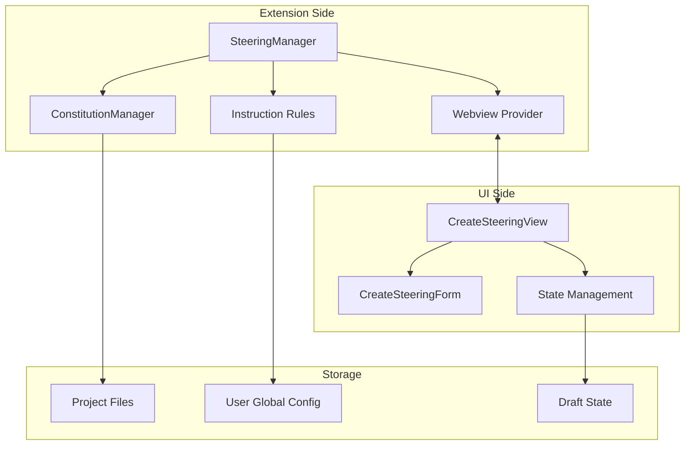
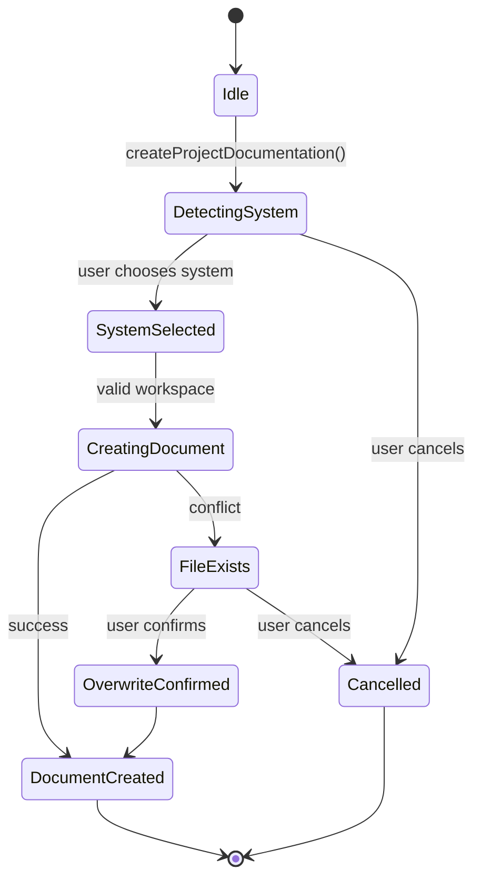
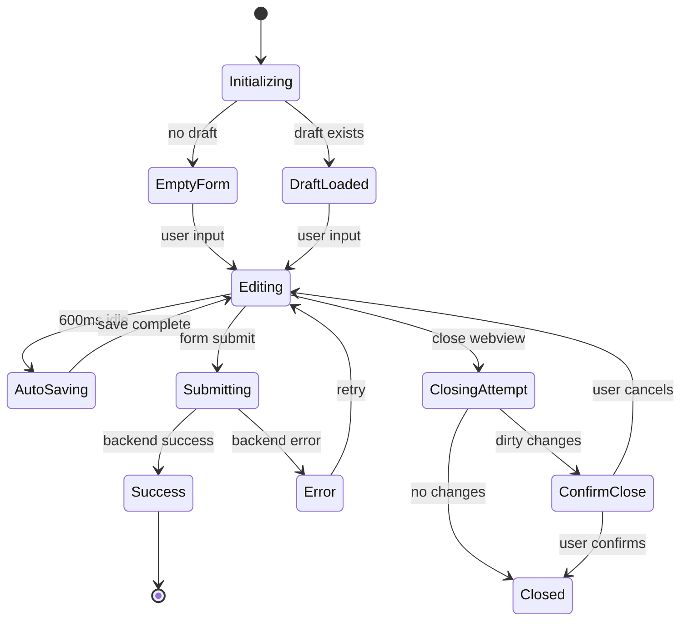
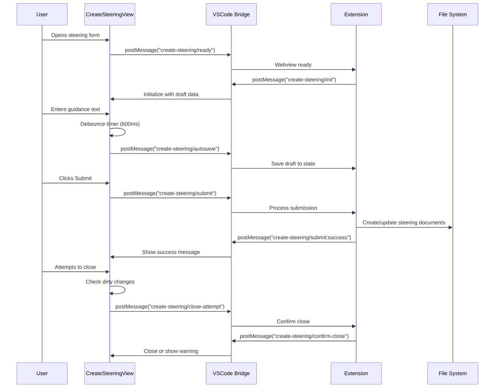

# Steering Management

## Overview
The Steering Management module provides tools for creating and managing AI agent steering documents—constitutions, instruction rules, and guidance systems that govern how AI agents behave in your projects. This module bridges the gap between human intent and AI execution by providing structured ways to define project principles, technical standards, and behavioral guidelines.

## Architecture & Design



**Key Patterns:**
- **Bridge Pattern**: Separates extension logic from UI components via message passing
- **Repository Pattern**: Manages steering documents as files in the filesystem
- **State Machine Pattern**: Handles form lifecycle (draft, submitting, saved)
- **Observer Pattern**: Webview messages observe and react to user interactions

## Core Components

### SteeringManager
**Purpose**: Main orchestrator for steering document creation and management.

**Business Rules:**
1. Detects existing SDD (Software Design Documentation) systems (SpecKit or OpenSpec)
2. Guides users through system selection when none is detected
3. Validates workspace context before creating documents
4. Handles file overwrite confirmations for existing documents

**State Machine:**


### CreateSteeringView
**Purpose**: React-based webview for creating steering guidance through a structured form.

**Business Rules:**
1. Form validation requires `summary` field (marked with asterisk)
2. Auto-saves drafts every 600ms of inactivity
3. Prevents data loss with dirty change detection
4. Maintains draft state across webview sessions

**State Machine:**


### Instruction Rules System
**Purpose**: Manages project and user-level instruction files for AI agents.

**Business Rules:**
1. Instruction names must normalize to kebab-case (`^[a-z0-9]+(-[a-z0-9]+)*$`)
2. Names cannot be empty or contain only special characters
3. Files are stored in `.github/instructions/` directories
4. Supports both project-specific and user-global instructions

### ConstitutionManager
**Purpose**: Manages project constitution files for SpecKit-based projects.

**Business Rules:**
1. Constitution files are stored at project root as `constitution.md`
2. Provides default constitution template when creating new files
3. Validates file existence before operations
4. Integrates with SpecKit workflow system

## Practical Examples

> [!TIP]
> The steering system helps you define "guardrails" for AI agents—think of it as creating a project playbook that all agents must follow.

### Creating Project Documentation
```typescript
// Example: Programmatically create project steering
const steeringManager = new SteeringManager(context, copilotProvider, outputChannel);

// This will:
// 1. Detect existing SDD system or prompt for selection
// 2. Create appropriate documentation (constitution.md or AGENTS.md)
// 3. Open the created file for editing
await steeringManager.createProjectDocumentation();
```

### Using the Webview Form
```typescript
// Example form data structure
const steeringData: CreateSteeringFormData = {
    summary: "Focus on code quality and test coverage",
    audience: "All developers on the backend team",
    keyPractices: `
    1. Write tests before implementation
    2. Use TypeScript strict mode
    3. Document public APIs
    4. Follow existing patterns`,
    antiPatterns: `
    1. Don't copy-paste code without understanding
    2. Avoid magic numbers and strings
    3. Don't ignore linting warnings`
};

// Message flow example
vscode.postMessage({
    type: "create-steering/submit",
    payload: steeringData
});
```

### Creating Instruction Rules
```typescript
// Example: Create a new instruction rule
const result = normalizeInstructionRuleName("Code Quality Rules");
if (result.ok) {
    const fileName = instructionRuleFileName(result.normalizedName);
    const template = buildInstructionRuleTemplate(result.normalizedName);
    // Save to .github/instructions/code-quality-rules.instructions.md
}
```

## Data Flow



## Dependencies

### Internal Dependencies:
- **[hooks_system](./hooks_system.md)**: For executing AI agent actions based on steering
- **[specification_management](./specification_management.md)**: Integrates with SpecKit workflow
- **[agents_management](./agents_management.md)**: Provides agent discovery and execution context
- **[ui_view_providers](./ui_view_providers.md)**: Shared UI component infrastructure
- **[preview_system](./preview_system.md)**: For document preview capabilities

### External Dependencies:
- **VSCode API**: Webview management, file system operations
- **React**: UI component framework for webviews
- **TypeScript**: Type safety and development tooling

## Integration Points

### With SpecKit:
When using SpecKit, steering documents become part of the "Specify -> Plan -> Implement" workflow. The constitution file (`constitution.md`) provides guiding principles that influence how specifications are written and reviewed.

### With OpenSpec:
For OpenSpec projects, steering manifests as `AGENTS.md` files that define agent behaviors and responsibilities within the openspec directory structure.

### With Copilot:
Global steering documents (`~/.github/copilot-instructions.md`) provide organization-wide guidance that applies to all Copilot interactions across projects.

## Best Practices

1. **Start Simple**: Begin with a basic constitution focusing on 3-5 core principles
2. **Iterate**: Refine steering documents as your team and project evolve
3. **Be Specific**: Vague guidance leads to inconsistent results; provide concrete examples
4. **Review Regularly**: Schedule quarterly reviews of steering documents
5. **Version Control**: Treat steering documents as code—commit and review changes

## Common Use Cases

### Onboarding New Team Members
Create a project constitution that defines coding standards, review processes, and team norms. New members can reference this document to understand project expectations.

### Enforcing Architectural Decisions
Use instruction rules to guide AI agents toward preferred patterns (e.g., "Use repository pattern for data access") and away from anti-patterns.

### Multi-Project Consistency
Create global instructions in `~/.github/instructions/` to ensure consistent AI behavior across all projects in your organization.

### Quality Gates
Define steering that requires tests, documentation, or specific validations before code can be considered complete.