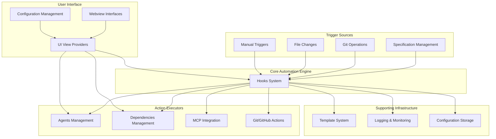
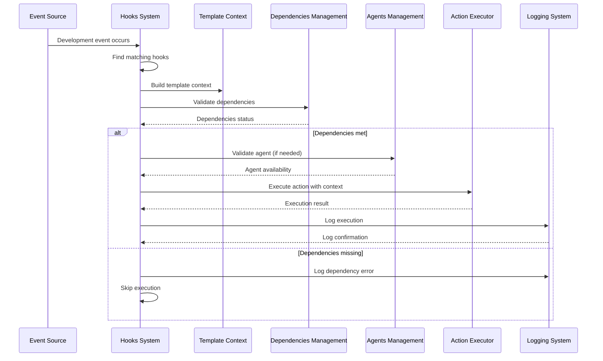
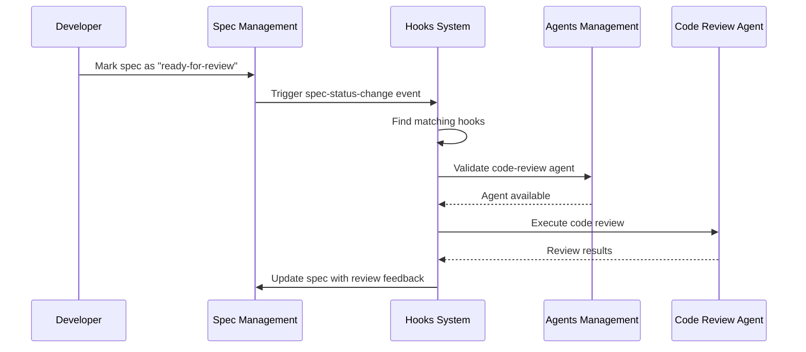
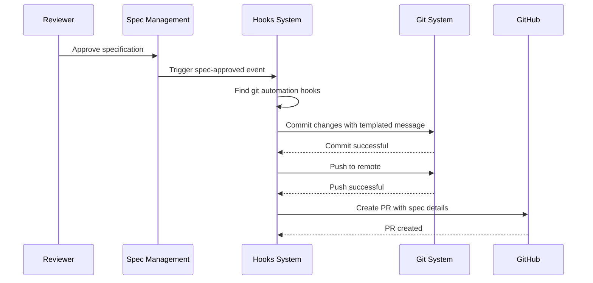
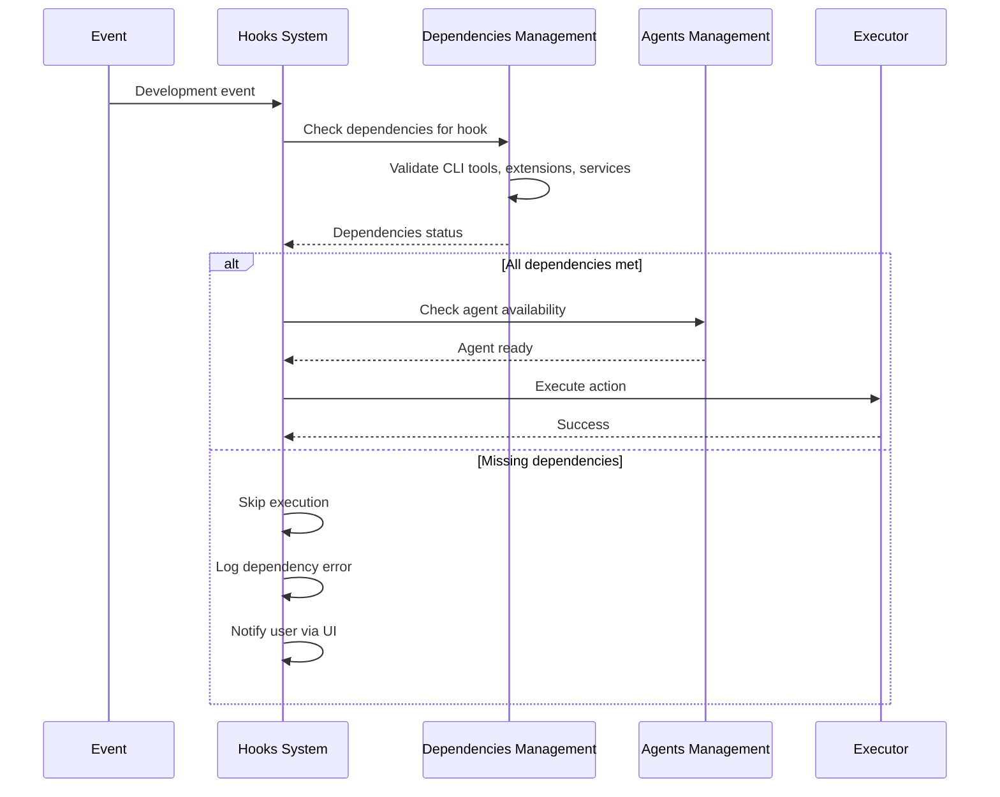

# System Overview: Hooks Automation Platform

## Introduction

The Hooks Automation Platform is a sophisticated event-driven automation system designed for software development workflows. It enables developers to create automated responses to development events, integrating tools like GitHub Copilot, MCP servers, Git, and custom agents into cohesive workflows.

## System Architecture



## Module Relationships

### Primary Flow: Hook Execution


## Key Modules

### 1. [hooks_system](hooks_system.md) - The Core Engine
**Purpose**: Central automation engine that matches events to hooks and executes actions.

**Key Responsibilities**:
- Hook definition and storage
- Event matching and trigger evaluation
- Action execution orchestration
- Execution logging and monitoring

**Integration Points**:
- Receives events from all trigger sources
- Coordinates with all action executors
- Provides data to UI for management
- Uses template system for parameterization

### 2. [specification_management](specification_management.md) - Primary Trigger Source
**Purpose**: Manages software specification lifecycle and generates status change events.

**Key Responsibilities**:
- Spec creation, editing, and storage
- Review workflow management
- Status transition validation
- Event generation for hooks system

**Integration Points**:
- Major source of hook triggers
- Provides rich context data (spec metadata, status changes)
- Integrates with Git for version control

### 3. [agents_management](agents_management.md) - Action Execution Foundation
**Purpose**: Discovers, registers, and manages available agents for custom actions.

**Key Responsibilities**:
- Agent discovery from multiple sources
- Availability checking and validation
- Agent metadata management
- Real-time agent status updates

**Integration Points**:
- Enables custom agent actions in hooks
- Provides agent selection for UI
- Validates agent capabilities before execution

### 4. [dependencies_management](dependencies_management.md) - Reliability Layer
**Purpose**: Ensures all required tools and services are available before execution.

**Key Responsibilities**:
- Dependency detection and validation
- Installation guidance generation
- Version compatibility checking
- Graceful degradation for optional dependencies

**Integration Points**:
- Pre-execution validation for hooks
- Provides dependency status to UI
- Enables reliable action execution

### 5. [ui_view_providers](ui_view_providers.md) - User Interface Layer
**Purpose**: Provides visual interfaces for system configuration and monitoring.

**Key Responsibilities**:
- Hook creation and management UI
- Dependency checking interface
- Agent selection interfaces
- Execution monitoring dashboard

**Integration Points**:
- Frontend for all user interactions
- Real-time status updates from all modules
- Configuration management interface

## Common Workflows

### Workflow 1: Automated Code Review


### Workflow 2: Git Automation


### Workflow 3: Dependency-aware Execution


## Configuration Management

### Hook Configuration Schema
```typescript
interface HookConfiguration {
    // Core identity
    id: string;                    // UUID v4
    name: string;                  // User-friendly name
    
    // Trigger configuration
    trigger: {
        type: TriggerType;         // Event type
        conditions: Record<string, any>; // Event-specific conditions
    };
    
    // Action configuration
    action: {
        type: ActionType;          // Agent, Git, GitHub, MCP, Custom
        params: ActionParams;      // Type-specific parameters
    };
    
    // Execution settings
    enabled: boolean;              // Active state
    executionCount: number;        // Statistics
    lastExecutedAt?: number;       // Last execution timestamp
    
    // Metadata
    createdAt: number;             // Creation timestamp
    modifiedAt: number;            // Last modification timestamp
}
```

### Template Variable System
The system supports template variables in action parameters:

```typescript
// Example: Git commit message with variables
const gitAction: GitActionParams = {
    operation: 'commit',
    messageTemplate: 'feat: {feature} implementation\n\nSpec: {specId}\nAuthor: {changeAuthor}'
};

// Available variables depend on trigger type:
// - spec-status-change: {specId, specPath, oldStatus, newStatus, changeAuthor, feature}
// - git-operation: {branch, commitHash, user, timestamp}
// - file-change: {fileName, filePath, changeType}
```

## Error Handling Strategy

### Layered Error Handling
1. **Validation Layer**: Prevent invalid configurations
2. **Dependency Layer**: Ensure execution prerequisites
3. **Execution Layer**: Handle runtime errors gracefully
4. **Recovery Layer**: Provide recovery options

### Error Categories
- **Configuration Errors**: Invalid hook definitions
- **Dependency Errors**: Missing tools or services
- **Execution Errors**: Action execution failures
- **Integration Errors**: External service failures
- **Permission Errors**: Insufficient access rights

## Performance Considerations

### Caching Strategy
- **Hook Matching Cache**: Compiled trigger conditions
- **Dependency Cache**: Detection results with TTL
- **Agent Cache**: Availability status with freshness checks
- **Template Cache**: Compiled template strings

### Optimization Techniques
- **Lazy Loading**: Load modules only when needed
- **Background Processing**: Non-blocking operations
- **Batch Operations**: Group similar operations
- **Incremental Updates**: Only process changed data

## Security Model

### Access Control
- **Workspace Trust**: Respect VS Code workspace trust boundaries
- **Permission Validation**: Check permissions before operations
- **Agent Sandboxing**: Isolate agent execution where possible
- **Credential Protection**: Secure handling of authentication data

### Input Validation
- **Template Sanitization**: Prevent injection attacks
- **Parameter Validation**: Validate all action parameters
- **Path Validation**: Secure file system operations
- **Command Sanitization**: Safe command execution

## Monitoring and Observability

### Logging Levels
1. **Execution Logs**: Detailed hook execution records
2. **System Logs**: Module initialization and errors
3. **Performance Logs**: Timing and resource usage
4. **Audit Logs**: Configuration changes and security events

### Metrics Collection
- **Hook Execution Count**: Success/failure rates
- **Execution Duration**: Performance monitoring
- **Dependency Status**: Availability metrics
- **Agent Usage**: Popular agents and success rates

## Getting Started

### Typical Implementation Journey
1. **Start Simple**: Create a single hook for a common task
2. **Add Templates**: Use variables to make hooks reusable
3. **Explore Agents**: Integrate custom agents for specialized tasks
4. **Build Workflows**: Chain multiple hooks for complex workflows
5. **Monitor and Optimize**: Use logs to refine and improve

### Recommended First Hooks
1. **Auto-clarify**: Trigger clarification on new specs
2. **Git commit**: Auto-commit on spec approval
3. **Notification**: Create GitHub issues for important changes
4. **Code review**: Automated code review on PR creation

## Conclusion

The Hooks Automation Platform provides a powerful, flexible foundation for automating development workflows. By integrating specification management, agent execution, dependency validation, and intuitive UI, it enables teams to create sophisticated automation while maintaining reliability and security.

Each module plays a specific role in the ecosystem, and together they provide a complete solution for event-driven automation in software development.