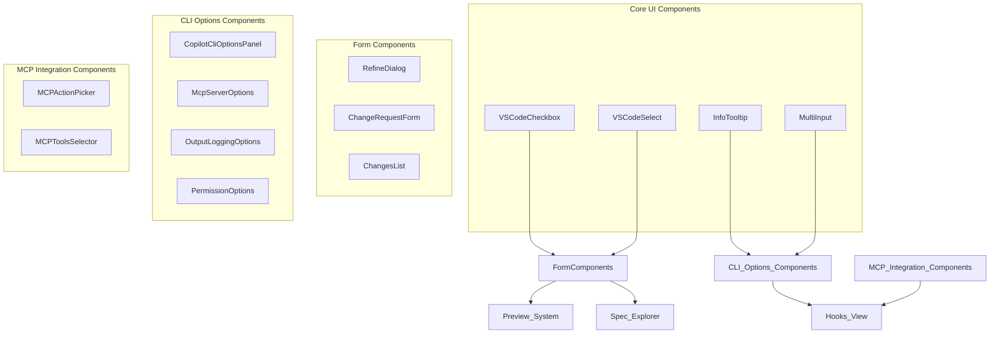
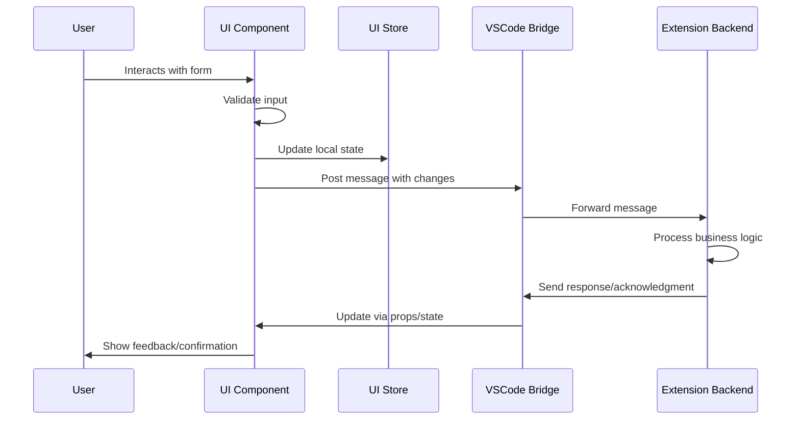
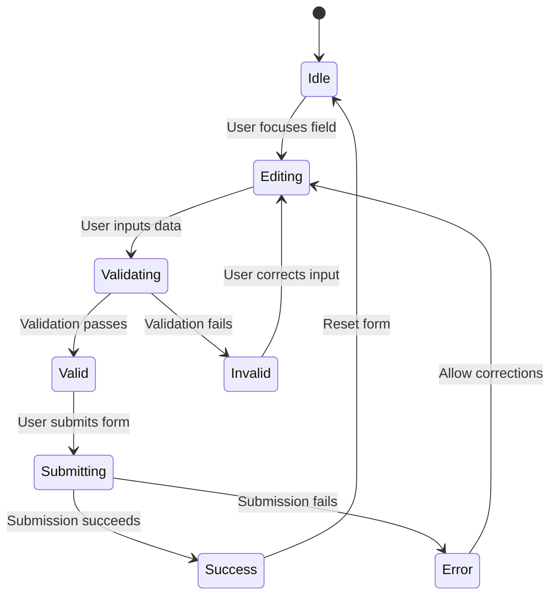

# UI Components

## Overview
The UI Components module provides a comprehensive library of reusable React components and form controls specifically designed for the extension's webview interfaces. These components implement consistent styling, accessibility patterns, and integration with the VSCode design system while supporting complex form handling, CLI option configuration, and specialized UI patterns for agent management and specification workflows.

## Architecture & Design


**Key Patterns:**
- **Compound Components**: CLI options panels use collapsible sections with specialized sub-components
- **Controlled Components**: All form components follow React controlled component patterns
- **Design System Integration**: Components implement VSCode styling and accessibility standards
- **Type-Safe Props**: Comprehensive TypeScript interfaces ensure type safety across component boundaries

## Core Components

### VSCodeCheckbox
- **Purpose**: Checkbox input component styled to match VSCode's design system using native CSS variables
- **Business Rules**: 
  - Uses `--vscode-checkbox-*` CSS variables for proper theming support
  - Supports indeterminate state for hierarchical selections with custom SVG icon
  - Implements proper accessibility with generated IDs and label associations
  - Size variants (sm: 3.5, md: 4, lg: 5) maintain consistent spacing
  - Focus states use `--vscode-focusBorder` for consistent keyboard navigation

### VSCodeSelect
- **Purpose**: Select dropdown component with VSCode styling and validation support
- **Business Rules**:
  - Required field validation with visual indicators using `required` prop
  - Error state management with descriptive messages displayed below the select
  - Size variants for different form contexts (sm/md/lg)
  - Optional description text for additional context
  - Proper label association with generated IDs for accessibility

### InfoTooltip
- **Purpose**: Contextual help tooltip with rich content support for CLI options
- **Business Rules**:
  - Position-aware rendering with viewport boundary detection (top/bottom/left/right)
  - Warning messages displayed with distinct yellow/orange styling and warning icon
  - "Learn more" links open in external browser with `rel="noopener noreferrer"`
  - Keyboard accessible with button trigger and `aria-label`
  - Click-to-toggle behavior for touch devices alongside hover support
  - Uses `aria-live="polite"` for screen reader announcements

### MultiInput
- **Purpose**: Tag-style input for managing arrays of string values (e.g., environment variables, CLI flags)
- **Business Rules**:
  - Keyboard navigation: Enter or comma to add values, Backspace to remove last value when input empty
  - Duplicate value prevention with `!value.includes(trimmed)` check
  - Real-time comma parsing: typing commas automatically creates new chips
  - Empty state handling with placeholder text that disappears when chips exist
  - Accessible chip removal with `aria-label="Remove {value}"` buttons
  - Visual chips with remove buttons for clear value management

### RefineDialogValues
- **Purpose**: Form data structure for specification refinement dialogs
- **Business Rules**:
  - Section references must be valid within the current specification
  - Issue types must be from predefined `PreviewRefinementIssueType` enum
  - Descriptions have minimum length requirements for actionable feedback

### ChangeRequestFormValues
- **Purpose**: Data structure for creating and editing specification change requests
- **Business Rules**:
  - Title must be non-empty and descriptive
  - Severity levels follow standardized impact assessment
  - Optional submitter field for team collaboration contexts

### CopilotCliOptionsPanel
- **Purpose**: Comprehensive configuration panel for GitHub Copilot CLI options
- **Business Rules**:
  - Collapsible sections for complex configuration groups
  - Validation of interdependent options (e.g., model selection with permissions)
  - Real-time validation feedback for invalid combinations

### MCPActionPicker
- **Purpose**: Server and tool selection component for MCP (Model Context Protocol) integration
- **Business Rules**:
  - Server availability validation before tool enumeration
  - Loading state management during server discovery
  - Error handling for connection failures

### MCPToolsSelector
- **Purpose**: Multi-select interface for choosing MCP tools from available servers
- **Business Rules**:
  - Tool categorization by server source
  - Selection persistence across component remounts
  - Disabled state handling for read-only contexts

## Practical Examples

> [!TIP]
> These components are designed to work together in complex forms while maintaining type safety and consistent user experience.

### Creating a CLI Options Configuration Form
```typescript
import { CopilotCliOptionsPanel } from "@/features/hooks-view/components/cli-options/copilot-cli-options-panel";
import { useState } from "react";
import type { CopilotCliOptions } from "@/features/hooks-view/types";

function HookConfigurationForm() {
  const [cliOptions, setCliOptions] = useState<CopilotCliOptions>({
    model: "gpt-4",
    allowAllPaths: false,
    allowAllTools: false,
    allowAllUrls: false,
    silent: false,
    logLevel: "info",
    noColor: false,
    stream: "on",
    banner: true,
    noAutoUpdate: false
  });

  const handleOptionsChange = (newOptions: CopilotCliOptions) => {
    // Validate and update options
    setCliOptions(newOptions);
    
    // Persist to backend via VSCode message bridge
    vscode.postMessage({
      type: "hooks/update",
      payload: {
        id: currentHookId,
        updates: { cliOptions: newOptions }
      }
    });
  };

  return (
    <div className="configuration-panel">
      <CopilotCliOptionsPanel
        value={cliOptions}
        onChange={handleOptionsChange}
        disabled={isSaving}
      />
    </div>
  );
}
```

### Building a Multi-Input Tag Manager
```typescript
import { MultiInput } from "@/components/cli-options/multi-input";

function EnvironmentVariablesEditor() {
  const [envVars, setEnvVars] = useState<string[]>([
    "API_KEY=secret123",
    "DEBUG=true",
    "LOG_LEVEL=info"
  ]);

  const handleEnvVarsChange = (newVars: string[]) => {
    // Validate each variable format
    const validVars = newVars.filter(variable => 
      variable.includes("=") && !variable.startsWith("=")
    );
    
    setEnvVars(validVars);
    
    // Update hook configuration
    updateHookConfig({ environment: validVars });
  };

  return (
    <MultiInput
      value={envVars}
      onChange={handleEnvVarsChange}
      placeholder="Add environment variable (KEY=VALUE)"
      label="Environment Variables"
      className="env-vars-input"
    />
  );
}
```

### Implementing a Change Request Workflow
```typescript
import { ChangeRequestForm } from "@/components/spec-explorer/change-request-form";
import { ChangesList } from "@/components/spec-explorer/changes-list";

function SpecificationReviewPanel() {
  const [changeRequests, setChangeRequests] = useState<ChangeRequest[]>([]);
  const [selectedSpec, setSelectedSpec] = useState<Specification>();

  const handleSubmitChangeRequest = (values: ChangeRequestFormValues) => {
    // Create new change request
    const newRequest: ChangeRequest = {
      id: generateId(),
      ...values,
      status: "open",
      createdAt: new Date().toISOString(),
      specId: selectedSpec.id
    };

    setChangeRequests([...changeRequests, newRequest]);
    
    // Notify backend
    vscode.postMessage({
      type: "createChangeRequest",
      request: newRequest
    });
  };

  return (
    <div className="spec-review">
      <ChangeRequestForm
        onSubmit={handleSubmitChangeRequest}
        existingRequests={changeRequests.filter(cr => cr.specId === selectedSpec?.id)}
      />
      
      <ChangesList
        items={changeRequests.map(cr => ({
          spec: getSpecById(cr.specId),
          changeRequest: cr
        }))}
        onItemClick={handleChangeRequestClick}
      />
    </div>
  );
}
```

## Data Flow



## Component Composition Patterns

### CLI Options Panel Hierarchy
The CLI options components follow a sophisticated composition pattern where specialized panels manage specific configuration domains:

```mermaid
graph TB
    subgraph "CopilotCliOptionsPanel"
        PermissionOptions[PermissionOptions]
        ModelExecutionOptions[ModelExecutionOptions]
        McpServerOptions[McpServerOptions]
        OutputLoggingOptions[OutputLoggingOptions]
        SessionConfigOptions[SessionConfigOptions]
    end
    
    PermissionOptions --> FileSystem[File System Access]
    PermissionOptions --> NetworkAccess[Network Access]
    PermissionOptions --> ProcessExec[Process Execution]
    
    ModelExecutionOptions --> ModelSelect[Model Selection]
    ModelExecutionOptions --> Temperature[Temperature Control]
    ModelExecutionOptions --> MaxTokens[Token Limits]
    
    McpServerOptions --> ServerConfig[MCP Server Config]
    McpServerOptions --> ToolSelection[Tool Selection]
    McpServerOptions --> GitHubMCP[GitHub MCP Tools]
    
    OutputLoggingOptions --> LogLevels[Log Levels]
    OutputLoggingOptions --> OutputFormats[Output Formats]
    OutputLoggingOptions --> ColorSettings[Color Settings]
    
    SessionConfigOptions --> SessionMgmt[Session Management]
    SessionConfigOptions --> ResumeOptions[Resume Options]
    SessionConfigOptions --> Sharing[Sharing Settings]
```



### Form Component Integration
Form components integrate with the broader application through standardized patterns:

1. **Controlled Component Pattern**: All form values flow through props
2. **Validation Coordination**: Parent components coordinate validation across child fields
3. **Message Bridge Integration**: Components post messages to VSCode extension via `vscode.postMessage()`
4. **Store Synchronization**: UI state synchronized with application stores (SpecExplorerStore, PreviewStore)

## Dependencies

### Internal Dependencies
- **[hooks_view](hooks_view.md)**: CLI options types (`CopilotCliOptions`), MCP server interfaces, and webview message protocols
- **[preview_system](preview_system.md)**: Refinement issue types (`PreviewRefinementIssueType`) and preview store integration
- **[spec_explorer](spec_explorer.md)**: Specification types, change request interfaces, and `SpecExplorerStore` for state management
- **[ui_infrastructure](ui_infrastructure.md)**: VSCode bridge utilities (`Window` interface) and page registry for routing
- **[hooks_system](hooks_system.md)**: Core hook types and execution parameters that inform UI validation rules
- **[specification_management](specification_management.md)**: Specification creation and submission types used in form components

### External Dependencies
- **React 18+**: Component framework with hooks for state management
- **TypeScript 5.0+**: Type safety and interface definitions with strict null checking
- **VSCode CSS Variables**: Design system integration using `--vscode-*` custom properties
- **CSS Modules**: Component-scoped styling with `.module.css` files
- **Tailwind CSS**: Utility classes for layout and responsive design (via `cn()` utility)
- **React Aria**: Accessibility hooks and behaviors (implied by ARIA patterns)

## Component Lifecycle & State Management

### Form Component State Machine


### CLI Options Panel Composition
The CLI options components follow a hierarchical composition pattern:

```
CopilotCliOptionsPanel
├── PermissionOptions (file system, network, process permissions)
├── ModelExecutionOptions (model, temperature, max tokens)
├── McpServerOptions (MCP server configurations)
├── OutputLoggingOptions (log levels, output formats)
└── SessionConfigOptions (session management, timeouts)
```

Each sub-component manages its own validation logic while reporting changes to the parent panel, which coordinates overall validation and persistence.

## Styling & Theming System

### VSCode Design System Integration
All components leverage VSCode's native CSS variable system for seamless theming:

```css
/* Example from VSCodeCheckbox component */
.vscode-checkbox {
  background: var(--vscode-checkbox-background, transparent);
  border: 1px solid var(--vscode-checkbox-border, #6b6b6b);
}

.vscode-checkbox:checked {
  background: var(--vscode-checkbox-selectBackground, #0078d4);
  border-color: var(--vscode-checkbox-selectBorder, #0078d4);
}

.vscode-checkbox:focus-visible {
  outline: 1px solid var(--vscode-focusBorder, #007fd4);
}
```

### CSS Module Pattern
Each component uses CSS Modules for scoped styling:

```typescript
// Component file
import styles from "./info-tooltip.module.css";

function InfoTooltip() {
  return <div className={styles.tooltip}>...</div>;
}
```

```css
/* info-tooltip.module.css */
.tooltip {
  /* Scoped styles that won't leak to other components */
  position: absolute;
  z-index: 1000;
}
```

### Responsive Design Principles
- **Mobile-First**: Components designed for VSCode's webview constraints
- **Fluid Layouts**: Use of flexbox and CSS grid for adaptive layouts
- **Touch Targets**: Minimum 44px touch targets for interactive elements
- **Viewport Awareness**: Tooltips and modals adjust position based on available space

## Accessibility Considerations

All components in this module implement comprehensive accessibility features:

### Keyboard Navigation
- **Tab Order**: Logical tab sequence following visual layout
- **Arrow Keys**: Navigation within component groups (e.g., checkbox groups)
- **Escape**: Dismiss modals, tooltips, and dropdowns
- **Enter/Space**: Activate buttons and toggle states

### ARIA Attributes
- **Roles**: Proper `role` attributes (tooltip, dialog, checkbox, etc.)
- **Labels**: `aria-label` and `aria-labelledby` for unlabeled elements
- **Live Regions**: `aria-live="polite"` for dynamic content updates
- **States**: `aria-checked`, `aria-disabled`, `aria-expanded` for state communication

### Screen Reader Support
- **Semantic HTML**: Native HTML elements where possible (`<button>`, `<input>`)
- **Descriptive Text**: Contextual labels that make sense without visual context
- **Focus Management**: Programmatic focus control for modal dialogs
- **Announcements**: Dynamic content changes announced to screen readers

### Color & Contrast
- **WCAG 2.1 AA**: Minimum 4.5:1 contrast ratio for normal text
- **Theme Awareness**: Colors adapt to VSCode's light/dark/high-contrast themes
- **Focus Indicators**: Visible focus rings with adequate contrast
- **State Differentiation**: Distinct visual states for hover, focus, active, disabled

## Performance Optimizations

- **Memoization**: Expensive calculations memoized with `useMemo` and `useCallback`
- **Virtualization**: Large lists use windowing techniques (via external libraries)
- **Lazy Loading**: Heavy components loaded on-demand
- **CSS Containment**: Component-scoped styles prevent layout thrashing

## Testing Strategy

Components are tested at three levels:
1. **Unit Tests**: Individual component logic and state management
2. **Integration Tests**: Component composition and data flow
3. **Visual Regression Tests**: UI consistency across updates

## Migration & Compatibility

When updating components:
1. **Backward Compatibility**: Deprecated props maintained for one major version
2. **Migration Guides**: Clear documentation for breaking changes
3. **Automated Codemods**: Scripts to update consumer code
4. **TypeScript Warnings**: Compiler warnings for deprecated usage

## Development Guidelines

### Creating New Components
When extending this module, follow these patterns:

1. **Type Safety First**: Define comprehensive TypeScript interfaces
2. **Controlled Components**: Use props for data flow, not internal state
3. **VSCode Theming**: Leverage `--vscode-*` CSS variables
4. **Accessibility**: Implement keyboard navigation and ARIA attributes
5. **CSS Modules**: Use scoped styles with `.module.css` files

### Component Testing Strategy
```typescript
// Example test pattern for VSCodeCheckbox
describe("VSCodeCheckbox", () => {
  it("toggles checked state on click", () => {
    const { getByRole } = render(<VSCodeCheckbox />);
    const checkbox = getByRole("checkbox");
    fireEvent.click(checkbox);
    expect(checkbox).toBeChecked();
  });

  it("supports indeterminate state", () => {
    const { getByRole } = render(<VSCodeCheckbox indeterminate />);
    const checkbox = getByRole("checkbox");
    expect(checkbox).toHaveAttribute("aria-checked", "mixed");
  });

  it("respects disabled state", () => {
    const { getByRole } = render(<VSCodeCheckbox disabled />);
    const checkbox = getByRole("checkbox");
    expect(checkbox).toBeDisabled();
    expect(checkbox).toHaveClass("opacity-50");
  });
});
```

### Performance Best Practices
- **Memoization**: Use `React.memo()` for pure components
- **Callback Stability**: Memoize event handlers with `useCallback`
- **Lazy Loading**: Code-split heavy components with `React.lazy()`
- **Virtualization**: Implement windowing for large lists
- **CSS Containment**: Use `contain: layout style paint` where appropriate

## Migration & Versioning

### Breaking Changes Policy
1. **Major Versions**: Breaking changes allowed (e.g., prop renames)
2. **Minor Versions**: New features, deprecation warnings
3. **Patch Versions**: Bug fixes only, no API changes

### Deprecation Process
```typescript
// Old API (deprecated)
interface OldProps {
  isDisabled?: boolean; // Will be removed in v2.0
}

// New API
interface NewProps {
  disabled?: boolean; // Use this instead
}

// Component implementation with backward compatibility
function MyComponent({ isDisabled, disabled = isDisabled }: OldProps & NewProps) {
  // Show warning in development
  if (process.env.NODE_ENV === "development" && isDisabled !== undefined) {
    console.warn("isDisabled is deprecated, use disabled instead");
  }
  return <div className={disabled ? "disabled" : ""}>...</div>;
}
```

## Conclusion

The UI Components module serves as the foundation for all user-facing interfaces in the extension, providing:

### Key Benefits
1. **Consistency**: Uniform look and feel across all webviews
2. **Accessibility**: WCAG 2.1 AA compliance out of the box
3. **Type Safety**: Full TypeScript support with comprehensive interfaces
4. **Theming**: Seamless integration with VSCode's theme system
5. **Performance**: Optimized rendering and minimal bundle impact

### Integration Patterns
- **Form Management**: Controlled components with validation
- **CLI Configuration**: Specialized panels for complex option sets
- **MCP Integration**: Server and tool selection interfaces
- **Specification Workflows**: Change request and refinement dialogs

### Future Directions
- **Component Library**: Potential extraction as standalone package
- **Design Tokens**: Formalized design system documentation
- **Interactive Playground**: Component documentation with live examples
- **Automated Accessibility Testing**: Integration with axe-core

This module enables rapid development of feature-rich webviews while maintaining high standards for usability, accessibility, and maintainability within the VSCode extension ecosystem.