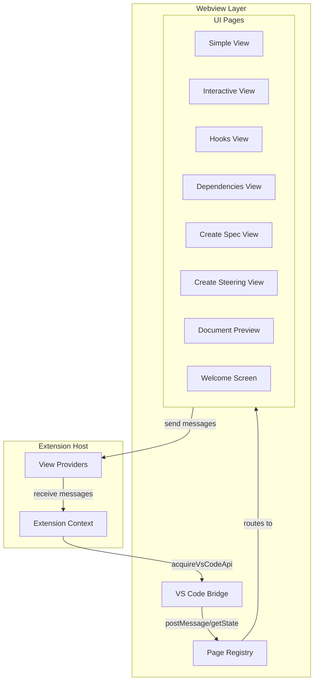
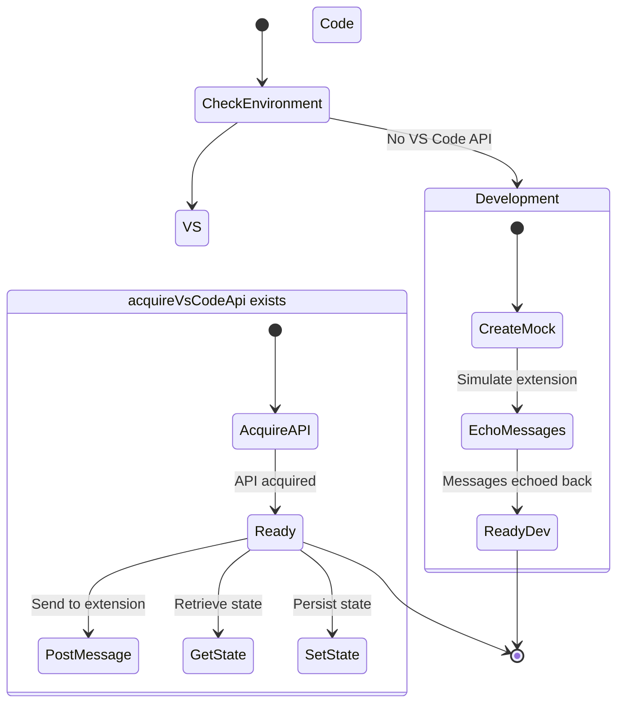
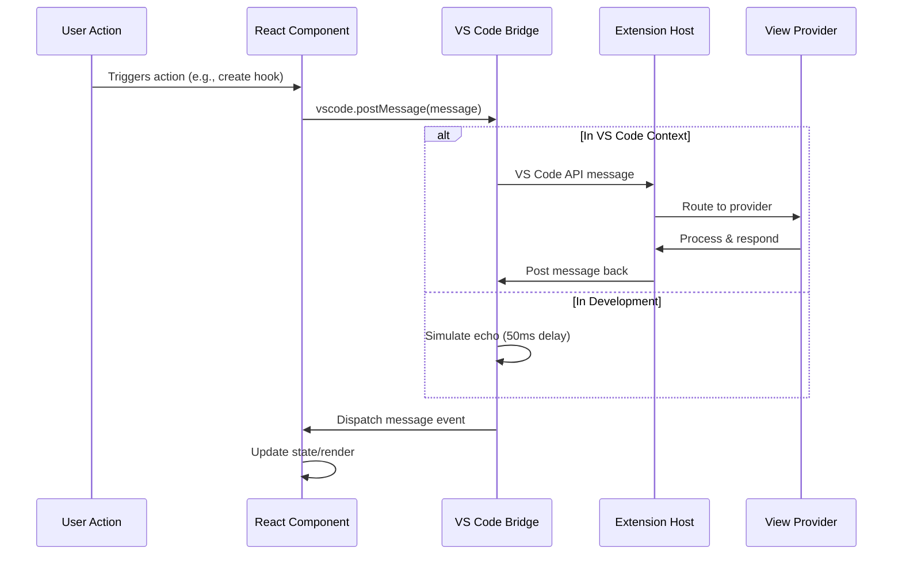

# UI Infrastructure

## Overview
The UI Infrastructure module provides the foundational layer for all webview-based interfaces in the VS Code extension. It handles VS Code API communication, page routing, and provides a consistent bridge between the extension host and React-based webviews. This module ensures that all UI components can communicate with the extension backend while maintaining a clean separation of concerns.

## Architecture & Design
- **Bridge Pattern**: Abstracts VS Code API communication with a development-friendly fallback
- **Registry Pattern**: Centralized page routing and component resolution
- **Message-Based Communication**: All UI ↔ Extension communication uses typed message protocols



## Core Components

### Window Interface
- **Purpose**: Type-safe declaration for VS Code's `acquireVsCodeApi` function in the webview context
- **Business Rules**: 
  - Only available in VS Code webview contexts
  - Provides access to VS Code's message passing API
  - Includes development fallback for local preview

```typescript
interface Window {
    acquireVsCodeApi?: () => VsCodeApi;
}
```

### SupportedPage Type
- **Purpose**: Defines all available webview pages in the application
- **Business Rules**:
  - Each page must have a corresponding renderer in `pageRenderers`
  - Page names must match the keys used in extension view registration
  - New pages must be added to this union type and the registry

```typescript
type SupportedPage =
    | "simple"           // Simple chat interface
    | "interactive"      // Interactive agent interface
    | "create-spec"      // Specification creation form
    | "create-steering"  // Steering instruction creation
    | "hooks"           // Hooks management interface
    | "dependencies"    // Dependencies management
    | "document-preview" // Document preview viewer
    | "welcome-screen";  // Welcome and setup screen
```

### Page Registry
- **Purpose**: Maps page names to React component renderers
- **Business Rules**:
  - Must provide a renderer for every `SupportedPage` type
  - Uses `satisfies` for type safety
  - Includes error boundaries for critical pages

```typescript
const pageRenderers = {
    simple: () => <SimpleView />,
    interactive: () => <InteractiveView />,
    "create-spec": () => <CreateSpecView />,
    "create-steering": () => <CreateSteeringView />,
    hooks: () => <HooksView />,
    dependencies: () => <DependenciesView />,
    "document-preview": () => <PreviewApp />,
    "welcome-screen": () => (
        <WelcomeErrorBoundary>
            <WelcomeScreen />
        </WelcomeErrorBoundary>
    ),
} satisfies Record<SupportedPage, () => JSX.Element>;
```

### VS Code Bridge
- **Purpose**: Abstracts VS Code API with development fallback
- **State Machine**:



## Practical Examples

> [!TIP]
> The VS Code bridge automatically handles environment detection, making your UI code work seamlessly in both development and production.

### Basic Page Rendering
```typescript
// In your extension code
const panel = window.createWebviewPanel(
    'gatomia.hooks',
    'Hooks Management',
    ViewColumn.One,
    {
        enableScripts: true,
        localResourceRoots: [extensionUri]
    }
);

// Set the HTML content that will load the React app
panel.webview.html = getWebviewContent('hooks');
```

### Message Communication
```typescript
// In your React component
import { vscode } from '../bridge/vscode';

// Send a message to the extension
const sendReadyMessage = () => {
    vscode.postMessage({
        type: 'hooks/ready',
        timestamp: Date.now()
    });
};

// Receive messages from the extension
useEffect(() => {
    const handleMessage = (event: MessageEvent) => {
        const message = event.data;
        switch (message.type) {
            case 'hooks/list':
                setHooks(message.payload);
                break;
            case 'hooks/created':
                showNotification('Hook created successfully');
                break;
        }
    };

    window.addEventListener('message', handleMessage);
    return () => window.removeEventListener('message', handleMessage);
}, []);
```

### Adding a New Page
```typescript
// 1. Add to SupportedPage type
type SupportedPage = 
    | "simple"
    | "interactive"
    // ... existing pages
    | "new-feature";  // Add new page

// 2. Create the React component
export const NewFeatureView = () => {
    return <div>New Feature Interface</div>;
};

// 3. Add to pageRenderers
const pageRenderers = {
    // ... existing renderers
    "new-feature": () => <NewFeatureView />,
} satisfies Record<SupportedPage, () => JSX.Element>;

// 4. Register in extension
extensionContext.subscriptions.push(
    vscode.window.registerWebviewViewProvider(
        'gatomia.new-feature',
        new NewFeatureViewProvider(extensionContext)
    )
);
```

## Data Flow



## Dependencies

### Internal Dependencies
- **ui_view_providers**: Provides message interfaces for each view type ([ui_view_providers.md](ui_view_providers.md))
- **preview_system**: Document preview functionality ([preview_system.md](preview_system.md))
- **welcome_setup**: Welcome screen implementation ([welcome_setup.md](welcome_setup.md))
- **hooks_view**: Hooks management UI ([hooks_view.md](hooks_view.md))
- **dependencies_view**: Dependencies management UI ([dependencies_view.md](dependencies_view.md))
- **create_spec_view**: Specification creation UI ([create_spec_view.md](create_spec_view.md))
- **spec_explorer**: Specification exploration ([spec_explorer.md](spec_explorer.md))

### External Dependencies
- **VS Code API**: `acquireVsCodeApi()` function for webview communication
- **React**: UI component framework
- **TypeScript**: Type safety and development tooling

## Integration Patterns

### 1. Message Protocol
Each view type has its own message protocol defined in the corresponding provider:
- `hooks/*` messages for HooksView
- `dependencies/*` messages for DependenciesView  
- `welcome/*` messages for WelcomeScreen
- `preview/*` messages for PreviewApp

### 2. State Management
The bridge provides `getState()` and `setState()` methods for persisting UI state across webview reloads, which is essential for maintaining user context in VS Code.

### 3. Development Experience
The development fallback enables:
- Hot reload during UI development
- Message echo for testing communication flows
- No VS Code dependency for frontend developers

### 4. Error Handling
Critical pages like the WelcomeScreen include error boundaries to prevent complete UI failure, while simpler views rely on the React error boundary at the root level.

## Best Practices

1. **Always use the `vscode` bridge** instead of directly accessing `acquireVsCodeApi`
2. **Type your messages** using the interfaces from corresponding providers
3. **Handle both environments** - your UI should work in development and production
4. **Use the page registry** for routing instead of manual component selection
5. **Persist important state** using `vscode.setState()` for better UX across reloads

## Common Issues & Solutions

### Issue: Messages not reaching the extension
**Solution**: Ensure you're using `vscode.postMessage()` not `window.parent.postMessage()`

### Issue: State lost on webview reload  
**Solution**: Use `vscode.getState()` on initialization and `vscode.setState()` on changes

### Issue: UI doesn't work in development
**Solution**: Check that your messages are properly formed - the dev echo expects `{ id, text }` shape

### Issue: New page not loading
**Solution**: Verify the page name matches exactly in:
1. `SupportedPage` type
2. `pageRenderers` object key
3. Extension view registration