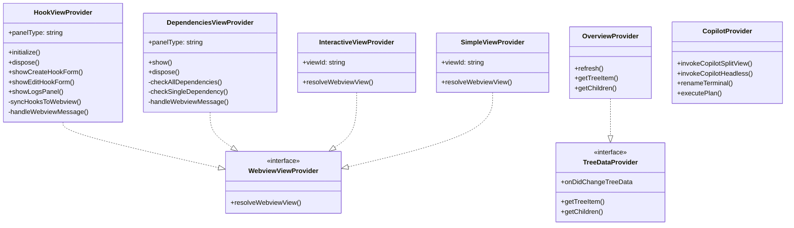
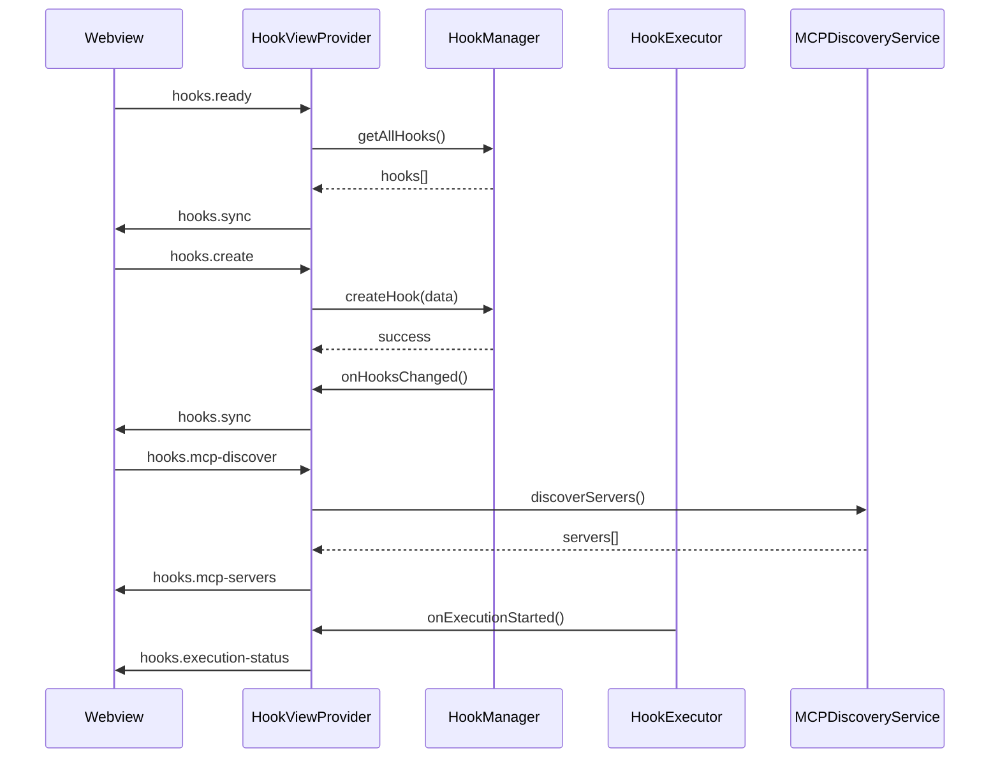

# UI View Providers

## Overview

The `ui_view_providers` module provides a collection of view providers that manage webview panels and sidebars in the GatomIA VS Code extension. These providers handle communication between the extension backend and webview frontends, enabling rich UI experiences for features like hooks management, dependency checking, and interactive views.

## Architecture



## Components

### Hook View Provider

The `HookViewProvider` manages the hooks configuration webview panel for creating, editing, and monitoring automation hooks.

#### Public API

```typescript
class HookViewProvider {
    static readonly panelType = "gatomia.hooksPanel";
    
    constructor(options: {
        context: ExtensionContext;
        hookManager: HookManager;
        hookExecutor: HookExecutor;
        mcpDiscoveryService: IMCPDiscoveryService;
        outputChannel: OutputChannel;
    });
    
    initialize(): void;
    dispose(): void;
    async showCreateHookForm(): Promise<void>;
    async showEditHookForm(hook: Hook): Promise<void>;
    async showLogsPanel(hookId?: string): Promise<void>;
}
```

#### Message Protocol

**Webview → Extension Messages:**
```typescript
interface HookCreateMessage {
    command?: "hooks.create";
    type?: "hooks/create";
    data: Omit<Hook, "id" | "createdAt" | "modifiedAt" | "executionCount">;
}

interface HookUpdateMessage {
    command?: "hooks.update";
    type?: "hooks/update";
    data: { id: string; updates: Partial<Hook> };
}

interface HookDeleteMessage {
    command?: "hooks.delete";
    type?: "hooks/delete";
    data: { id: string };
}

interface HookToggleMessage {
    command?: "hooks.toggle";
    type?: "hooks/toggle";
    data: { id: string; enabled: boolean };
}

interface HookListRequestMessage {
    command?: "hooks.list";
    type?: "hooks/list";
}

interface HookReadyMessage {
    command?: "hooks.ready";
    type?: "hooks/ready";
}

interface HookLogsRequestMessage {
    command?: "hooks.logs";
    type?: "hooks/logs";
    data?: { hookId?: string };
}

interface MCPDiscoveryRequestMessage {
    command?: "hooks.mcp-discover";
    type?: "hooks/mcp-discover";
    data?: { forceRefresh?: boolean };
}

interface AgentListRequestMessage {
    command?: "hooks.agents-list";
    type?: "hooks/agents-list";
    data?: { forceRefresh?: boolean };
}
```

**Extension → Webview Messages:**
```typescript
interface HooksSyncMessage {
    command: "hooks.sync";
    type: "hooks/sync";
    data: { hooks: Hook[] };
}

interface HookCreatedMessage {
    command: "hooks.created";
    type: "hooks/created";
    data: { hook: Hook };
}

interface HookUpdatedMessage {
    command: "hooks.updated";
    type: "hooks/updated";
    data: { hook: Hook };
}

interface HookDeletedMessage {
    command: "hooks.deleted";
    type: "hooks/deleted";
    data: { id: string };
}

interface ErrorMessage {
    command: "hooks.error";
    type: "hooks/error";
    data: { message: string; code?: string; validationErrors?: any[] };
}

interface ExecutionStatusMessage {
    command: "hooks.execution-status";
    type: "hooks/execution-status";
    data: HookExecutionStatusPayload;
}

interface ExecutionLogsMessage {
    command: "hooks.logs";
    type: "hooks/logs";
    data: { logs: HookExecutionLog[] };
}

interface MCPServersMessage {
    command: "hooks.mcp-servers";
    type: "hooks/mcp-servers";
    data: { servers: MCPServer[] };
}

interface MCPErrorMessage {
    command: "hooks.mcp-error";
    type: "hooks/mcp-error";
    data: { message: string };
}

interface AgentListMessage {
    command: "hooks.agents-list";
    type: "hooks/agents-list";
    data: {
        local: Array<{ id: string; name: string; displayName: string; description?: string }>;
        background: Array<{ id: string; name: string; displayName: string; description?: string }>;
    };
}

interface ShowFormMessage {
    command: "hooks.show-form";
    type: "hooks/show-form";
    data?: { mode?: "create" | "edit"; hook?: Hook };
}

interface ShowLogsPanelMessage {
    command: "hooks.show-logs";
    type: "hooks/show-logs";
    data: { visible: boolean; hookId?: string };
}
```

#### Usage Examples

```typescript
// Initialize the provider
const hookViewProvider = new HookViewProvider({
    context: extensionContext,
    hookManager: hookManager,
    hookExecutor: hookExecutor,
    mcpDiscoveryService: mcpDiscoveryService,
    outputChannel: outputChannel
});
hookViewProvider.initialize();

// Show create hook form
await hookViewProvider.showCreateHookForm();

// Show edit hook form
await hookViewProvider.showEditHookForm(existingHook);

// Show logs panel
await hookViewProvider.showLogsPanel("hook-id-123");

// Clean up
hookViewProvider.dispose();
```

#### Message Flow



### Dependencies View Provider

The `DependenciesViewProvider` manages the dependencies checker webview panel for verifying and installing required CLI tools.

#### Public API

```typescript
class DependenciesViewProvider {
    static readonly panelType = "gatomia.dependenciesPanel";
    
    constructor(context: ExtensionContext, outputChannel: OutputChannel);
    
    dispose(): void;
    async show(): Promise<void>;
}
```

#### Message Protocol

**Webview → Extension Messages:**
```typescript
interface DependenciesReadyMessage {
    type: "dependencies/ready";
}

interface DependenciesCheckMessage {
    type: "dependencies/check";
}

interface DependenciesCheckOneMessage {
    type: "dependencies/check-one";
    payload: { name: string };
}

interface DependenciesCopyMessage {
    type: "dependencies/copy";
    payload: { command: string };
}

interface DependenciesPasteMessage {
    type: "dependencies/paste";
    payload: { command: string };
}

interface DependenciesExecuteMessage {
    type: "dependencies/execute";
    payload: { command: string };
}
```

**Extension → Webview Messages:**
```typescript
interface DependenciesStatusMessage {
    type: "dependencies/status";
    payload: {
        dependencies: DependencyStatus[];
        steps: InstallationStep[];
    };
}

interface DependencyUpdatedMessage {
    type: "dependencies/updated";
    payload: DependencyStatus;
}

interface DependenciesCheckingMessage {
    type: "dependencies/checking";
    payload: { name?: string };
}

interface DependenciesErrorMessage {
    type: "dependencies/error";
    payload: { message: string };
}

interface DependenciesActionResultMessage {
    type: "dependencies/action-result";
    payload: { action: string; success: boolean; message?: string };
}
```

#### Data Structures

```typescript
interface DependencyStatus {
    name: string;
    installed: boolean;
    version?: string;
    error?: string;
    command: string;
}

interface InstallationStep {
    id: string;
    title: string;
    description: string;
    command: string;
    platform?: "darwin" | "linux" | "win32" | "all";
}
```

#### Dependencies Checked

| Dependency | Command | Minimum Version |
|------------|---------|-----------------|
| Node.js | `node --version` | 20.19.0 |
| Python | `python3 --version` | 3.11.0 |
| UV | `uv --version` | - |
| SpecKit | `specify version` | - |
| OpenSpec | `openspec --version` | - |

#### Usage Examples

```typescript
// Initialize the provider
const dependenciesViewProvider = new DependenciesViewProvider(
    extensionContext,
    outputChannel
);

// Show dependencies panel
await dependenciesViewProvider.show();

// Clean up
dependenciesViewProvider.dispose();
```

### Interactive View Provider

The `InteractiveViewProvider` provides a simple interactive webview sidebar for demonstration purposes.

#### Public API

```typescript
class InteractiveViewProvider implements WebviewViewProvider {
    static readonly viewId = "gatomia.interactiveView";
    
    constructor(extensionUri: Uri);
    
    resolveWebviewView(
        webviewView: WebviewView,
        context: WebviewViewResolveContext,
        _token: CancellationToken
    ): void;
}
```

#### Message Protocol

**Webview → Extension Messages:**
```typescript
{
    command: "interactive-view.sendMessage";
    text: string;
}
```

**Extension → Webview Messages:**
```typescript
{
    command: "interactive-view.showMessage";
    text: string;
}
```

#### Usage Examples

```typescript
// Register in extension activation
const interactiveViewProvider = new InteractiveViewProvider(context.extensionUri);
context.subscriptions.push(
    window.registerWebviewViewProvider(
        InteractiveViewProvider.viewId,
        interactiveViewProvider
    )
);
```

### Simple View Provider

The `SimpleViewProvider` provides a basic webview sidebar with no interactivity.

#### Public API

```typescript
class SimpleViewProvider implements WebviewViewProvider {
    static readonly viewId = "gatomia.simpleView";
    
    constructor(extensionUri: Uri);
    
    resolveWebviewView(
        webviewView: WebviewView,
        context: WebviewViewResolveContext,
        _token: CancellationToken
    ): void;
}
```

#### Usage Examples

```typescript
// Register in extension activation
const simpleViewProvider = new SimpleViewProvider(context.extensionUri);
context.subscriptions.push(
    window.registerWebviewViewProvider(
        SimpleViewProvider.viewId,
        simpleViewProvider
    )
);
```

### Overview Provider

The `OverviewProvider` implements a tree data provider for the overview sidebar, designed to show viewsWelcome content.

#### Public API

```typescript
class OverviewProvider implements TreeDataProvider<OverviewItem> {
    readonly onDidChangeTreeData: Event<OverviewItem | undefined | null | void>;
    
    constructor(context: ExtensionContext);
    
    refresh(): void;
    getTreeItem(element: OverviewItem): TreeItem;
    async getChildren(element?: OverviewItem): Promise<OverviewItem[]>;
}
```

#### Usage Examples

```typescript
// Register in extension activation
const overviewProvider = new OverviewProvider(context);
const overviewTreeView = window.createTreeView("gatomia.overviewView", {
    treeDataProvider: overviewProvider
});
context.subscriptions.push(overviewTreeView);

// Refresh the view
overviewProvider.refresh();
```

### Copilot Provider

The `CopilotProvider` manages interactions with GitHub Copilot CLI, including terminal creation and command execution.

#### Public API

```typescript
class CopilotProvider {
    constructor(context: ExtensionContext, outputChannel: OutputChannel);
    
    async invokeCopilotSplitView(
        prompt: string,
        title?: string
    ): Promise<Terminal>;
    
    async renameTerminal(terminal: Terminal, newName: string): Promise<void>;
    
    async invokeCopilotHeadless(
        prompt: string
    ): Promise<{ exitCode: number | undefined; output?: string }>;
    
    async executePlan(prompt: string): Promise<void>;
}
```

#### Data Structures

```typescript
interface CopilotAvailabilityResult {
    isAvailable: boolean;
    isInstalled: boolean;
    version: string | null;
    isCompatible: boolean;
    errorMessage: string | null;
    setupGuidance: string | null;
}
```

#### Usage Examples

```typescript
// Initialize the provider
const copilotProvider = new CopilotProvider(context, outputChannel);

// Invoke Copilot in split view
const terminal = await copilotProvider.invokeCopilotSplitView(
    "Write a function to calculate fibonacci numbers",
    "GatomIA - Fibonacci"
);

// Rename the terminal
await copilotProvider.renameTerminal(terminal, "Copilot - Fibonacci Result");

// Invoke Copilot in headless mode
const result = await copilotProvider.invokeCopilotHeadless(
    "Generate unit tests for the fibonacci function"
);
```

## Webview Content Generation

All providers use the `getWebviewContent` utility function to generate HTML content:

```typescript
export const getWebviewContent = (
    webview: Webview,
    extensionUri: Uri,
    page: string
): string => {
    // Returns HTML with CSP, scripts, and styles
    // The page parameter determines which React component to render
};
```

**Supported Page Types:**
- `"hooks"` - Hooks management interface
- `"dependencies"` - Dependencies checker interface
- `"interactive"` - Interactive demo interface
- `"simple"` - Simple static interface

## Business Rules and Validations

### Hook View Provider

1. **Message Normalization**: Both `command` and `type` fields are supported for backward compatibility
2. **Webview Ready State**: Messages are queued until webview sends `hooks.ready` message
3. **Execution Status Caching**: Execution statuses are cached and flushed when webview becomes ready
4. **Agent Discovery**: Agents are loaded from `.github/agents/` directory with `.agent.md` extension
5. **Error Handling**: Validation errors from `HookValidationError` are extracted and sent to webview

### Dependencies View Provider

1. **Platform-Specific Installation Steps**: Installation commands are filtered by current platform
2. **Path Extension**: Uses `getExtendedPath()` to ensure CLI tools in non-standard locations are found
3. **Version Extraction**: Uses `extractVersion()` to parse version numbers from command output
4. **Terminal Management**: Creates and reuses terminals for command execution
5. **Command Actions**: Supports copy, paste, and execute actions for installation commands

### Copilot Provider

1. **WSL Path Conversion**: Automatically converts Windows paths to WSL format when needed
2. **Temp File Cleanup**: Temporary prompt files are automatically cleaned up after 30 seconds
3. **Shell Integration**: Prefers shell integration for command execution tracking when available
4. **Terminal Delay**: Configurable delay before sending commands to allow venv activation
5. **Background Execution**: Headless mode uses hidden terminals for background processing

## Integration Examples

### Complete Extension Setup

```typescript
import * as vscode from 'vscode';
import { HookViewProvider } from './providers/hook-view-provider';
import { DependenciesViewProvider } from './providers/dependencies-view-provider';
import { InteractiveViewProvider } from './providers/interactive-view-provider';
import { SimpleViewProvider } from './providers/simple-view-provider';
import { OverviewProvider } from './providers/overview-provider';
import { CopilotProvider } from './providers/copilot-provider';

export function activate(context: vscode.ExtensionContext) {
    const outputChannel = vscode.window.createOutputChannel('GatomIA');
    
    // Register webview view providers
    const interactiveViewProvider = new InteractiveViewProvider(context.extensionUri);
    const simpleViewProvider = new SimpleViewProvider(context.extensionUri);
    
    context.subscriptions.push(
        vscode.window.registerWebviewViewProvider(
            InteractiveViewProvider.viewId,
            interactiveViewProvider
        ),
        vscode.window.registerWebviewViewProvider(
            SimpleViewProvider.viewId,
            simpleViewProvider
        )
    );
    
    // Register tree view provider
    const overviewProvider = new OverviewProvider(context);
    const overviewTreeView = vscode.window.createTreeView('gatomia.overviewView', {
        treeDataProvider: overviewProvider
    });
    context.subscriptions.push(overviewTreeView);
    
    // Initialize other providers
    const copilotProvider = new CopilotProvider(context, outputChannel);
    const dependenciesViewProvider = new DependenciesViewProvider(context, outputChannel);
    
    // Register commands
    context.subscriptions.push(
        vscode.commands.registerCommand('gatomia.showDependencies', () => {
            dependenciesViewProvider.show();
        }),
        vscode.commands.registerCommand('gatomia.invokeCopilot', async () => {
            const prompt = await vscode.window.showInputBox({
                prompt: 'Enter prompt for Copilot'
            });
            if (prompt) {
                await copilotProvider.invokeCopilotSplitView(prompt);
            }
        })
    );
}
```

### Hook Provider Integration with Hooks System

```typescript
// In extension activation
const hookManager = new HookManager(/* ... */);
const hookExecutor = new HookExecutor(/* ... */);
const mcpDiscoveryService = new MCPDiscoveryService(/* ... */);

const hookViewProvider = new HookViewProvider({
    context: extensionContext,
    hookManager,
    hookExecutor,
    mcpDiscoveryService,
    outputChannel
});

hookViewProvider.initialize();

// Register command to show hooks panel
context.subscriptions.push(
    vscode.commands.registerCommand('gatomia.showHooks', () => {
        hookViewProvider.showCreateHookForm();
    })
);
```

## Dependencies

### Internal Dependencies
- **[hooks_system](hooks_system.md)**: For hook management operations and types
- **[dependencies_management](dependencies_management.md)**: For CLI detection utilities
- **[agents_management](agents_management.md)**: For agent discovery and management

### External Dependencies
- **VS Code API**: For webview panels, tree views, and extension context
- **Node.js Child Process**: For dependency checking and command execution
- **GitHub Copilot CLI**: For Copilot integration features

## Error Handling

### Common Error Scenarios

1. **Webview Not Ready**: Messages are queued until webview sends ready signal
2. **Dependency Check Failures**: Shows installation steps for missing dependencies
3. **MCP Server Discovery Errors**: Provides error messages with retry options
4. **Hook Validation Errors**: Displays inline validation errors in forms
5. **Terminal Execution Errors**: Shows error messages with copyable commands

### Error Recovery

- **Automatic Retry**: For transient network errors in MCP discovery
- **Graceful Degradation**: Shows partial data when some operations fail
- **User Guidance**: Provides actionable error messages with solutions
- **Logging**: Detailed logs in output channel for debugging

## Performance Considerations

- **Message Queueing**: Prevents message loss during webview initialization
- **Caching**: Execution statuses and MCP servers are cached
- **Lazy Loading**: Webviews are created on-demand, not at extension startup
- **Background Processing**: Dependency checks run in background threads
- **Debounced Updates**: Prevents rapid UI updates during typing

## Security

- **Content Security Policy**: Strict CSP for all webviews
- **Input Validation**: All user input validated before processing
- **Path Sanitization**: File paths are validated and sanitized
- **Secure Communication**: Webview messages use VS Code's secure channel
- **Permission Checks**: Validates user permissions for operations