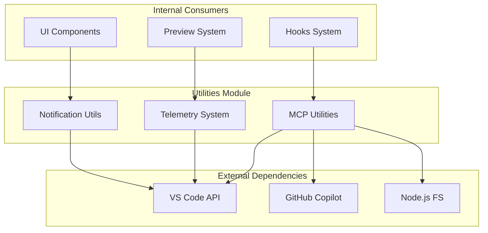
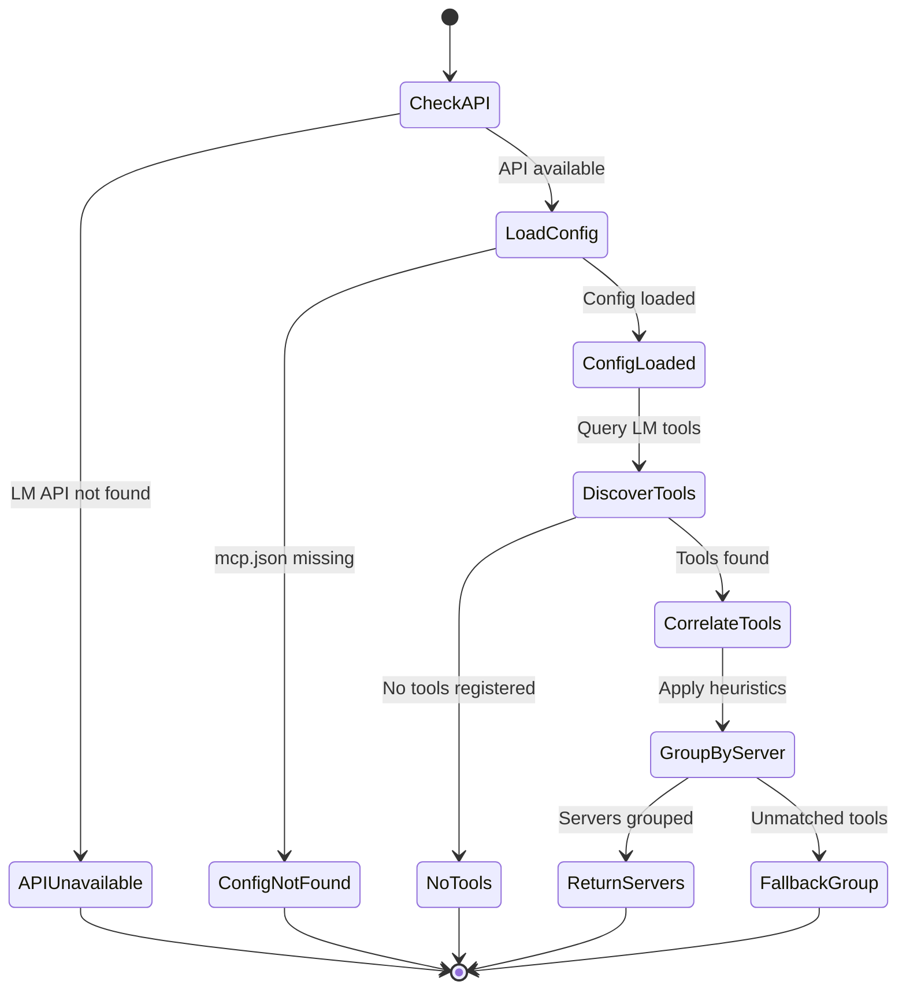
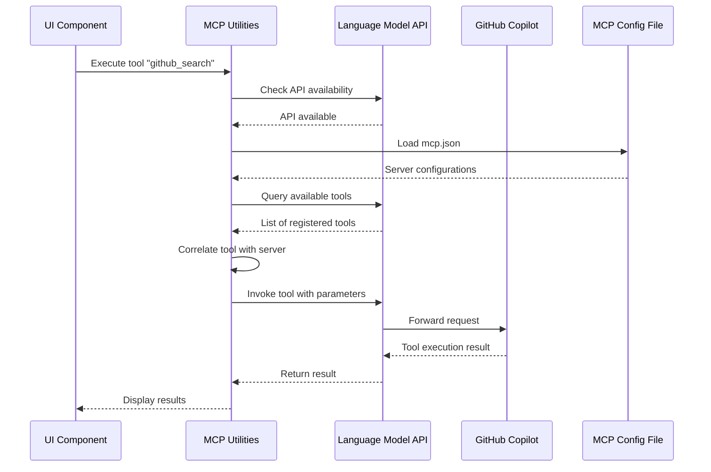
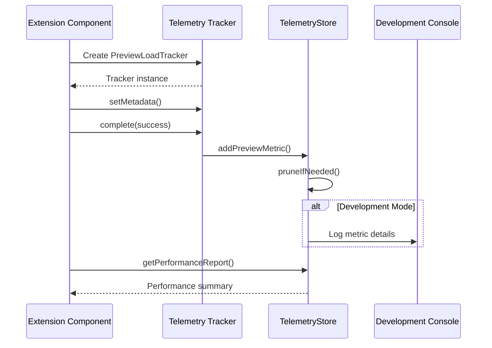

# Utilities

## Overview
The Utilities module provides essential cross-cutting services that support the entire Gatomia VS Code extension. It handles three critical areas: **MCP (Model Context Protocol) integration** with GitHub Copilot, **performance telemetry tracking** for monitoring extension health, and **user notification management** for consistent UX across the application.

## Architecture & Design


**Key Patterns:**
- **Singleton Pattern**: TelemetryStore uses a singleton instance for centralized metric collection
- **Builder Pattern**: PreviewLoadTracker and DiagramRenderTracker follow a builder pattern for metric collection
- **Facade Pattern**: NotificationUtils provides a simplified interface to VS Code's notification system
- **Strategy Pattern**: MCP utilities use heuristic strategies for tool-server correlation

## Core Components

### MCP Utilities (`src/utils/copilot-mcp-utils.ts`)
**Purpose**: Integrate with GitHub Copilot's Model Context Protocol to discover and execute MCP tools.

**Business Rules:**
1. **MCP Configuration Discovery**: Automatically detects the correct MCP config path based on VS Code profile and platform
2. **Tool-Server Correlation**: Uses heuristics to match tool names with configured MCP servers:
   - Exact match: Tool name contains server ID
   - Partial match: Tool name contains parts of server ID
   - MCP prefix pattern: Tools starting with `mcp_` prefix
   - Fallback: Unmatched tools grouped under "other-tools"
3. **Availability Checking**: Verifies Language Model API availability before attempting MCP operations
4. **Error Handling**: Graceful degradation when MCP features are unavailable

**State Machine for MCP Tool Discovery:**


### Telemetry System (`src/utils/telemetry.ts`)
**Purpose**: Track performance metrics to ensure the extension meets Service Level Objectives (SLOs).

**Business Rules:**
1. **Performance SLOs**:
   - SC-001: 95% of previews load within 3 seconds
   - SC-002: 90% diagram render success rate
2. **Data Retention**: Maximum of 1000 metrics per category to prevent unbounded growth
3. **Privacy**: Only collects performance metrics, no user data or content
4. **Development Logging**: Detailed logging in development mode only

**Key Metrics Tracked:**
- **Preview Load Metrics**: Document load times, success rates, diagram/form counts
- **Diagram Render Metrics**: Render times, success rates, retry counts by diagram language
- **Form Interaction Metrics**: Field interactions, validation success rates
- **Refinement Request Metrics**: Issue types, success rates, request tracking

### Notification Utilities (`src/utils/notification-utils.ts`)
**Purpose**: Provide consistent, user-friendly notifications across the extension.

**Business Rules:**
1. **Auto-dismissal**: Informational notifications auto-dismiss after 3 seconds
2. **Error Persistence**: Error notifications remain until user action
3. **Review Alerts**: Special handling for review-related notifications
4. **Progress Integration**: Auto-dismiss notifications use VS Code progress API

## Practical Examples

> [!TIP]
> These utilities are designed to be simple and intuitive. Use them throughout your code for consistent behavior.

### MCP Integration Example
```typescript
import { queryMCPServers, executeMCPTool, isCopilotAvailable } from "../utils/copilot-mcp-utils";

// Check if MCP is available
if (isCopilotAvailable()) {
  // Discover available MCP servers
  const servers = await queryMCPServers();
  
  // Execute a specific tool
  const result = await executeMCPTool(
    "github",
    "github_search_repositories",
    { query: "typescript", limit: 10 }
  );
  
  console.log("Search results:", result);
}
```

### Telemetry Tracking Example
```typescript
import { 
  PreviewLoadTracker, 
  DiagramRenderTracker,
  trackFormInteraction,
  getPerformanceReport 
} from "../utils/telemetry";

// Track preview load
const previewTracker = new PreviewLoadTracker("doc-123", "specification");
previewTracker.setMetadata({
  diagramCount: 3,
  formFieldCount: 12,
  sectionCount: 5
});
// ... load preview ...
previewTracker.complete(true);

// Track diagram render
const diagramTracker = new DiagramRenderTracker("doc-123", "diagram-1", "mermaid");
// ... render diagram ...
diagramTracker.complete(true);

// Track form interaction
trackFormInteraction({
  documentId: "doc-123",
  sessionId: "session-456",
  fieldId: "title",
  fieldType: "text",
  interactionType: "change",
  validationSuccess: true
});

// Get performance report
console.log(getPerformanceReport());
```

### Notification Example
```typescript
import { NotificationUtils } from "../utils/notification-utils";

// Auto-dismissing notification for quick messages
await NotificationUtils.showAutoDismissNotification("Preview loaded successfully");

// Error notification (requires user action)
NotificationUtils.showError("Failed to load specification: File not found");

// Warning notification
NotificationUtils.showWarning("Some features may be limited without GitHub Copilot");

// Standard info notification
NotificationUtils.showInfo("Review completed successfully");

// Review-specific notification
NotificationUtils.showReviewAlert("New feedback available for your specification");
```

## Data Flow

### MCP Tool Execution Flow


### Telemetry Collection Flow


## Dependencies

### Internal Dependencies
- **hooks_system**: Uses `MCPServer` and `MCPTool` types from hooks types
- **preview_system**: Primary consumer of telemetry tracking
- **ui_components**: Uses notification utilities for user feedback
- **agents_management**: May use MCP utilities for agent integration

### External Dependencies
- **VS Code API**: `vscode` module for notifications, language model API, and extensions
- **Node.js FileSystem**: `fs` module for reading MCP configuration files
- **GitHub Copilot Extension**: For MCP tool discovery and execution
- **Platform Utilities**: `platform-utils` for MCP config path resolution

## Performance Considerations

### Telemetry Storage
- **Memory Efficiency**: Limits to 1000 metrics per category using FIFO pruning
- **Fast Operations**: All operations are O(1) or O(n) with small n
- **Development Only**: Detailed logging only in development mode

### MCP Performance
- **Caching**: Consider caching MCP server discovery results
- **Async Operations**: All MCP operations are async and non-blocking
- **Error Resilience**: Graceful degradation when features unavailable

### Notification Performance
- **Auto-dismiss**: Prevents notification fatigue for transient messages
- **Progress Integration**: Uses VS Code's native progress API for smooth UX
- **Non-blocking**: All notifications are async where appropriate

## Testing Guidelines

### Unit Testing
```typescript
// Test telemetry tracking
test("PreviewLoadTracker records correct metrics", () => {
  const tracker = new PreviewLoadTracker("test-doc", "specification");
  tracker.setMetadata({ diagramCount: 2 });
  tracker.complete(true);
  
  const metrics = telemetryStore.getPreviewMetrics();
  expect(metrics[0].diagramCount).toBe(2);
});

// Test notification utilities
test("Auto-dismiss notification shows progress", async () => {
  await NotificationUtils.showAutoDismissNotification("Test", 100);
  // Verify progress API was called
});
```

### Integration Testing
```typescript
// Test MCP integration (requires Copilot)
test("MCP tools can be discovered", async () => {
  if (isCopilotAvailable()) {
    const servers = await queryMCPServers();
    expect(servers).toBeInstanceOf(Array);
  }
});
```

## Common Use Cases

### 1. Monitoring Extension Health
```typescript
// Check if performance meets SLOs
const meetsPreviewTarget = meetsPreviewPerformanceTarget();
const meetsDiagramTarget = meetsDiagramSuccessTarget();

if (!meetsPreviewTarget || !meetsDiagramTarget) {
  NotificationUtils.showWarning(
    "Extension performance below targets. Check telemetry report."
  );
}
```

### 2. Enhanced User Feedback
```typescript
// Provide rich feedback during long operations
async function loadComplexSpecification() {
  await NotificationUtils.showAutoDismissNotification("Loading specification...");
  
  const tracker = new PreviewLoadTracker(specId, "specification");
  // ... loading logic ...
  
  if (success) {
    await NotificationUtils.showAutoDismissNotification("Specification loaded successfully");
    tracker.complete(true);
  } else {
    NotificationUtils.showError("Failed to load specification");
    tracker.complete(false, error.message);
  }
}
```

### 3. MCP Tool Integration
```typescript
// Create a custom hook that uses MCP tools
async function executeGitHubSearch(query: string) {
  if (!isCopilotAvailable()) {
    NotificationUtils.showWarning("GitHub Copilot required for this feature");
    return;
  }
  
  try {
    const result = await executeMCPTool(
      "github",
      "github_search_repositories",
      { query, limit: 5 }
    );
    return result;
  } catch (error) {
    NotificationUtils.showError(`GitHub search failed: ${error.message}`);
    throw error;
  }
}
```

## Troubleshooting

### MCP Issues
1. **"Language Model API not available"**: Ensure VS Code version supports LM API (≥1.85)
2. **No MCP tools discovered**: Check if GitHub Copilot is installed and configured
3. **Tool execution fails**: Verify MCP server is running and configured in mcp.json

### Telemetry Issues
1. **Metrics not recorded**: Check if telemetry tracking is initialized
2. **High memory usage**: TelemetryStore automatically prunes old metrics
3. **Incorrect performance reports**: Clear telemetry with `clearTelemetry()` and retest

### Notification Issues
1. **Notifications not showing**: Check VS Code notification settings
2. **Auto-dismiss not working**: Ensure proper async/await usage
3. **Too many notifications**: Use auto-dismiss for transient messages