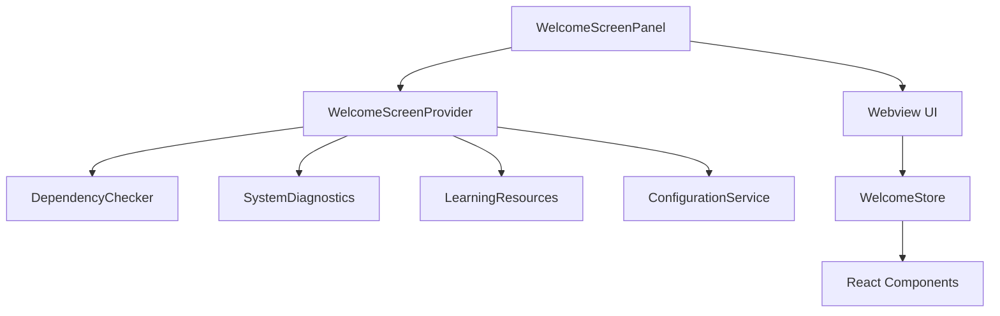
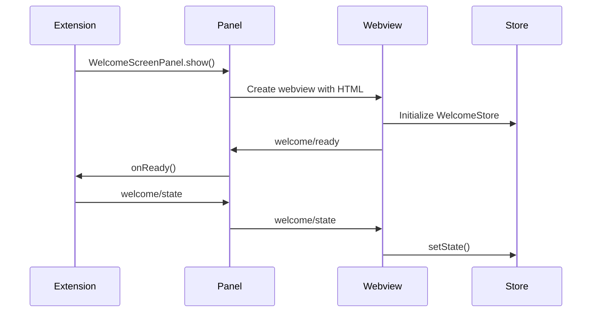
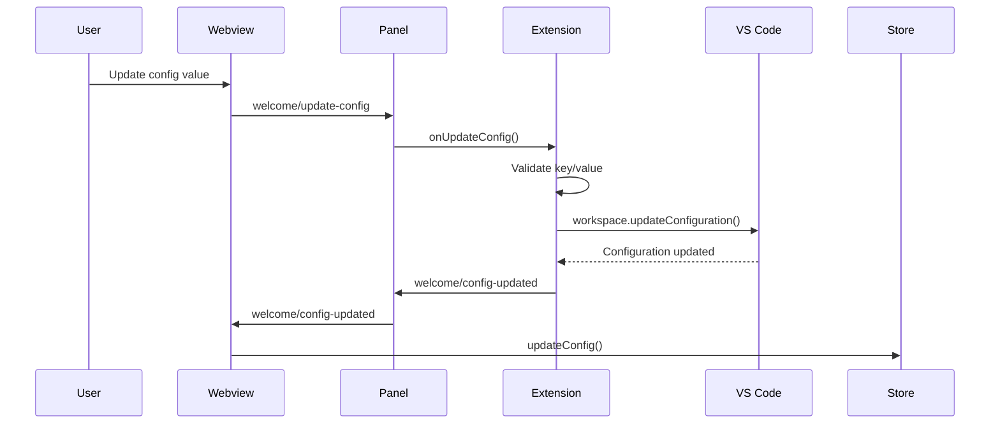
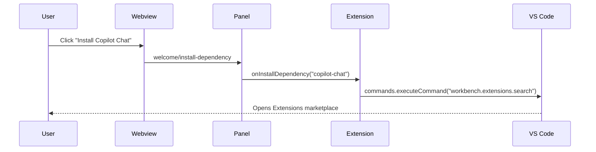

# Welcome Setup

The Welcome Setup module provides the initial onboarding experience for GatomIA users, featuring dependency detection, configuration management, and guided setup workflows. This module implements the welcome screen that appears on first launch and can be accessed anytime via the command palette.

## Overview

The Welcome Setup module orchestrates the initial user experience by:

1. **Dependency Detection**: Checks for required tools (GitHub Copilot Chat, SpecKit CLI, OpenSpec CLI)
2. **Configuration Management**: Provides UI for editing key extension settings
3. **System Diagnostics**: Displays recent errors and warnings
4. **Learning Resources**: Offers curated documentation and tutorials
5. **Feature Discovery**: Quick access to core GatomIA features

### Architecture



## Core Components

### Message Contracts

#### Extension → Webview Messages

```typescript
interface WelcomeInitMessage {
    type: "welcome/init";
    extensionVersion: string;
    vscodeVersion: string;
}

interface WelcomeStateMessage {
    type: "welcome/state";
    hasShownBefore: boolean;
    dontShowOnStartup: boolean;
    currentView: "setup" | "features" | "configuration" | "status" | "learning";
    dependencies: DependencyStatus;
    configuration: ConfigurationState;
    diagnostics: SystemDiagnostic[];
    learningResources: LearningResource[];
    featureActions: FeatureAction[];
}

interface WelcomeConfigUpdatedMessage {
    type: "welcome/config-updated";
    key: string;
    newValue: string | boolean;
}

interface WelcomeDependencyStatusMessage {
    type: "welcome/dependency-status";
    copilotChat: {
        installed: boolean;
        active: boolean;
        version: string | null;
    };
    speckit: {
        installed: boolean;
        version: string | null;
    };
    openspec: {
        installed: boolean;
        version: string | null;
    };
    lastChecked: number;
}

interface WelcomeDiagnosticAddedMessage {
    type: "welcome/diagnostic-added";
    diagnostic: SystemDiagnostic;
}

interface WelcomeErrorMessage {
    type: "welcome/error";
    code: string;
    message: string;
    context?: string;
}
```

#### Webview → Extension Messages

```typescript
interface WelcomeReadyMessage {
    type: "welcome/ready";
}

interface WelcomeExecuteCommandMessage {
    type: "welcome/execute-command";
    commandId: string;
    args?: unknown[];
}

interface WelcomeUpdateConfigMessage {
    type: "welcome/update-config";
    key: string;
    value: string | boolean;
}

interface WelcomeInstallDependencyMessage {
    type: "welcome/install-dependency";
    dependency: "copilot-chat" | "speckit" | "openspec";
}

interface WelcomeRefreshDependenciesMessage {
    type: "welcome/refresh-dependencies";
}

interface WelcomeUpdatePreferenceMessage {
    type: "welcome/update-preference";
    preference: "dontShowOnStartup";
    value: boolean;
}

interface WelcomeOpenExternalMessage {
    type: "welcome/open-external";
    url: string;
}

interface WelcomeNavigateSectionMessage {
    type: "welcome/navigate-section";
    section: "setup" | "features" | "configuration" | "status" | "learning";
}

interface WelcomeSearchResourcesMessage {
    type: "welcome/search-resources";
    query: string;
}
```

### Data Model Types

```typescript
interface DependencyStatus {
    copilotChat: {
        installed: boolean;
        active: boolean;
        version: string | null;
    };
    speckit: {
        installed: boolean;
        version: string | null;
    };
    openspec: {
        installed: boolean;
        version: string | null;
    };
    lastChecked: number;
}

interface ConfigurationItem {
    key: string;
    label: string;
    currentValue: string | boolean;
    editable: boolean;
    options?: string[];
    description?: string;
}

interface ConfigurationState {
    specSystem: ConfigurationItem & {
        currentValue: "auto" | "speckit" | "openspec";
        options: string[];
    };
    speckitSpecsPath: ConfigurationItem & { currentValue: string };
    speckitMemoryPath: ConfigurationItem & { currentValue: string };
    speckitTemplatesPath: ConfigurationItem & { currentValue: string };
    openspecPath: ConfigurationItem & { currentValue: string };
    promptsPath: ConfigurationItem & { currentValue: string };
    otherSettings: Array<ConfigurationItem & { editable: false }>;
}

interface SystemDiagnostic {
    id: string;
    timestamp: number;
    severity: "error" | "warning";
    message: string;
    source: string;
    suggestedAction: string | null;
}

interface LearningResource {
    id: string;
    title: string;
    description: string;
    url: string;
    category: "Getting Started" | "Advanced Features" | "Troubleshooting";
    keywords: string[];
    estimatedMinutes: number | null;
}

interface FeatureAction {
    id: string;
    featureArea: "Specs" | "Prompts" | "Hooks" | "Steering";
    label: string;
    description: string;
    commandId: string;
    enabled: boolean;
    icon?: string;
}

interface WelcomeScreenState {
    extensionVersion: string;
    vscodeVersion: string;
    hasShownBefore: boolean;
    dontShowOnStartup: boolean;
    currentView: "setup" | "features" | "configuration" | "status" | "learning";
    dependencies: DependencyStatus;
    configuration: ConfigurationState;
    diagnostics: SystemDiagnostic[];
    learningResources: LearningResource[];
    featureActions: FeatureAction[];
}
```

### Error Codes

```typescript
const WelcomeErrorCode = {
    CONFIG_UPDATE_FAILED: "CONFIG_UPDATE_FAILED",
    INVALID_CONFIG_KEY: "INVALID_CONFIG_KEY",
    INVALID_CONFIG_VALUE: "INVALID_CONFIG_VALUE",
    COMMAND_EXECUTION_FAILED: "COMMAND_EXECUTION_FAILED",
    DEPENDENCY_CHECK_FAILED: "DEPENDENCY_CHECK_FAILED",
} as const;
```

## Main Classes

### WelcomeScreenProvider

The central orchestration class that aggregates state and handles business logic for the welcome screen.

```typescript
class WelcomeScreenProvider {
    constructor(context: ExtensionContext, outputChannel: OutputChannel);
    
    // Public API
    async getWelcomeState(): Promise<WelcomeScreenState>;
    async updateConfiguration(key: string, value: string | boolean, panel: WelcomeScreenPanel): Promise<void>;
    async executeCommand(commandId: string, args: unknown[], panel: WelcomeScreenPanel): Promise<void>;
    async installDependency(dependency: "copilot-chat" | "speckit" | "openspec", panel: WelcomeScreenPanel): Promise<void>;
    async refreshDependencies(panel: WelcomeScreenPanel): Promise<void>;
    async openExternal(url: string): Promise<void>;
    searchResources(query: string): LearningResource[];
    getCallbacks(): WelcomeScreenPanelCallbacks;
    getSystemDiagnostics(): SystemDiagnostics;
    recordError(severity: "error" | "warning", message: string, source: string, suggestedAction?: string): void;
}
```

#### Key Methods

**`getWelcomeState()`**: Aggregates all necessary data for rendering the welcome screen. Typically completes in <100ms using parallel Promise.all for efficiency. DependencyChecker caches results for 60 seconds.

**`updateConfiguration()`**: Validates key is editable and persists to VS Code settings. Only allows editing of spec system-related settings defined in `EDITABLE_CONFIG_KEYS`.

**`installDependency()`**: Provides installation guidance for each dependency:
- **copilot-chat**: Opens Extensions marketplace to GitHub Copilot Chat
- **speckit**: Copies UV install command to clipboard
- **openspec**: Copies npm install command to clipboard

The dedicated **Install Dependencies** panel also validates and installs:
- **Copilot CLI** (`npm install -g @github/copilot`)
- **GatomIA CLI** (`uv tool install gatomia --from git+https://github.com/eitatech/gatomia-cli.git`)

GatomIA CLI installation is only shown after all other prerequisites are installed, and the panel includes configuration guidance for GitHub Copilot as default provider via:

```shell
gatomia config set --llm-provider copilot --main-model gpt-4
```

### WelcomeScreenPanel

Manages the webview panel lifecycle and message passing with singleton pattern to prevent multiple instances.

```typescript
class WelcomeScreenPanel {
    static readonly panelType = "gatomia.welcomeScreen";
    
    // Static methods
    static show(context: ExtensionContext, outputChannel: OutputChannel, callbacks?: WelcomeScreenPanelCallbacks): WelcomeScreenPanel;
    
    // Instance methods
    async postMessage(message: ExtensionToWebviewMessage): Promise<void>;
    dispose(): void;
    isVisible(): boolean;
}
```

#### Panel Callbacks

```typescript
interface WelcomeScreenPanelCallbacks {
    onReady?: () => Promise<void> | void;
    onExecuteCommand?: (commandId: string, args?: unknown[]) => Promise<void> | void;
    onUpdateConfig?: (key: string, value: string | boolean) => Promise<void> | void;
    onInstallDependency?: (dependency: "copilot-chat" | "speckit" | "openspec") => Promise<void> | void;
    onRefreshDependencies?: () => Promise<void> | void;
    onUpdatePreference?: (preference: "dontShowOnStartup", value: boolean) => Promise<void> | void;
    onOpenExternal?: (url: string) => Promise<void> | void;
    onNavigateSection?: (section: string) => Promise<void> | void;
    onSearchResources?: (query: string) => Promise<void> | void;
    setPanel?: (panel: WelcomeScreenPanel) => void;
}
```

### WelcomeStore (UI Store)

Zustand store for webview state management with VS Code message bridge integration.

```typescript
interface WelcomeStore {
    // State
    state: WelcomeScreenState | null;
    loading: boolean;
    error: WelcomeErrorData | null;
    extensionVersion: string;
    vscodeVersion: string;

    // Actions
    setState: (state: WelcomeScreenState) => void;
    updateConfig: (key: string, value: string | boolean) => void;
    updateDependencies: (dependencies: DependencyStatus) => void;
    addDiagnostic: (diagnostic: SystemDiagnostic) => void;
    setCurrentView: (view: ViewSection) => void;
    setDontShowOnStartup: (value: boolean) => void;
    setError: (error: WelcomeErrorData | null) => void;
    setLoading: (loading: boolean) => void;
    initialize: (init: WelcomeInitData) => void;
    reset: () => void;
}
```

## UI Components

### WelcomeScreen (Main Component)

The root React component that renders the welcome screen with five main sections:

1. **SetupSection**: Dependency installation and initial configuration
2. **FeaturesSection**: Quick access to core GatomIA features
3. **ConfigSection**: Editable configuration settings
4. **StatusSection**: System diagnostics and version information
5. **LearningSection**: Documentation and tutorial resources

### Component Props

```typescript
interface SetupSectionProps {
    dependencies: DependencyStatus;
    onInstallDependency: (dependency: "copilot-chat" | "speckit" | "openspec") => void;
    onRefreshDependencies: () => void;
    onNavigateNext: () => void;
}

interface FeaturesSectionProps {
    featureActions: FeatureAction[];
    onExecuteCommand: (commandId: string, args?: unknown[]) => void;
}

interface ConfigSectionProps {
    configuration: ConfigurationState;
    onUpdateConfig: (key: string, value: string | boolean) => void;
    onOpenSettings: () => void;
}

interface StatusSectionProps {
    extensionVersion: string;
    vscodeVersion: string;
    dependencies: DependencyStatus;
    diagnostics: SystemDiagnostic[];
    onInstallDependency: (dependency: "copilot-chat" | "speckit" | "openspec") => void;
}

interface LearningSectionProps {
    resources: LearningResource[];
    onOpenExternal: (url: string) => void;
    onSearch: (query: string) => void;
}
```

## Business Rules and Validations

### Configuration Management

**Editable Configuration Keys** (FR-007):
```typescript
const EDITABLE_CONFIG_KEYS = [
    "gatomia.specSystem",           // "auto" | "speckit" | "openspec"
    "gatomia.speckit.specsPath",    // string (path)
    "gatomia.speckit.memoryPath",   // string (path)
    "gatomia.speckit.templatesPath", // string (path)
    "gatomia.openspec.path",        // string (path)
    "gatomia.prompts.path",         // string (path)
] as const;
```

**Validation Rules**:
1. Only keys in `EDITABLE_CONFIG_KEYS` can be modified from welcome screen
2. Path configurations (`*Path` keys) must be string values
3. `specSystem` must be one of: `"auto"`, `"speckit"`, or `"openspec"`

### Dependency Detection

**Cache Behavior**:
- Dependency status cached for 60 seconds (`CACHE_TTL_MS = 60_000`)
- Cache can be invalidated with `invalidateCache()` method
- Force refresh available via `checkAll(true)`

**Detection Methods**:
- **GitHub Copilot Chat**: VS Code extension API (synchronous)
- **SpecKit CLI**: CLI detection via `specify --version` (5s timeout)
- **OpenSpec CLI**: CLI detection via `openspec --version` (5s timeout)

### System Diagnostics

**Storage Rules**:
- 24-hour rolling window for diagnostics
- Maximum of 5 most recent diagnostics displayed
- Diagnostics automatically pruned when older than 24 hours

### Security

**External URL Validation**:
- Only HTTPS URLs can be opened (`env.openExternal()`)
- Non-HTTPS URLs blocked with user warning
- URL validation occurs before opening

## Usage Examples

### Basic Integration

```typescript
// In extension.ts
import { WelcomeScreenProvider } from "./providers/welcome-screen-provider";
import { WelcomeScreenPanel } from "./panels/welcome-screen-panel";

// Create provider
const welcomeProvider = new WelcomeScreenProvider(context, outputChannel);

// Get callbacks
const callbacks = welcomeProvider.getCallbacks();

// Show panel
const panel = WelcomeScreenPanel.show(context, outputChannel, callbacks);

// Set panel reference in callbacks
callbacks.setPanel?.(panel);
```

### Customizing Feature Actions

```typescript
// Extend WelcomeScreenProvider to customize feature actions
class CustomWelcomeProvider extends WelcomeScreenProvider {
    private getFeatureActions(): FeatureAction[] {
        return [
            ...super.getFeatureActions(),
            {
                id: "custom-action",
                featureArea: "Specs",
                label: "Custom Action",
                description: "My custom action",
                commandId: "myextension.customCommand",
                enabled: true,
                icon: "codicon-star",
            },
        ];
    }
}
```

### Handling Configuration Updates

```typescript
// Listen for configuration changes
workspace.onDidChangeConfiguration((event) => {
    if (event.affectsConfiguration("gatomia")) {
        // Refresh welcome screen state
        const state = await welcomeProvider.getWelcomeState();
        await panel.postMessage({
            type: "welcome/state",
            ...state,
        });
    }
});
```

### Adding Custom Diagnostics

```typescript
// Record custom diagnostic
welcomeProvider.recordError(
    "warning",
    "Custom warning message",
    "my-component",
    "Check configuration settings"
);

// Or get system diagnostics service
const diagnostics = welcomeProvider.getSystemDiagnostics();
diagnostics.recordError("error", "Something went wrong", "my-feature");
```

## Message Flow

### Initialization Sequence



### Configuration Update Flow



### Dependency Installation Flow



## Error Handling

### Error Message Structure

```typescript
interface WelcomeErrorData {
    code: string;  // One of WelcomeErrorCode values
    message: string;  // User-friendly error message
    context?: string;  // Technical details for debugging
}
```

### Error Recovery

1. **Configuration Errors**: User notified, changes reverted in UI
2. **Command Execution Errors**: Error shown in notification, logged to OutputChannel
3. **Dependency Check Errors**: Fallback to cached values, retry on next refresh
4. **Webview Communication Errors**: Messages queued until connection restored

## Dependencies

### Internal Dependencies

- **[dependencies_management.md](dependencies_management.md)**: Uses `DependencyChecker` service for CLI and extension detection
- **[ui_view_providers.md](ui_view_providers.md)**: Integrates with view provider system for panel management
- **[utilities.md](utilities.md)**: Uses workspace state utilities for persistence

### External Dependencies

- **VS Code API**: Configuration, commands, webview, workspace state management
- **React**: UI component framework (webview side)
- **TypeScript**: Type safety across extension/webview boundary
- **Zustand**: State management for webview UI

## Performance Considerations

1. **Lazy Loading**: Learning resources loaded only when section is viewed
2. **Caching**: Dependency detection cached for 60 seconds
3. **Message Queueing**: Messages queued when webview not ready
4. **Batch State Updates**: Complete state sent on load, incremental updates thereafter
5. **Error Boundaries**: UI errors contained without crashing entire webview

## Testing Scenarios

### First-Time Activation
```typescript
// Given: Fresh workspace with no prior configuration
// When: Extension activates
// Then: Welcome screen appears automatically
// And: Setup section shows missing dependencies
// And: User can install dependencies and configure spec system
```

### Configuration Management
```typescript
// Given: Welcome screen is open
// When: User edits spec system setting
// Then: Validation ensures key is editable
// And: Value persists to VS Code settings
// And: UI updates with confirmation
```

### Error Recovery
```typescript
// Given: System has recent errors
// When: User views status section
// Then: Last 5 errors from past 24 hours displayed
// And: Suggested actions provided for each error
// And: User can attempt remediation
```

## Related Modules

- **[hooks_system.md](hooks_system.md)**: Welcome screen can trigger hook executions
- **[specification_management.md](specification_management.md)**: Feature actions include spec creation
- **[agents_management.md](agents_management.md)**: Agent discovery and management features
- **[steering_management.md](steering_management.md)**: Steering rule creation from feature actions

---

*Documentation generated based on specification 006-welcome-screen and implementation analysis.*
